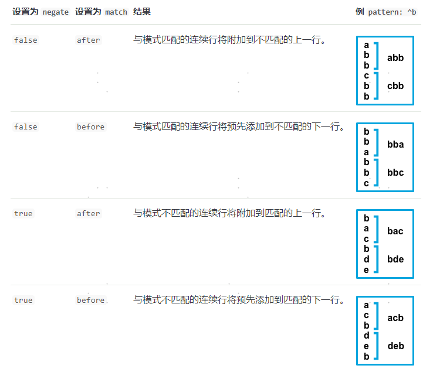

## Filebeat笔记


```sh
tar xzvf filebeat-7.2.0-linux-x86_64.tar.gz
```


sudo ./filebeat -e -c filebeat.yml


### 


### 2 Filebeat inputs

#### 2.1 type


#### 2.2 paths

定义输入日志路径.

```yaml
filebeat.inputs:
- type: log 
  paths:
    - /var/log/system.log
    - /var/log/wifi.log
- type: log 
  paths:
    - "/var/log/apache2/*"
  fields:
    apache: true
  fields_under_root: true
```


#### 2.3 exclude_lines

示例将Filebeat配置为删除任何以`DBG`开头的行 

```yaml
filebeat.inputs:
- type: log
  ...
  exclude_lines: ['^DBG']
```


#### 2.4 include_lines

示例将Filebeat配置为导出以`ERR`或`WARN`开头的所有行

```yaml
filebeat.inputs:
- type: log
  ...
  include_lines: ['^ERR', '^WARN']
```


>如果两个`include_lines`和`exclude_lines`定义，Filebeat执行`include_lines`，然后再执行`exclude_lines`。


#### 2.5 exclude_files

示例将Filebeat配置为忽略具有`gz`扩展名的所有文件

```yaml
filebeat.inputs:
- type: log
  ...
  exclude_files: ['\.gz$']
```


#### 2.6 enabled

使用该`enabled`选项可启用和禁用输入。默认情况下，enabled设置为true。


#### 2.7 tags

Filebeat在`tags`每个已发布事件的字段中包含的标记列表。

```yaml
filebeat.inputs:
- type: log
  . . .
  tags: ["json"]
```


#### 2.8 fields

可以指定的可选字段，用于向输出添加其他信息。

```yaml
filebeat.inputs:
- type: log
  . . .
  fields:
    app_id: query_engine_12
```


#### 2.9 multiline

Filebeat获取所有不以其开头的行`[`并将它们与前一行组合。

```yaml
filebeat:
  inputs:
    - type: log
      paths:
        - /var/log/*.log
      multiline:
        pattern: '^['
        negate: true
        match: after
```


**multiline.pattern**：指定要匹配的正则表达式模式

**multiline.negate**：定义模式是否被否定。默认是`false`。

**multiline.match**：指定Filebeat如何将匹配行组合到事件中。




| **支持的Perl字符类** |                                     |
| -------------------- | ----------------------------------- |
| `\d`                 | 数字（相同`[0-9]`）                 |
| `\D`                 | 不是数字（相同`[^0-9]`）            |
| `\s`                 | 空白（同`[\t\n\f\r ]`）             |
| `\S`                 | 不是空白（相同`[^\t\n\f\r ]`）      |
| `\w`                 | 单词字符（同`[0-9A-Za-z_]`）        |
| `\W`                 | 不是单词字符（相同`[^0-9A-Za-z_]`） |


### 3 Logstash output


```yaml
#----------------------------- Logstash output --------------------------------
output.logstash:
  hosts: ["localhost:5044", "localhost:5045"]
```