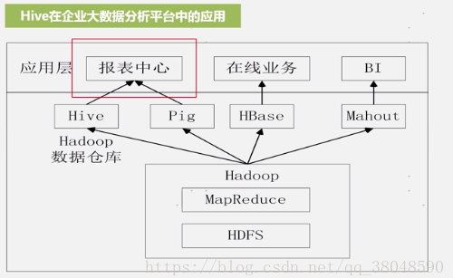

## Hive原理

Hive是一个数据仓库基础工具，它是建立在Hadoop之上的数据仓库，在某种程度上可以把它看做用户编程接口（API），本身也并不存储和处理数据，依赖于HDFS存储数据，依赖MR处理数据。它提供了一系列对数据进行提取、转换、加载的工具。Hive查询语言采用Hive为MapReduce处理结构化数据。Hive不是实时查询语言。

数据仓库：面向主题的，集成的，相对稳定的，反映历史变化的数据集和，用于支持管理决策。

数据仓库和数据库的区别：数据仓库的数据是稳定的，只读的，数据仓库存储历史数据，数据库只能保留某个时刻的特性，而数据仓库则保留了所有的历史数据。（用于帮助企业分析、决策）

Hive两个方面特性：

1】采用批处理方式处理海量数据

	a Hive会把HiveQL语句转换成MapReduce任务进行运行。
	b 数据仓库存储的是静态数据，对静态数据分析适合采用批处理方式，不需要快速响应，数据本身不会频繁变化。
2】提供了一系列对数据进行提取、转换、加载（ETL）的工具

HBase和hive是互补的关系，Hive是进行批处理的工具，而HBase可以对实时数据进行分析。

#### 1 Hive对外访问接口

CLI：命令行工具
HWI：Hive Web Interface 是Hive的web接口
JDBC和ODBC：开放数据库连接接口
Thrift Server：基于Thrift架构开发的接口，允许外界通过这个接口实现对Hive仓库的RPC调用
驱动模块：driver把Hive输入的HQl语句转换成MapReduce作业。

#### 2 Hive中metastore的三种方式

- 内嵌Derby方式
- Local方式
- Remote方式

##### 1】Local方式

