## Hadoop原理浅析

### 1 HDFS架构

| 实体     | 描述                                                         |
| -------- | ------------------------------------------------------------ |
| namenode | 管理文件系统的命名空间（Namespace）。维护文件系统树及整颗树内所有的文件和目录，核心文件为FsImage和EditLog。 |
| datanode | 受理客户端的读写请求，定期上报心跳和块的存储位置。           |
| block    | HDFS数据块，默认副本为3，通常是在同一机架的两个节点存储两份，另外一个机架上的节点存储一份。 |
| edits    | 编辑日志文件，操作日志中记录了所有针对文件的创建、删除、重命名等操作 |
| fsimage  | 命名空间镜像文件，用于维护文件系统树以及文件树中所有的文件和文件夹的元数据 |

整体架构如下图：

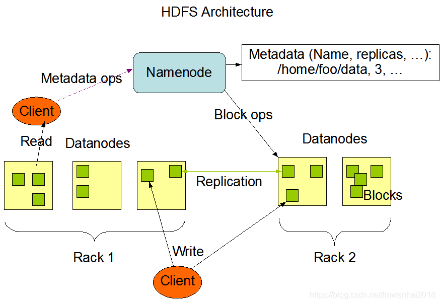

### 2 HDFS文件结构

#### 2.1 Namenode

最新格式化的NameNode会创建以下目录结构：

> ${dfs.name.dir}/current/VERSION
>                     /edits
>                     /fsimage
>                     /fstime

一个典型的VERSION文件包括的内容：

> \#Tue Jun 17 16:55:18 CST 2014
> namespaceID=1812798012
> cTime=0
> storageType=NAME_NODE
> layoutVersion=-18

- namespaceID：文件系统的唯一标识符。
- cTime：标记了NameNode存储空间创建的时间。
- StorageType：存储目录的数据结构
- layoutVersion：定义了HDFS持久数据结构（也称布局）的版本。

**1】 edits**

当客户端执行写操作时，NameNode会先在编辑日志中写下记录，并在内存中保存一个文件系统元数据，元数据会在编辑日志有所改动后进行更新。

2】**fsimage**

fsimage文件是文件系统元数据的持久性检查点。

检查点处理过程：

- \1. Secondary NameNode首先请求原NameNode进行edits的滚动，这样新的编辑操作就能够进入新的文件中。
- \2. Secondary NameNode通过HTTP方式读取原NameNode中的fsimage及edits。
- \3. Secondary NameNode读取fsimage到内存中，然后执行edits中的每个操作，并创建一个新的统一的fsimage文件。
- \4. Secondary NameNode（通过HTTP方式）将新的fsimage发送到原NameNode。
- \5. 原NameNode用新的fsimage替换旧的fsimage，旧的edits文件通过步骤1）中的edits进行替换。同时系统会更新fsimage文件到记录检查点记录的时间。

### 2.2 Secondary NameNode

Secondary NameNode目录如下:

> ${fs.checkpoint.dir}/current/VERSION
>                     /edits
>                     /fsimage
>                     /fstime
>                /previous.checkpoint/VERSION
>                      /edits
>                      /fsimage
>                      /fstime

子目录/previous.checkpoint可以作为NameNode的元数据备份源。

### 2.3 DataNode

DataNode不需要进行格式化，它会在启动时自己创建存储目录，其中关键的文件和目录如下：

> ${dfs.data.dir}/current/VERSION
>                      /blk_<id_1>
>                      /blk_<id_1>.meta
> 　　　　　　　　　　　 /blk_<id_2>
> 　　　　　　　　　　　 /blk_<id_2>.meta
> 　　　　　　　　　　　 /……
> 　　　　　　　　　　　 /subdir0/
> 　　　　　　　　　　　 /subdir1/
> 　　　　　　　　　　　 /…
> 　　　　　　　　　　　 /subdir63/

DataNode中的VERSION文件跟NameNode类似：

> \#Wed Jun 18 19:32:42 CST 2014
> namespaceID=1812798012
> storageID=DS-1146216163-10.16.78.34-50010-1400812209946
> cTime=0
> storageType=DATA_NODE
> layoutVersion=-18

DataNode中current目录下的其他文件都有blk_前缀，它有两种类型：

- HDFS中的文件块本身，存储的是原始文件内容。
- 块的元数据信息（使用.meta后缀标识）。

###  3 HDFS读流程分析

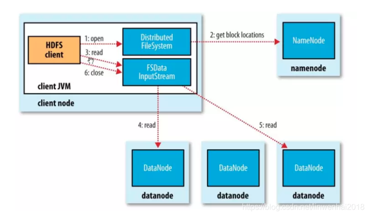

- \1. 客户端调用FileSystem对象的open()方法打开文件；
- \2. DistributedFileSystem通过RPC调用namenode，获取文件起始块位置；namenode返回块对应的datanode地址，并排序；DistributedFileSystem返回DSDataInputStream对象；
- \3. 客户端对DSDataInputStream对象调用read()方法;
- \4. DSDataInputStream对象连接距离最近的datanode获取块数据;
- \5. 反复调用read()方法获取其他datanode块数据；
- \6. 获取文件所有块数据,客户端对DSDataInputStream对象调用close()方法;

 

### 4 HDFS写流程分析

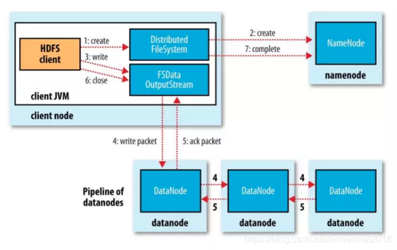

- \1. 客户端调用FileSystem对象的create()方法创建新文件；
- \2. DistributedFileSystem通过RPC调用namenode，在namespace新建一个文件；DistributedFileSystem返回DSDataOutputStream对象；
- \3. 客户端对DSDataOutputStream对象调用write()方法,将写入数据分拆成数据包，写入内部队列;
- \4. DSDataOutputStream将队列数据包流式传输到第1个datanode，第1个datanode存储数据包并把数据包传输给第2个datanode，第2个datanode存储数据包并把数据包传输给第3个datanode；
- \5. DSDataOutputStream等待所有的datanode收到确认回执，把数据包从队列删除；
- \6. 客户端完成数据写入，调用close()方法；

 

### 5 NameNode的HA机制

#### 5.1 NameNode HA

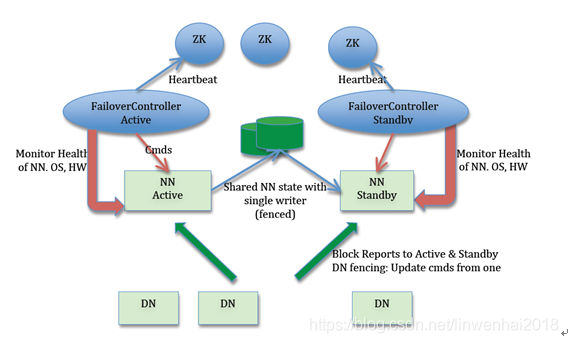

- Active NameNode和Standby NameNode两台NameNode形成互备，一台处于Active状态，作为主节点，另外一台是Standby状态，作为备节点，只有主节点才能对外提供读写服务；
- ZKFC（ZKFailoverContoller）作为独立的进程运行，对NameNode的主备切换进行总体控制；
- 基于QJM的共享存储系统保存了NameNode运行过程中的所有产生的HDFS的元数据，由多个奇数JournalNode组成；

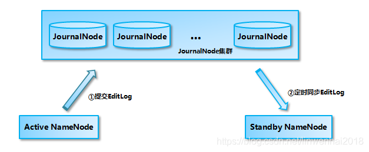

#### 5.2 NameNode的切换流程

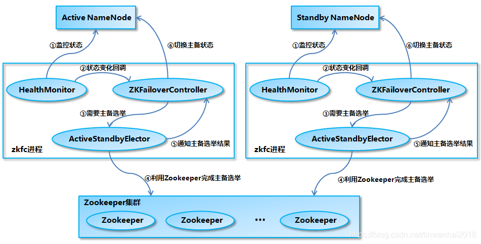

- HealthMonitor初始化完成之后会启动内部的线程来定时调用对应NameNode的HAServiceProtocol RPC接口的方法，对NameNode的健康状态进行检测；
- HealthMonitor如果检测到NameNode的健康状态发生变化，会回调ZKFailoverController注册的相应方法进行处理；
- 如果ZKFailoverController判断需要进行主备切换，会首先使用ActiveStandbyElector来进行自动的主备选举；
- ActiveStandbyElector与Zookeeper进行交互完成自动的主备选举；
- ActiveStandbyElector在主备选举完成后，会回调ZKFailoverController的相应方法来通知当前的NameNode成为主NameNode或备NameNode；
- ZKFailoverController调用对应NameNode的 HAServiceProtocol RPC接口的方法将NameNode转换为Active状态或Standby状态；

### 6 YARN架构

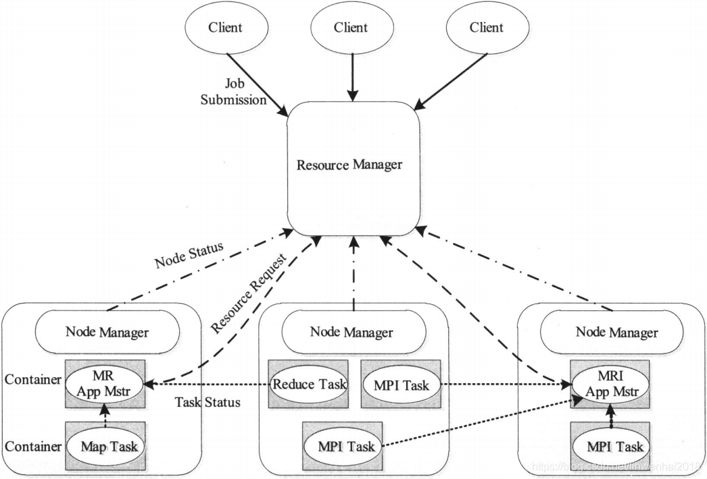

| 组件                    | 描述                                                         |
| ----------------------- | ------------------------------------------------------------ |
| ResourceManager（RM）   | 1. 处理客户端请求。 2. 启动或监控ApplicationMaster。 3. 监控NodeManager。 4. 资源的分配与调度。 |
| NodeManager（NM）       | 1. 单个节点上的资源管理。 2. 处理来自ResourceManager上的命令。 3. 处理来自ApplicationMaster上的命令。 |
| ApplicationMaster（AM） | 1. 负责数据的切分。 2. 为应用程序申请资源并分配给内部的任务。 3. 任务的监控与容错。 |
| Container               | 对任务运行环境进行抽象，封装CPU、内存等多维度的资源以及环境变量、启动命令等任务运行相关的信息。 |

###  7 YARN原理

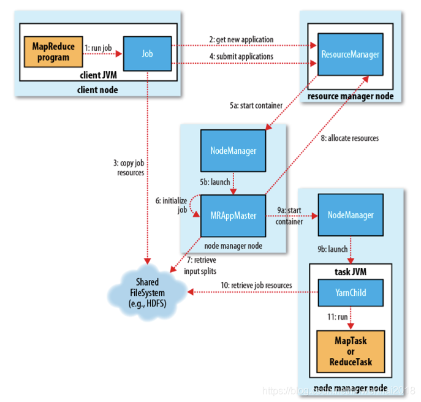

#### 7.1 作业提交

client调用job.waitForCompletion方法，向整个集群提交MapReduce作业 (第1步) 。 新的作业ID(应用ID)由资源管理器分配(第2步). 作业的client核实作业的输出, 计算输入的split,将作业的资源(包括Jar包, 配置文件, split信息)拷贝给HDFS(第3步). 最后, 通过调用资源管理器的submitApplication()来提交作业(第4步)。

#### 7.2 作业初始化

当资源管理器收到submitApplication()的请求时, 就将该请求发给调度器(scheduler), 调度器分配container, 然后资源管理器在该container内启动应用管理器进程, 由节点管理器监控(第5a和5b步)。MapReduce作业的应用管理器是一个主类为MRAppMaster的Java应用。其通过创造一些bookkeeping对象来监控作业的进度, 得到任务的进度和完成报告(第6步)。然后其通过分布式文件系统得到由客户端计算好的输入split(第7步)。然后为每个输入split创建一个map任务, 根据mapreduce.job.reduces创建reduce任务对象。

#### 7.3 任务分配

如果作业很小，应用管理器会选择在其自己的JVM中运行任务。如果不是小作业, 那么应用管理器向资源管理器请求container来运行所有的map和reduce任务(第8步). 这些请求是通过心跳来传输的, 包括每个map任务的数据位置, 比如存放输入split的主机名和机架(rack). 调度器利用这些信息来调度任务, 尽量将任务分配给存储数据的节点, 或者退而分配给和存放输入split的节点相同机架的节点。

#### 7.4 任务运行

当一个任务由资源管理器的调度分配给一个container后, 应用管理器通过联系节点管理器来启动container(第9a步和9b步). 任务由一个主类为YarnChild的Java应用执行. 在运行任务之前首先本地化任务需要的资源, 比如作业配置, JAR文件, 以及分布式缓存的所有文件(第10步). 最后, 运行map或reduce任务(第11步)。

YarnChild运行在一个专用的JVM中, 但是YARN不支持JVM重用。

#### 7.5 进度和状态更新

YARN中的任务将其进度和状态（包括counter）返回给应用管理器，客户端每秒（通过mapreduce.client.progressmonitor.pollinterval设置）向应用管理器请求进度更新，展示给用户。

#### 7.6 作业完成

除了向应用管理器请求作业进度外，客户端每5分钟都会通过调用waitForCompletion()来检查作业是否完成。时间间隔可以通过mapreduce.client.completion. pollinterval来设置。作业完成之后, 应用管理器和container会清理工作状态, OutputCommiter的作业清理方法也会被调用。作业的信息会被作业历史服务器存储以备之后用户核查。

###  

### 8 YARN调度器

#### 8.1 FIFO Scheduler

将所有的Applications放到队列中，先按照作业的优先级高低、再按照到达时间的先后，为每个app分配资源。

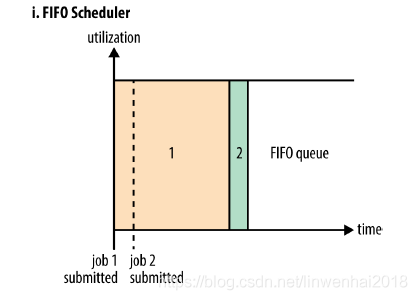

上图的示例：有一个很大的job1，它先提交，并且占据了全部的资源。那么job2提交时发现没有资源了，则job2必须等待job1执行结束，才能获得资源执行。

#### 8.2 Capacity Scheduler

CapacityScheduler允许将整个集群的资源分成多个部分，每个组织使用其中的一部分，即每个组织有一个专门的队列，每个组织的队列还可以进一步划分成层次结构（Hierarchical Queues），从而允许组织内部的不同用户组的使用。
每个队列内部，按照FIFO的方式调度Applications。当某个队列的资源空闲时，可以将它的剩余资源共享给其他队列。

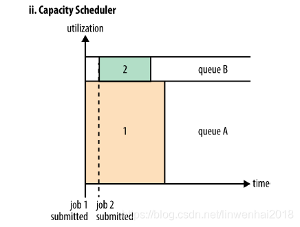

上图的示例：有一个专门的队列允许小的apps提交之后能够尽快执行，注意到job1先提交，先执行时并没有占用系统的全部资源（假如job1需要100G内存，但是整个集群只有100G内存，那么只分配给job1 80G），而是保留了一部分的系统资源。

**配置例子：**

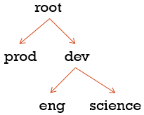

说明：root队列下面有两个队列，分别为prod(40%的容量，即使用40%的集群资源)和dev(60%的容量，最大的75%)，说明即使prod队列空闲了，那么dev最多只能使用75%的集群资源。这样就可以保证prod中添加新的apps时马上可以使用25%的资源。

#### 8.3 Fair Scheduler

Fair Scheduler允许应用在一个集群中公平地共享资源。默认情况下FairScheduler的公平调度只基于内存，也可以配置成基于memory and CPU。当集群中只有一个app时，它独占集群资源。当有新的app提交时，空闲的资源被新的app使用，这样最终每个app就会得到大约相同的资源。可以为不同的app设置优先级，决定每个app占用的资源百分比。FairScheduler可以让短的作业在合理的时间内完成，而不必一直等待长作业的完成。

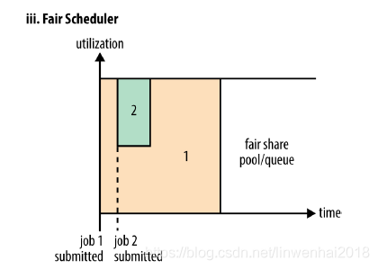

上图示例：大的任务job1提交并执行，占用了集群的全部资源，开始执行。之后小的job2执行时，获得系统一半的资源，开始执行。因此每个job可以公平地使用系统的资源。当job2执行完毕，并且集群中没有其他的job加入时，job1又可以获得全部的资源继续执行。

注意：job2提交之后并不能马上就获取到集群一半的资源，因为job2必须等待job1释放containers。

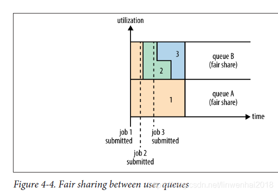

上图示例：两个用户A和B。A提交job1时集群内没有正在运行的app，因此job1独占集群中的资源。用户B的job2提交时，job2在job1释放一半的containers之后，开始执行。job2还没执行完的时候，用户B提交了job3，job2释放它占用的一半containers之后，job3获得资源开始执行。