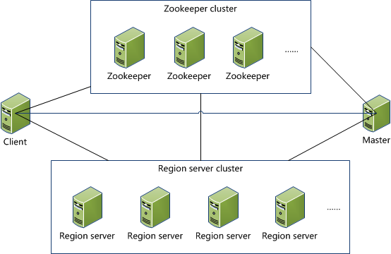
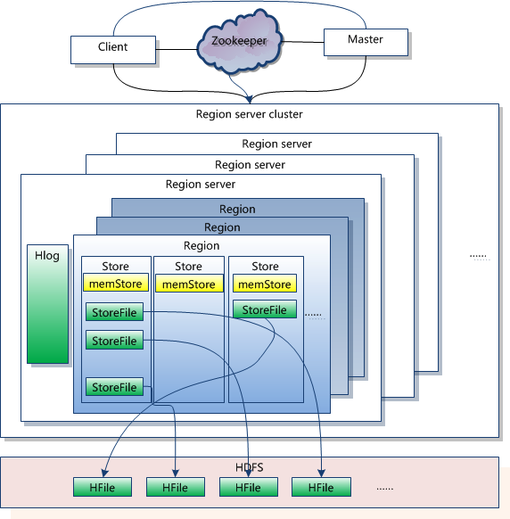
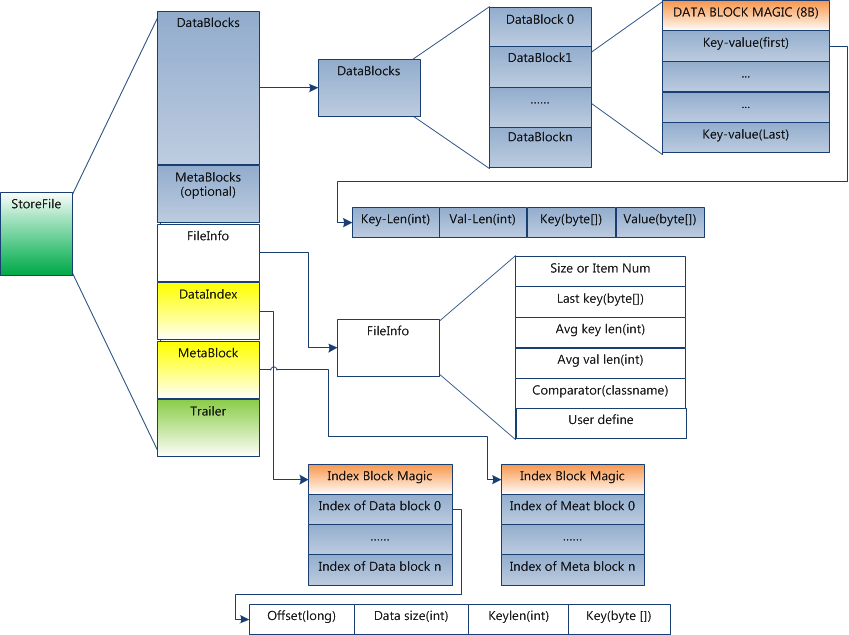

## Hbase原理

### 1 Hbase系统架构

**1】Zookeeper**

- 保证任何时候集群只有一个HMaster。
- 监控regionServer的状态，将其上线下线信息通知mater。
- 存储meta表Region的地址。
- 存储hbase的元数据信息。包括有哪些表、有哪些列族等等。

**2】Hbase Master Server**

- 为RegionServer分配Region。
- 为RegionServer进行负载的均衡。
- GFS上的垃圾回收。
- 处理对Schema数据的更新请求。

**3】HRegion Server**

- 维护Master分配给它的region，处理对这些region的IO请求。
- 负责切分在运行过程中变得过大的region。

**4】HLog**

- WAL为Write ahead log，记录数据的所有变更，用来做灾难恢复之用。

**5】Region**

- hbase表中的数据按照行键的字典顺序排序，表中的数据按照行的的方向切分为多个region。
- region是hbase表分布式存储和负载均衡的基本单元。
- 一个表的多个region可能分布在多台RegionServer上。

**6】Store**

- 一个region由多个Store来组成。
- store数量取决于表的列族的数量，一个列族对应一个store。

**7】Memstore**

- 一个store由一个memstore和零个或多个storefile组成。
- memstore负责保存内存中的数据。

**8】Storefile**

- storefile就是hdfs中的hfile，只能写入不能修改。

### 2 Hfile架构

**HFile分为六个部分：**

- 1】 Data Block段：保存表中的数据。
- 2】Meta Block 段(可选的)：保存用户自定义的kv对。
- 3】File Info段：Hfile的元信息。
- 4】Data Block Index段：Data Block的索引。
- 5】Meta Block Index段(可选的)：Meta Block的索引。
- 6】Trailer段：保存每一段的偏移量。

### 3 读写数据流

**写入数据：**

- 先写入Hlog，再写入memstore，然后返回成功。

>Memstore工作：写入数量达到一定的阈值的时候，就会创建一个新的memstore继续工作，而旧的memstore会用一个单独的线程将数据写出到storefile中，最终清空旧的memstore并在zookeeper中记录最后写出数据时间的redo point信息。

**读取数据：**

- 1】查询数据时，先查找内存，如内存中有当前键对应的数据，获取数据直接返回。
- 2】 如果没有在内存中找到数据，就去查找region对应的hfile，查找每个hfile的trailer，通过trailer找到Data Block Index，通过索引找到Data Blocks中对应的Data Block，将Data Block数据送回内存组装，最终将多个hfile中获取到的数据进行合并，然后返回最新版本的数据。

>Hfile --> Trailer --> Data block index --> Data block --> Mem --> 合并数据 --> 返回客户端

### 4 Hbase中region的寻址

客户端查找数据-->读取zookeeper的meta表