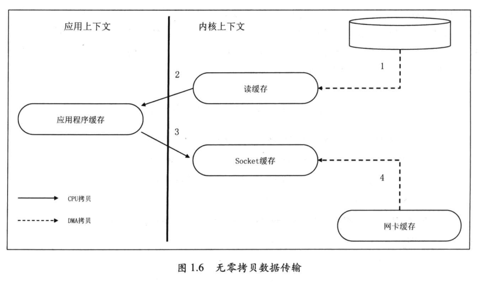
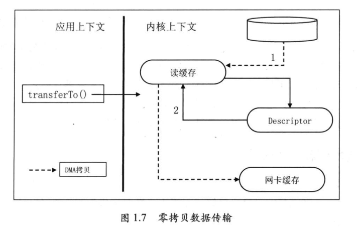
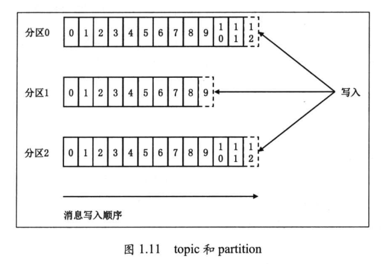
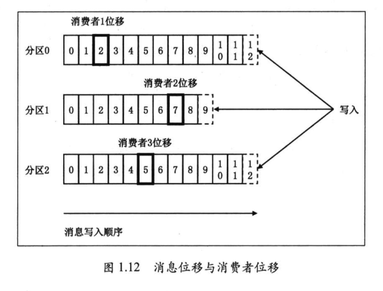
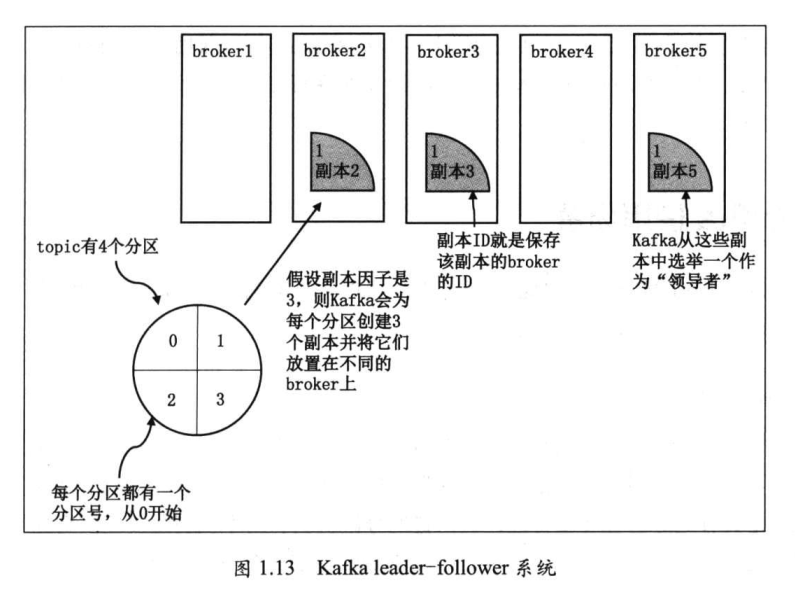

## Kafka原理

### 1 kafka优点

- 高可靠性：消息持久化；
- 高吞吐量：负载均衡、文件系统独特设计；
- 高可用性：故障转移；
- 高伸缩性：

**kafka高吞吐量、低延迟原由**

- 大量使用操作系统叶缓存，内存操作速度快且命中率高。
- kafka不直接参与物理I/O操作，交由操作系统来处理。
- kafka写入操作采用追加写入方式，避免磁盘随机读/写操作。
- 使用sendfile为代表的零拷贝技术，加强网络间数据传输效率。

### 2 零拷贝技术

### 3 topic和partition

partition上每一天消息都分配唯一的序列号，称为offset（消息offset）。

### 4 leader和follower

replica leader：负责对外提供服务。

replica follower：保持与leader数据同步，leader候补。

ISR：in-sync replica，与leader replica保持同步的replica集合。

### 5 kafka应用场景

- 消息传递
- 网站行为日志追踪
- 审计数据收集
- 日志收集

