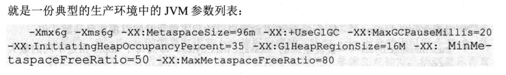

## Kafka参数

### 1 broker参数

- **broker.id**：kafka服务器唯一标识
- **log.dirs**：kafka持久化消息目录
- **zookeeper.connect**：kafka连接zookeeper
- **listeners**：broker监听器列表，格式：[协议]://[主机名]:[端口],[协议]://[主机名]:[端口]
- **unclean.leader.election.enable**：是否开启unclean leader选举，默认false
- **delete.topic.enable**：是否允许Kafka删除topic
- **log.retention.{hour|minutes|ms}**：控制消息数据保留时间
- **log.retention.bytes**：控制消息数据大小
- **min.insync.replicas**：
- **num.network.threads**：broker后台处理网络请求的线程数，默认是3
- **num.io.threads**：broker后台处理网络请求的线程数，默认是8
- **message.max.bytes**：broker接收最大消息大小，默认977KB

### 2 topic参数

- **delete.retention.ms**：定义日志保留时间，覆盖全局默认值
- **max.message.bytes**：覆盖参数message.max.bytes
- **retention.bytes**：覆盖参数log.retention.bytes

### 3 GC参数

### 4 JVM参数

-Xmx6G -Xms6G -XX:PermSize=64m -XX:MaxPermSize=128m -XX:SurvivorRatio=6 -XX:CMSInitiatingOccupancyFraction=70 -XX:+UseCMSInitiatingOccupancyOnly

### 5 OS参数

ulimit -n 100000