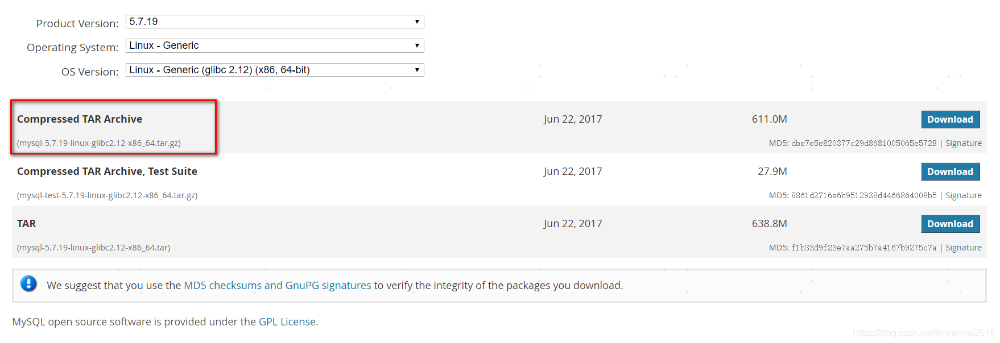

## Mysql 二进制包安装


#### 一、下载

https://downloads.mysql.com/archives/community/

mysql-5.7.19-linux-glibc2.12-x86_64.tar.gz




#### 二、安装

【1】删除旧环境

```bash
rpm -qa | grep mysql
rpm -qa | grep mariadb
rpm -e --nodeps <包名>	# 强制删除包
rm -rf /etc/my.cnf
rm -rf /etc/mysql
```

【2】安装依赖包

```bash
yum install libaio
yum install libtinfo.so.5
```

【3】解压安装

```bash
cd /opt
tar zxvf mysql-5.7.19-linux-glibc2.12-x86_64.tar.gz
mv mysql-5.7.19-linux-glibc2.12-x86_64 mysql
```

【4】创建用户和目录

```bash
groupadd mysql
useradd -r -g mysql -s /bin/false mysql
mkdir -p /opt/mysql/data
mkdir -p /opt/mysql/logs
chown -R mysql:mysql /opt/mysql
```

【5】修改配置my.cnf

```bash
vi /etc/my.cnf
```

>[mysqld]
>port=3306
>basedir=/opt/mysql
>datadir=/opt/mysql/data
>socket=/opt/mysql/data/mysql.sock
>pid-file = /opt/mysql/data/mysql.pid
>log-error = /opt/mysql/logs/error.log
>character-set-server=utf8mb4
>
>[mysql]
>default-character-set=utf8mb4
>
>[client]
>socket=/opt/mysql/data/mysql.sock

【6】初始化数据库

```bash
bin/mysqld --initialize --user=mysql --basedir=/opt/mysql --datadir=/opt/mysql/data
```

【7】 修改启动脚本

```bash
vi support-files/mysql.server
```

>basedir=/opt/mysql
>datadir=/opt/mysql/data


#### 三、启停

```bash
# 启停mysql
support-files/mysql.server start
support-files/mysql.server stop
 
# 查看进程
ps -ef|grep mysql
```


```bash
# 重置root密码，初始密码在logs/error.log
bin/mysql -uroot -p
mysql> set password = password('123456');
mysql> flush privileges;
```


