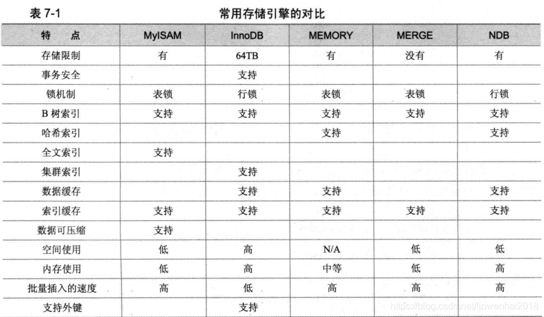

## 存储引擎


Mysql 5.5版本前默认存储引擎是MyISAM，5.5之后默认是InnoDB。


```sql
show variables like '%engine%';    -- 查看默认存储引擎
```

```
+----------------------------------+--------+
| Variable_name                    | Value  |
+----------------------------------+--------+
| default_storage_engine           | InnoDB |
| default_tmp_storage_engine       | InnoDB |
| disabled_storage_engines         |        |
| internal_tmp_disk_storage_engine | InnoDB |
+----------------------------------+--------+
```


```sql
show engines \G    -- 查看数据库支持存储引擎
```


```sql
create table test(i int(20)) engine=myisam default charset=gbk;    --创建表指定存储引擎和字符集
show create table test \G
```


#### 一、存储引擎特性




#### 二、MyISAM存储引擎

**MyISAM特点**：不支持事务、不支持外键，特点是速度快。

**使用场景**：对事物完整性没要求或以select、insert为主。

**存储文件**：

- .frm：存储表定义
- .MYD：存储数据
- .MYI：存储索引

```sql
--测试
mysql> create table emp(name varchar(10)) engine=myisam;
mysql> insert into emp values('aaa'),('bbb'),('ccc');
```

```
-rw-r----- 1 mysql mysql   65 Jan  5 16:43 db.opt
-rw-r----- 1 mysql mysql 8560 Jan  5 16:45 emp.frm
-rw-r----- 1 mysql mysql   60 Jan  5 16:46 emp.MYD
-rw-r----- 1 mysql mysql 1024 Jan  5 16:46 emp.MYI
```


#### 三、InnoDB存储引擎

**InnoDB特性**：支持事务，支持外键。

- 自动增长列
- 外键约束
- 存储方式：共享表空间存储与多表空间存储，.frm存储表定义，.ibd存储数据和索引。

```sql
-- 测试
mysql> create table emp2(name varchar(10));
mysql> insert into emp2 values('AAA'),('AAA'),('AAA');
```

```
-rw-r----- 1 mysql mysql  8560 Jan  5 17:09 emp2.frm
-rw-r----- 1 mysql mysql 98304 Jan  5 17:09 emp2.ibd
```


```sql
-- 测试，自动增长列必须是索引（主键）
create table demo(
id smallint not null auto_increment,
name varchar(10),
primary key(id)
);
 
-- 自动增长列，插入0或null值，会插入自动增加的值
insert into demo values(1,'aa'),(2,'bb'),(null,'cc');		
 
select * from demo;
```


```sql
-- 测试外键约束
create table country(
country_id smallint unsigned not null auto_increment,
country varchar(50) not null,
primary key(country_id)
);
 
-- 外键约束，从表的外键关联的必须是主表的主键，且主键和外键的数据类型必须一致
create table city(
city_id smallint unsigned not null auto_increment,
city varchar(50) not null,
country_id smallint unsigned not null,
primary key(city_id),
constraint fk_city_country
foreign key(country_id) references country(country_id)
);
 
-- 外键指定on delete restrict on update cascade
-- 如主表删除记录，如子表有对应记录，不给删除；主表更新数据，子表同步更新
create table city(
city_id smallint unsigned not null auto_increment,
city varchar(50) not null,
country_id smallint unsigned not null,
primary key(city_id),
constraint fk_city_country
foreign key(country_id) references country(country_id)
on delete restrict on update cascade
);
```


