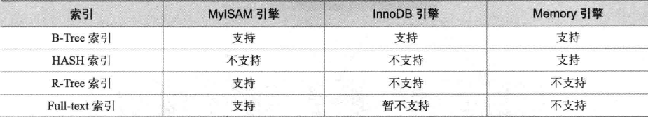

## 索引和视图


#### 一、索引




**唯一索引**：通过确保表中没有两个数据行具有完全相同的键值来帮助维护数据完整性。

MyISAM与InnoDB存储引擎的表默认创建索引是BTREE索引。


```sql
create index sal_index on emp(sal);    -- 创建索引
```


```sql
explain select * from emp where sal='10000' \G    -- 验证是否走索引
```


```sql
drop index sal_index on emp;    -- 删除索引
```


**设计索引原则**：

- 搜索的索引列，不一定是所要选择的列。（最合适索引的列是出现在where字句中的列，或连接字句中指定的列）
- 使用唯一索引。（列的基数越大，索引效果越好）
- 使用短索引。（指定前缀）
- 最左前缀。（N列索引，使用索引中最左边的列集匹配）
- 不要过度索引。
- InnoDB引擎表定义主键。


#### 二、视图

```sql
create or replace view emp_view as select ename,sal from emp;    -- 创建视图
```


```sql
show tables;    -- 查看视图定义
show create view emp_view \G
```


```sql
drop view emp_view;    -- 删除视图
```


