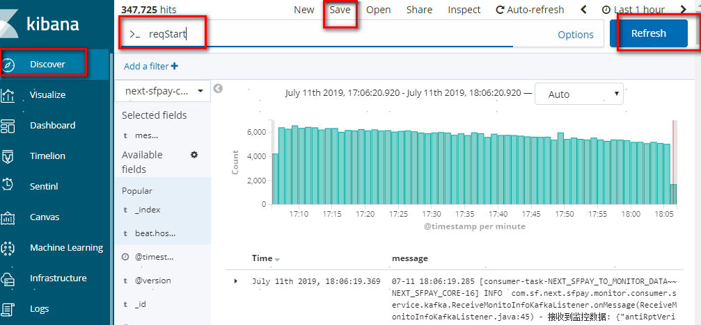
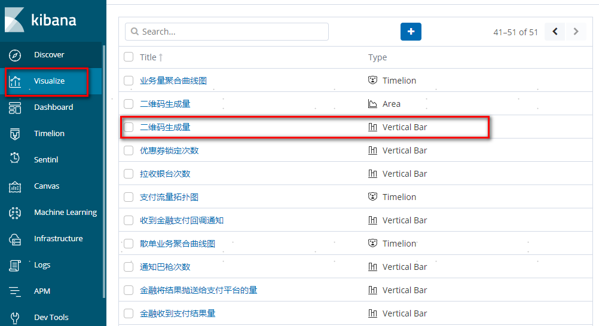

## ELK6.6环境部署

### 1 jdk环境搭建

```SHELL
cd /app
tar -zxvf jdk-8u201-linux-x64.tar.gz
ln -s jdk1.8.0_201 jdk
vi /etc/profile
```

```
----添加如下内容-----
export JAVA_HOME=/app/jdk
export JRE_HOME=${JAVA_HOME}/jre
export CLASSPATH=.:$JAVA_HOME/lib/dt.jar:$JAVA_HOME/lib/tools.jar:$JRE_HOME/lib:$CLASSPATH
export PATH=$JAVA_HOME/bin:$PATH
```

```shell
source /etc/profile
```


### 2 Elasticsearch部署

#### 2.1 OS配置

```shell
vi /etc/security/limits.conf
```

```
----添加如下内容,修改完成limits.conf，需重新登陆生效----
* 	soft 	memlock 	unlimited 
* 	hard 	memlock 	unlimited
```


```shell
vi /etc/sysctl.conf
```

```
-----添加如下内容-----
vm.max_map_count=655360
```

```shell
sysctl -p
```


#### 2.2 elasticsearch.yml文件

```shell
cd /app
tar -zxvf elasticsearch-6.6.0.tar.gz
ln -s elasticsearch-6.6.0 elasticsearch
mkdir -p /app/elasticsearch/data
cd /app/elasticsearch/config
vi elasticsearch.yml
```

```
--------添加如下内容----------
cluster.name: my-es
node.name: node-1
path.data: /app/elasticsearch/data
path.logs: /app/elasticsearch/logs
bootstrap.memory_lock: true
network.host: 10.119.97.210
http.port: 9200
discovery.zen.ping.unicast.hosts: ["10.119.97.210", "10.119.97.219","10.119.97.222"]
discovery.zen.minimum_master_nodes: 2
```

>node.name：需每个节点自定义名字
>network.host：本节点IP
>
>discovery.zen.minimum_master_nodes：N/2 + 1(向下取整)


```shell
#启动关闭集群
/app/elasticsearch/bin/elasticsearch -d
ps -ef|grep elasticsearch|awk '{print $2}'|xargs kill -9
```


#### 2.3 查看集群状态

```shell
# elasticsearch集群健康检查
curl -XGET http://10.119.97.210:9200/_cat/health?v
curl -XGET http://10.119.97.210:9200/_cluster/health?pretty

# 查询所有节点列表
curl -XGET http://10.119.97.210:9200/_cat/nodes?v

# 查询所有索引
curl -XGET http://10.119.97.210:9200/_cat/indices?v
```


#### 2.4 测试

```shell
# 新增一个log_test索引
curl -XPUT "10.119.97.210:9200/log_test?pretty"

# 删除log_test索引
curl -X DELETE "10.119.97.210:9200/log_test?pretty"

# 为log_test索引新增两条记录，指定type为article，ID为2和3
curl -XPUT -H "Content-Type: application/json" '10.119.97.210:9200/log_test/article/2?pretty' -d '
{
	"title": "test",
	"content":"testsfsdfdsfdsf",
	"PV":10
}'
curl -XPUT -H "Content-Type: application/json" '10.119.97.210:9200/log_test/article/3?pretty' -d '
{
	"title": "test",
	"content":"testsfsdfdsfdsf",
	"PV":23
}'

# 通过ID来查询
curl -XGET '10.119.97.210:9200/log_test/article/2?pretty'

# 指定具体的索引和type进行搜索
curl -XGET 'http://10.119.97.210:9200/log_test/article/_search?q=title:test'
```


#### 2.5 日志清理

```shell
vi /app/es-index-clear.sh
```

```
CLEAN_LOG="/app/clean_es_index.log"
INDEX_PRFIX="next-sfpay-core"
SERVER_PORT=10.119.97.210:9200
INDEXS=$(curl -s "${SERVER_PORT}/_cat/indices?v" |grep "${INDEX_PRFIX}"|awk '{print $3}')
DELTIME=7
SECONDS=$(date -d  "$(date  +%F) -${DELTIME} days" +%s)
if [ ! -f  "${CLEAN_LOG}" ]
then
touch "${CLEAN_LOG}"
fi
echo "----------------------------clean time is $(date +%Y-%m-%d_%H:%M:%S) ------------------------------" >>${CLEAN_LOG}
for del_index in ${INDEXS}
do
    indexDate=$( echo ${del_index##*-} )
    format_date=$(echo ${indexDate}| sed 's/\.//g')
    echo "------开始删除索引---${format_date}----" >>${CLEAN_LOG}
    #根据索引的名称的长度进行切割，不同长度的索引在这里需要进行对应的修改
    indexSecond=$(date -d ${format_date} +%s)
    if [ $(($SECONDS- $indexSecond)) -gt 0 ]
        then
        echo "${del_index}" >> ${CLEAN_LOG}
        #取出删除索引的返回结果
        delResult=`curl -s  -XDELETE "${SERVER_PORT}/"${del_index}"?pretty" |sed -n '2p'`
        #写入日志
        echo "${del_index}-----delResult is ${delResult}----clean time is $(date)-------" >>${CLEAN_LOG}
    fi
done
```


```shell
crontab -e
```

```
0 02 * * * sh /app/es-index-clear.sh > /dev/null 2>&1
```


### 3 Logstash部署

#### 3.1 logstash.conf文件

```shell
cd /app
tar -zxvf logstash-6.6.0.tar.gz
ln -s logstash-6.6.0 logstash
cd /app/logstash/config
```

```yml
input {
   beats {
   port => 10151
  }
}
 
filter {
    date {
       match => [ "timestamp", "dd/mmm/yyyy:hh:mm:ss z" ]
       target => ["datetime"]
  }
}

output {
   if [fields][logtype] == "next-sfpay-core-jdk-app-process-stdout"{
    stdout {codec => rubydebug}
    elasticsearch {
      hosts => ["10.119.97.210:9200","10.119.97.219:9200","10.119.97.222:9200"]
      index => "next-sfpay-core-jdk-app-process-stdout-%{+YYYY.MM.dd}"
    }
  }
} 
```


#### 3.2 启动/关闭

```shell
nohup /app/logstash/bin/logstash -f /app/logstash/config/logstash.conf >/dev/null 2>&1 &
ps -ef|grep logstash|awk '{print $2}'|xargs kill -9
```


### 4 Kibana部署

```shell
tar -zxvf kibana-6.6.1-linux-x86_64.tar.gz
ln -s kibana-6.6.1-linux-x86_64 kibana
cd /app/kibana/config
vi kibana.yml
```

```
--------添加如下内容--------
server.port: 80
server.host: "10.119.97.227"
elasticsearch.hosts: ["http://10.119.97.210:9200"]
```


```shell
# 启动应用
cd /app/kibana/bin
nohup ./kibana >/dev/null 2>&1 &
ps -ef|grep node
```


#### 4.1 sentinl插件安装

sentinl-v6.6.1.zip\

```shell
./kibana-plugin install file:/app/sentinl-v6.6.1.zip
```


#### 4.2 配置拓扑图

1】先配置discover搜索项






2】创建视图

```
.es(q=reqstart,index=next-sfpay-core-jdk-app-process-stdout-*).label('二维码生成'),.es(q=pullCashier,index=next-sfpay-core-jdk-app-process-stdout-*).label('拉收银台次数'),.es(q=callBack,index=next-sfpay-core-jdk-app-process-stdout-*).label('收到金融支付回调通知'),.es(q=notifyHHT,index=next-sfpay-core-jdk-app-process-stdout-*).label('通知巴枪次数')
```


3】创建面板


### 5 filebeat

vi filebeat.yml

```yml
filebeat.inputs:
- type: log
  enabled: true
  paths:
    - /app/logs/stdout*.log
  fields:
    logtype: next-sfpay-core-jdk-app-coupons-stdout
  multiline:
     pattern: ^\d{2}
     negate: true
     match: after

filebeat.config.modules:
  path: ${path.config}/modules.d/*.yml
  reload.enabled: false

setup.template.settings:
  index.number_of_shards: 3

output.logstash:
  hosts: ["10.119.99.6:10151","10.119.99.10:10151","10.119.99.12:10151"]

processors:
  - add_host_metadata: ~
  - add_cloud_metadata: ~

```


```shell
rm -rf /app/deploy/filebeat/data/registr
cd /app/deploy/filebeat/
chmod 755 filebeat
nohup ./filebeat -e -c filebeat.yml>/dev/null 2>&1 &
```


