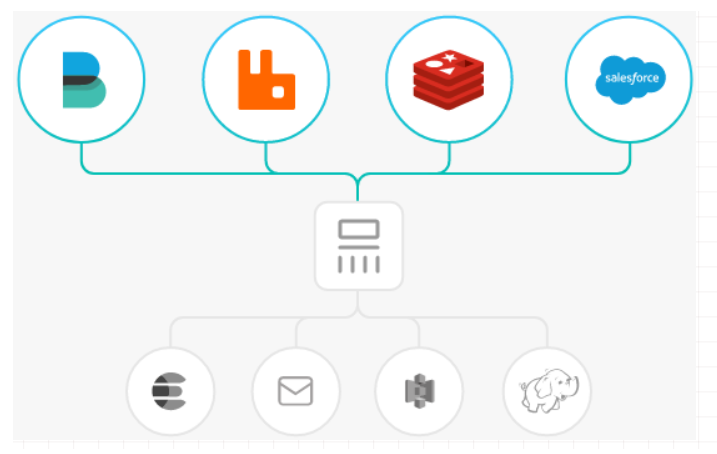
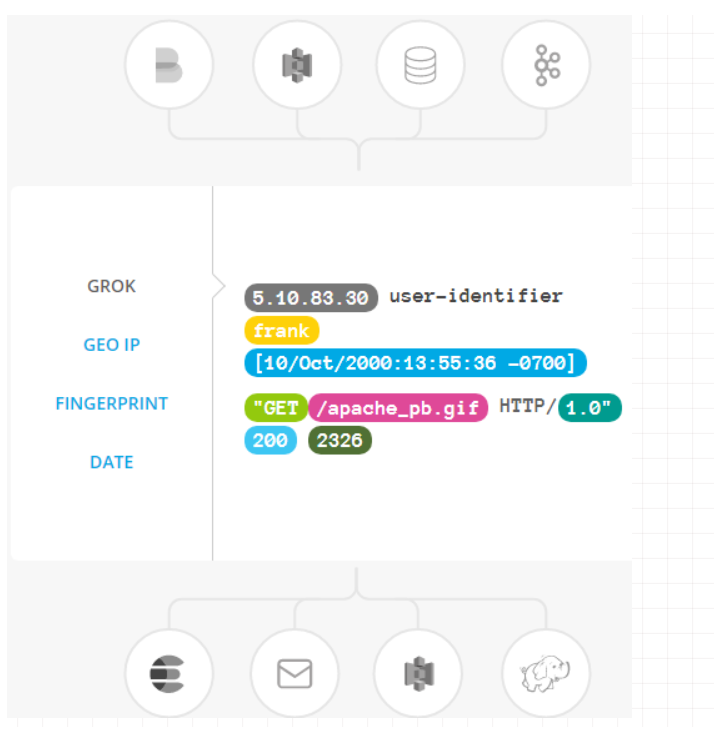
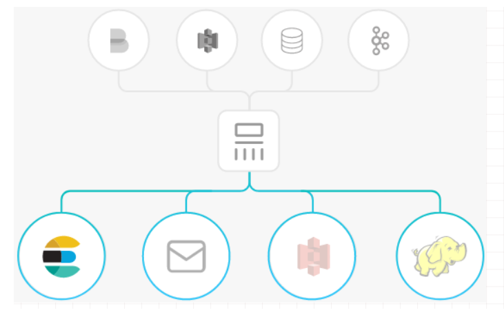
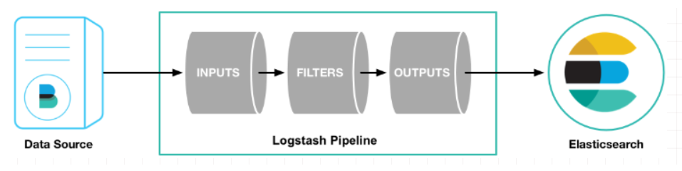
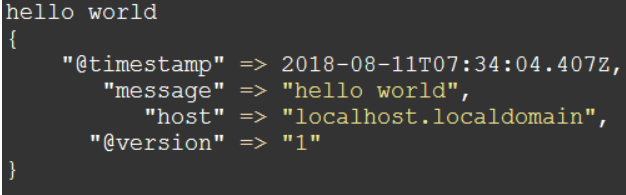
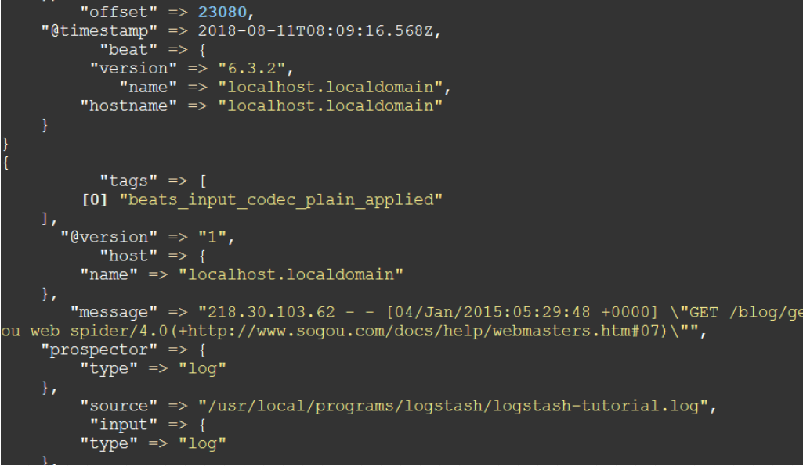
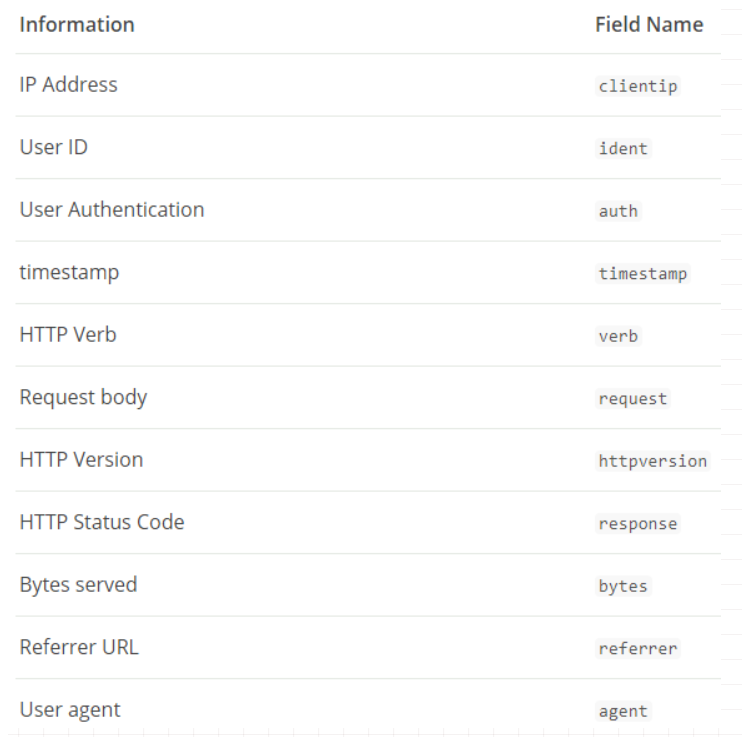
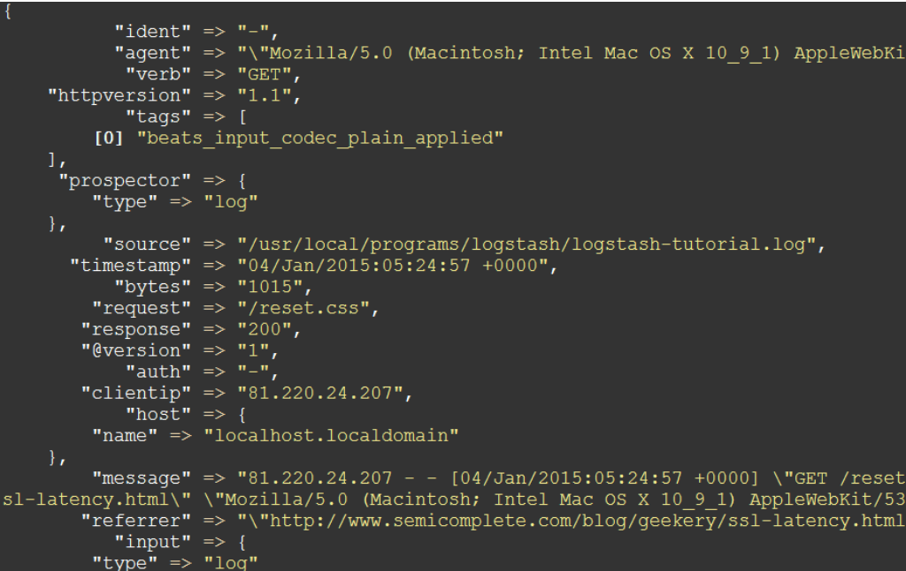

## Logstash

### 1 Logstash简介

Logstash是一个开源数据收集引擎，具有实时管道功能。Logstash可以动态地将来自不同数据源的数据统一起来，并将数据标准化到你所选择的目的地。

Logstash是一个开源的服务器端数据处理管道，可以同时从多个数据源获取数据，并对其进行转换，然后将其发送到你最喜欢的“存储”。（如Elasticsearch）

`输入`：采集各种样式、大小和来源的数据




`过滤器`：实时解析和转换数据

数据从源传输到存储库的过程中，Logstash 过滤器能够解析各个事件，识别已命名的字段以构建结构，并将它们转换成通用格式，以便更轻松、更快速地分析和实现商业价值。

Logstash 能够动态地转换和解析数据，不受格式或复杂度的影响：

- 利用 Grok 从非结构化数据中派生出结构
- 从 IP 地址破译出地理坐标
- 将 PII 数据匿名化，完全排除敏感字段
- 整体处理不受数据源、格式或架构的影响





`输出`：选择你的存储，导出你的数据

尽管 Elasticsearch 是我们的首选输出方向，能够为我们的搜索和分析带来无限可能，但它并非唯一选择。
Logstash 提供众多输出选择，您可以将数据发送到您要指定的地方，并且能够灵活地解锁众多下游用例。




### 2 安装Logstash

Logstash管道有两个必需的元素，输入和输出，以及一个可选元素过滤器。输入插件从数据源那里消费数据，过滤器插件根据你的期望修改数据，输出插件将数据写入目的地。



#### 2.1 测试Logstash

```shell
bin/logstash -e 'input { stdin {} } output { stdout {} }'
```

在命令行下输入"hello world"




### 3 用Logstash解析日志

#### 3.1 配置Filebeat来发送日志行到Logstash

Filebeat客户端是一个轻量级的、资源友好的工具，它从服务器上的文件中收集日志，并将这些日志转发到你的Logstash实例以进行处理。Filebeat设计就是为了可靠性和低延迟。Filebeat在主机上占用的资源很少，而且Beats input插件将对Logstash实例的资源需求降到最低。


#### 3.2 配置filebeat.yml

```yml
filebeat.inputs:
- type: log
  paths:
    - /usr/local/programs/logstash/logstash-tutorial.log

output.logstash:
  hosts: ["localhost:5044"]
```


#### 3.3 新建first-test.conf

```conf
input {
	beats {
		port => "5044"
	}
}

output {
	stdout { codec => rubydebug }
}
```

>beats { port => "5044" }的意思是用Beats输入插件，而stdout { codec => rubydebug }的意思是输出到控制台）


#### 3.4 启动Logstash

```shell
# 检查解析配置文件
bin/logstash -f first-test.conf --config.test_and_exit

# config.reload.automatic选项的意思是启用自动配置加载，以至于每次你修改完配置文件以后无需停止然后重启Logstash
bin/logstash -f first-test.conf --config.reload.automatic
```


#### 3.5 启动filebeat

```shell
./filebeat -e -c filebeat.yml -d "publish"
```

如果一切正常，你将会在Logstash控制台下看到类似这样的输出：




### 4 用Grok过滤器插件解析日志

grok 过滤器插件允许你将非结构化日志数据解析为结构化和可查询的数据。

%{COMBINEDAPACHELOG} grok模式




4.1 修改first-test.conf

```conf
input {
	beats {
		port => "5044"
	}
}

filter {
	grok {
		match => { "message" => "%{COMBINEDAPACHELOG}" }
	}
}

output {
	stdout { codec => rubydebug }
}
```


修改first-test.conf后，需强制Filebeat从头读取日志文件，停掉Filebeat，然后删除Filebeat注册文件。

```shell
cd /app/filebeat
rm -rf data/registry

# 重启Filebeat
./filebeat -e -c filebeat.yml -d "publish"
```


再看Logstash控制台，输出可能是这样的:




### 5 用 Geoip 过滤器插件增强你的数据

5.1 修改first-test.conf

```conf
input {
	beats {
		port => "5044"
	}
}

filter {
	grok {
		match => { "message" => "%{COMBINEDAPACHELOG}" }
	}
	geoip {
		source => "clientip"
	}
}

output {
	stdout { codec => rubydebug }
}
```


### 6 索引你的数据到Elasticsearch

6.1 修改first-test.conf

```conf
input {
	beats {
		port => "5044"
	}
}

filter {
	grok {
		match => { "message" => "%{COMBINEDAPACHELOG}" }
	}
	geoip {
		source => "clientip"
	}
}

output {
	elasticsearch {
		hosts => { "localhost:9200" }
	}
}
```


6.2 查看Elasticsearch的索引

```shell
# 重启filebeat后
curl 'localhost:9200/_cat/indices?v'
```

可以看到有一个名字叫"logstash-2018.08.11"的索引


```shell
# 查看这个索引下的文档
curl -X GET 'localhost:9200/logstash-2018.08.11/_search?pretty&q=response=200'
```


```shell
curl -XGET 'localhost:9200/logstash-2018.08.11/_search?pretty&q=geoip.city_name=Buffalo'
```


