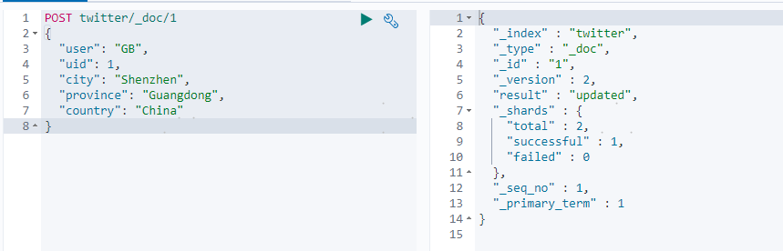
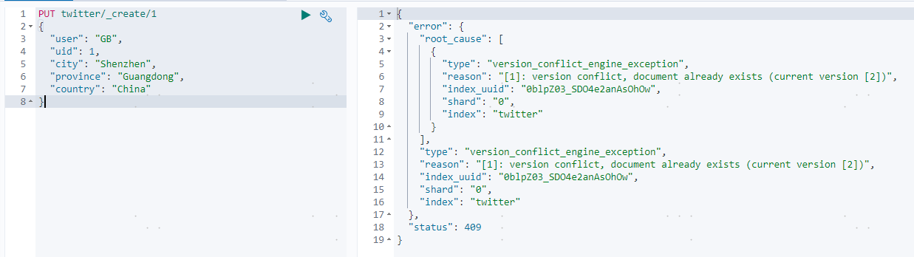
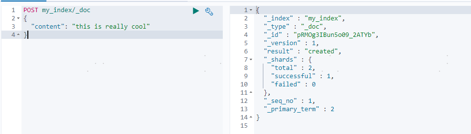
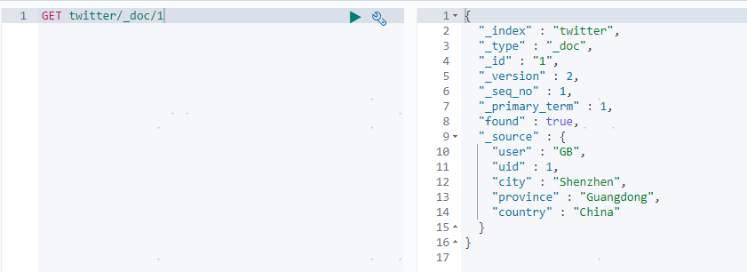
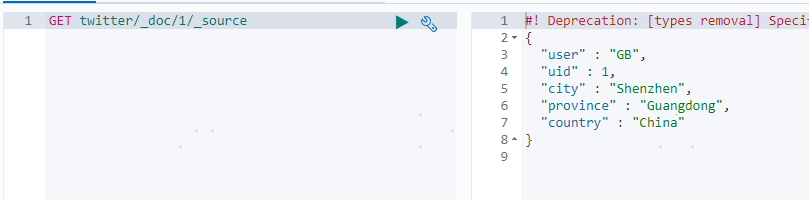

## Elasticsearch CRUD

CRUD：增加（**C**reate），查询（**R**ead)，更新（**U**pdate）及删除（**D**elete）


### 1 索引文档

```shell
#指定ID索引文档，如索引不存在，自动创建
PUT twitter/_doc/1
{
  "user": "GB",
  "uid": 1,
  "city": "Beijing",
  "province": "Beijing",
  "country": "China"
}
```

执行结果：


```shell
#更新文档，version会增加
POST twitter/_doc/1
{
  "user": "GB",
  "uid": 1,
  "city": "Shenzhen",
  "province": "Guangdong",
  "country": "China"
}
```

执行结果：




```shell
#使用_create接口索引文档，如ID存在会报错
PUT twitter/_create/1
{
  "user": "GB",
  "uid": 1,
  "city": "Shenzhen",
  "province": "Guangdong",
  "country": "China"
}
```

执行结果：




```shell
#自动创建id
POST my_index/_doc
{
  "content": "this is really cool"
}
```

执行结果：




### 2 获取文档

```shell
GET twitter/_doc/1
```

执行结果：




```shell
#只获取文档的_source部分
GET twitter/_doc/1/_source
```

执行结果：




```shell
#_mget接口，一次请求查找多个文档
GET _mget
{
  "docs": [
    {
      "_index": "twitter",
      "_id": 1
    },
    {
      "_index": "twitter",
      "_id": 2
    }
  ]
}
```

执行结果：


### 3 更新文档

```shell
#
PUT twitter/_doc/1
{
   "user": "GB",
   "uid": 1,
   "city": "北京",
   "province": "北京",
   "country": "中国",
   "location":{
     "lat":"29.084661",
     "lon":"111.335210"
   }
}
```


