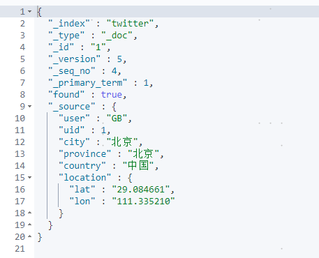
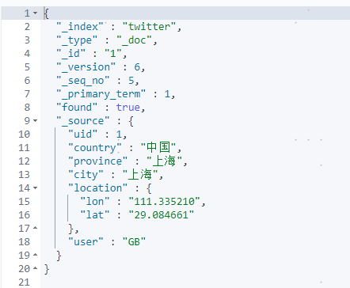
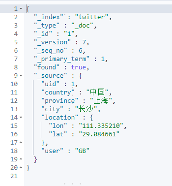
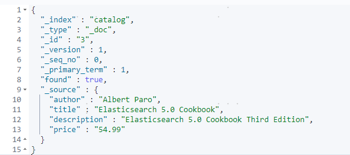

## Elasticsearch CRUD

CRUD：增加（**C**reate），查询（**R**ead)，更新（**U**pdate）及删除（**D**elete）


### 1 索引文档

```shell
#指定ID索引文档，如索引不存在，自动创建
PUT twitter/_doc/1
{
  "user": "GB",
  "uid": 1,
  "city": "Beijing",
  "province": "Beijing",
  "country": "China"
}
```

执行结果：


```shell
#更新文档，version会增加
POST twitter/_doc/1
{
  "user": "GB",
  "uid": 1,
  "city": "Shenzhen",
  "province": "Guangdong",
  "country": "China"
}
```

执行结果：


```shell
#使用_create接口索引文档，如ID存在会报错
PUT twitter/_create/1
{
  "user": "GB",
  "uid": 1,
  "city": "Shenzhen",
  "province": "Guangdong",
  "country": "China"
}
```

执行结果：


```shell
#自动创建id
POST my_index/_doc
{
  "content": "this is really cool"
}
```

执行结果：


### 2 获取文档

```shell
GET twitter/_doc/1
```

执行结果：


```shell
#只获取文档的_source部分
GET twitter/_doc/1/_source
```

执行结果：


```shell
#_mget接口，一次请求查找多个文档
GET _mget
{
  "docs": [
    {
      "_index": "twitter",
      "_id": 1
    },
    {
      "_index": "twitter",
      "_id": 2
    }
  ]
}
```

执行结果：


### 3 更新文档

```shell
#指定一个特定的id来进行修改
PUT twitter/_doc/1
{
   "user": "GB",
   "uid": 1,
   "city": "北京",
   "province": "北京",
   "country": "中国",
   "location":{
     "lat":"29.084661",
     "lon":"111.335210"
   }
}
```




```shell
#通过查询更新文档
POST twitter/_update_by_query
{
  "query": {
    "match": {
      "user": "GB"
    }
  },
  "script": {
    "source": "ctx._source.city = params.city;ctx._source.province = params.province;ctx._source.country = params.country",
    "lang": "painless",
    "params": {
      "city": "上海",
      "province": "上海",
      "country": "中国"
    }
  }
}
```




```shell
#_update更新文档
POST twitter/_update/1
{
  "script" : {
      "source": "ctx._source.city=params.city",
      "lang": "painless",
      "params": {
        "city": "长沙"
      }
  }
}
```




```shell
#doc_as_upsert参数检查具有给定ID的文档是否已经存在，并将提供的doc与现有文档合并。
POST /catalog/_update/3
{
     "doc": {
       "author": "Albert Paro",
       "title": "Elasticsearch 5.0 Cookbook",
       "description": "Elasticsearch 5.0 Cookbook Third Edition",
       "price": "54.99"
      },
     "doc_as_upsert": true
}
```




### 4 检查文档

```shell
#检查一个文档是否存在
HEAD twitter/_doc/1
```


### 5 删除文档

```shell
DELETE twitter/_doc/1
```


```shell
#通过查询删除文档
POST twitter/_delete_by_query
{
  "query": {
    "match": {
      "city": "上海"
    }
  }
}
```


```shell
#统计索引文档数量
GET twitter/_count
```


### 6 删除索引

```shell
DELETE twitter
```


### 7 批处理

```shell
#_index接口创建文档，如ID存在，覆盖
POST _bulk
{ "index" : { "_index" : "twitter", "_id": 1} }
{"user":"双榆树-张三","message":"今儿天气不错啊，出去转转去","uid":2,"age":20,"city":"北京","province":"北京","country":"中国","address":"中国北京市海淀区","location":{"lat":"39.970718","lon":"116.325747"}}
{ "index" : { "_index" : "twitter", "_id": 2 }}
{"user":"东城区-老刘","message":"出发，下一站云南！","uid":3,"age":30,"city":"北京","province":"北京","country":"中国","address":"中国北京市东城区台基厂三条3号","location":{"lat":"39.904313","lon":"116.412754"}}
{ "index" : { "_index" : "twitter", "_id": 3} }
{"user":"东城区-李四","message":"happy birthday!","uid":4,"age":30,"city":"北京","province":"北京","country":"中国","address":"中国北京市东城区","location":{"lat":"39.893801","lon":"116.408986"}}
{ "index" : { "_index" : "twitter", "_id": 4} }
{"user":"朝阳区-老贾","message":"123,gogogo","uid":5,"age":35,"city":"北京","province":"北京","country":"中国","address":"中国北京市朝阳区建国门","location":{"lat":"39.718256","lon":"116.367910"}}
{ "index" : { "_index" : "twitter", "_id": 5} }
{"user":"朝阳区-老王","message":"Happy BirthDay My Friend!","uid":6,"age":50,"city":"北京","province":"北京","country":"中国","address":"中国北京市朝阳区国贸","location":{"lat":"39.918256","lon":"116.467910"}}
{ "index" : { "_index" : "twitter", "_id": 6} }
{"user":"虹桥-老吴","message":"好友来了都今天我生日，好友来了,什么 birthday happy 就成!","uid":7,"age":90,"city":"上海","province":"上海","country":"中国","address":"中国上海市闵行区","location":{"lat":"31.175927","lon":"121.383328"}}
```


```shell
#_create接口创建文档,如ID存在，报错
POST _bulk
{ "create" : { "_index" : "twitter", "_id": 1} }
{"user":"双榆树-张三","message":"今儿天气不错啊，出去转转去","uid":2,"age":20,"city":"北京","province":"北京","country":"中国","address":"中国北京市海淀区","location":{"lat":"39.970718","lon":"116.325747"}}
{ "index" : { "_index" : "twitter", "_id": 2 }}
{"user":"东城区-老刘","message":"出发，下一站云南！","uid":3,"age":30,"city":"北京","province":"北京","country":"中国","address":"中国北京市东城区台基厂三条3号","location":{"lat":"39.904313","lon":"116.412754"}}
```


```shell
#批量删除文档
POST _bulk
{ "delete" : { "_index" : "twitter", "_id": 1 }}
```


```shell
POST _bulk
{ "update" : { "_index" : "twitter", "_id": 2 }}
{"doc": { "city": "长沙"}}
```


