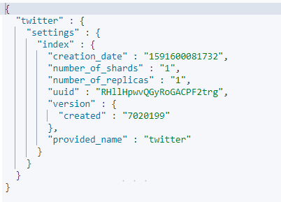
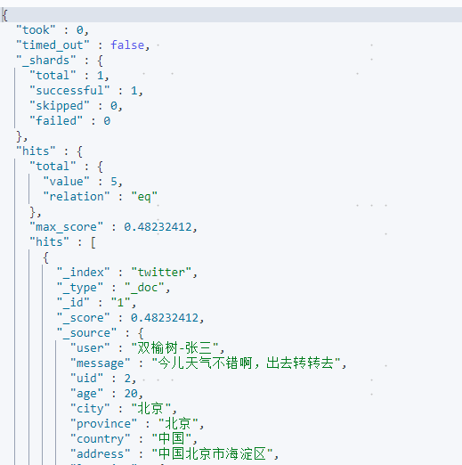

Elasticsearch中的两类搜索：

- queries：进行全文搜索
- aggregations：对数据进行统计及分析


```shell
#没有指定任何index，默认的返回个数是10个,可指定
GET /_search
GET /_search?size=20
```


```shell
#对多个index进行搜索
POST /index1,index2,index3/_search
```


```shell
#对所有以index为开头的索引来进行搜索，但是排除index3索引
POST /index*,-index3/_search
```


```shell
#指定index，指定显示size文档数量
GET twitter/_search
GET twitter/_search?size=2
```

```shell
GET twitter/_search
{
  "size": 2,
  "from": 2, 
  "query": {
    "match_all": {}
  }
}
```


```shell
#filter_path来控制输出的较少的字段
GET twitter/_search?filter_path=hits.total
```


```shell
#通过_source来定义返回想要的字段
GET twitter/_search
{
  "_source": ["user", "city"],
  "query": {
    "match_all": {
    }
  }
}
```


```shell
#统计索引文档数量
GET twitter/_count
```


```shell
#统计索引文档数量，指定查询条件
GET twitter/_count
{
  "query": {
    "match": {
      "city": "北京"
    }
  }
}
```


```shell
#查询索引_settings
GET twitter/_settings
```




```shell
#创建索引，指定配置，
PUT test1
{
  "settings": {
    "number_of_shards": 1,
    "number_of_replicas": 1
  }
}
```


```shell
#查看索引mapping
GET twitter/_mapping
```


```shell
#查询数据 match query
GET twitter/_search
{
  "query": {
    "match": {
      "city": "北京"
    }
  }
}
```

```shell
GET twitter/_search?q=city:"北京"
```




```shell
#排查score
GET twitter/_search
{
  "query": {
    "bool": {
      "filter": {
        "term": {
          "city.keyword": "北京"
        }
      }
    }
  }
}
```


