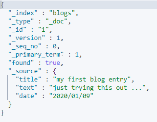
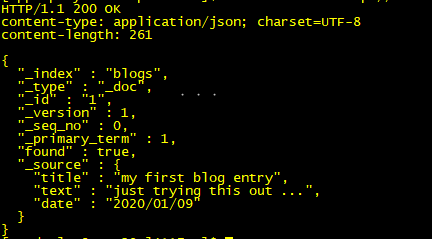

在Elasticsearch中存储数据的行为就叫做索引(indexing)。


### 1 索引文档

JSON文档

```yml
PUT /megacorp/_doc/1
{
  "first_name" : "John",
  "last_name" : "Smith",
  "age" : 25,
  "about" : "I love to go rock climbing",
  "interests": [ "sports", "music" ]
}
```

>megacorp：索引名
>_doc：默认类型
>1：员工ID


### 2 搜索文档

```shell
curl -XGET "http://10.110.39.241:9200/megacorp/_doc/1"
GET /megacorp/_doc/1
```


```yml
# 搜索索引megacorp的ID等于1的文档
GET /megacorp/_doc/1

# 搜索索引megacorp的所有文档
GET /megacorp/_search

# 搜索索引megacorp的员工last_name为Smith文档
GET /megacorp/_search?q=last_name:Smith
```


```yml
# 搜索索引megacorp的员工last_name为Smith文档（DSL查询）
GET /megacorp/_search
{
  "query": {
    "match": {
      "last_name": "Smith"
    }
  }
}
```


```yml
# bool/must/filter搜索
GET /megacorp/_search
{
  "query" : {
      "bool" : {
          "filter" : {
              "range" : {
                "age" : { "gt" : 30 }
              }
          },
          "must" : {
              "match" : {
                "last_name" : "smith"
              }
          }
      }
  }
}
```


```yml
# 全文搜索
GET /megacorp/_search
{
  "query":{
    "match": {
      "about": "rock climbing"
    }
  }
}
```


```yml
# 短语搜索
GET /megacorp/_search
{
  "query":{
    "match_phrase": {
      "about": "rock climbing"
    }
  }
}
```


```yml
# 高亮搜索匹配到的关键字
GET /megacorp/_search
{
  "query":{
    "match_phrase": {
      "about": "rock climbing"
    }
  }
  , "highlight": {
    "fields": {
      "about": {}
    }
  }
}
```


#### 1】集群健康

```yml
# 集群健康
GET /_cluster/health
```

>green ：所有主要分片和复制分片都可用。
>yellow ：所有主要分片可用，但不是所有复制分片都可用。
>red ：不是所有的主要分片都可用。


#### 2】创建索引

```yml
# 创建索引，指定分片和副本
PUT /blogs
{
  "settings": {
    "number_of_shards": 3
    , "number_of_replicas": 1
  }
}
```


```yml
# 调整索引副本数量
PUT /blogs/_settings
{
  "number_of_replicas": 2
}
```


Elasticsearch是一个分布式的文档(document)存储引擎

文档的三个核心元数据：

- _index：索引名，文档存储地方
- _type：文档代表的对象的类
- _id：文档的唯一标识


#### 3】索引文档

```yml
PUT /blogs/_doc/1
{
  "title": "my first blog entry",
  "text": "just trying this out ...",
  "date": "2020/01/09"
}
```


#### 4】自增ID

```yml
POST /blogs/_doc/
{
  "title":"my first blog entry",
  "text":"just trying this out ...",
  "date":"2020/01/09"
}
```


#### 5】搜索文档

```yml
GET /blogs/_doc/1?pretty
```

>在任意的查询字符串中增加 pretty 参数，会让Elasticsearch美化输出JSON响应以便更加容易阅读。 
>GET请求返回的响应内容包括 {"found": true} 。这意味着文档已经找到。




```shell
curl -i -XGET http://10.110.39.241:9200/blogs/_doc/1?pretty
```




#### 6】检索文档的一部分

```sh
GET /blogs/_doc/1?_source=title,text
```


```sh
GET /blogs/_doc/1/_source
```


#### 7】检查文档是否存在

```sh
curl -i -XHEAD http://10.110.39.241:9200/blogs/_doc/1
```


