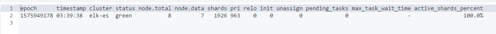
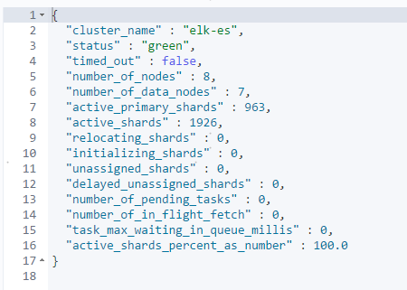

## Elasticsearch7.2.1环境搭建

### 1 环境

OS：CentOS Linux release 7.2

ES：elasticsearch-7.2.1-linux-x86_64.tar.gz

Nodes：

10.203.197.48

10.203.197.43

10.203.197.113


### 2 OS配置

```shell
ulimit -n
vi /etc/security/limits.conf
```

```
-----------添加如下内容---------------
*	soft    nproc   65535
*	hard    nproc   65535
*	soft    nofile  65535
*	hard    nofile  65535

* soft memlock unlimited
* hard memlock unlimited
```


```shell
vi /etc/sysctl.conf
```

```
-----------添加如下内容---------------
vm.max_map_count=262144
```

```shell
sysctl -p
```


### 3 JVM设置

/app/elasticsearch/config/jvm.options

```
-Xms2g
-Xmx2g
```


### 4 集群配置

/app/elasticsearch/config/elasticsearch.yml

1】节点10.203.197.48

```yml
cluster.name: cluster-test
node.name: node-1
path.data: /app/elasticsearch/data
path.logs: /app/elasticsearch/logs
bootstrap.memory_lock: true
network.host: 10.203.197.48
http.port: 9200
discovery.seed_hosts: ["10.203.197.48", "10.203.197.43", "10.203.197.113"]
cluster.initial_master_nodes: ["node-1", "node-2", "node-3"]
```

2】节点10.203.197.43

```yml
cluster.name: cluster-test
node.name: node-2
path.data: /app/elasticsearch/data
path.logs: /app/elasticsearch/logs
bootstrap.memory_lock: true
network.host: 10.203.197.43
http.port: 9200
discovery.seed_hosts: ["10.203.197.48", "10.203.197.43", "10.203.197.113"]
cluster.initial_master_nodes: ["node-1"]
```

3】节点10.203.197.113

```yml
cluster.name: cluster-test
node.name: node-3
path.data: /app/elasticsearch/data
path.logs: /app/elasticsearch/logs
bootstrap.memory_lock: true
network.host: 10.203.197.113
http.port: 9200
discovery.seed_hosts: ["10.203.197.48", "10.203.197.43", "10.203.197.113"]
cluster.initial_master_nodes: ["node-1"]
```


grep -v '#' elasticsearch.yml|grep -v ^$


### 6 Secure设置

#### 1】生成证书

```shell
bin/elasticsearch-certutil cert -out config/elastic-certificates.p12 -pass ""
```


#### 2】配置 TLS

config/elasticsearch.yml

```yml
# 配置TLS
xpack.security.enabled: true
xpack.security.transport.ssl.enabled: true
xpack.security.transport.ssl.verification_mode: certificate
xpack.security.transport.ssl.keystore.path: elastic-certificates.p12
xpack.security.transport.ssl.truststore.path: elastic-certificates.p12
```


### 7 启动ES

```shell
# 启动
/app/elasticsearch/bin/elasticsearch -d
 
# 关闭
ps -ef|grep elasticsearch|awk '{print $2}'|xargs kill -9
```


### 8 设置ES集群密码

```shell
bin/elasticsearch-setup-passwords auto
```

auto - 随机生成密码。
interactive - 自定义不同用户的密码


### 9 在其他ES节点上配置TLS

将主节点的配置目录conf完全复制到节点的配置目录中。

注意：修改 elasticsearch.yml配置文件

```yml
node.name: node-1
network.host: 10.203.197.48
```


### 10 集群状态

```shell
curl -XGET http://10.203.197.48:9200/_cat/health?v
```




```shell
curl -XGET http://10.203.197.48:9200/_cluster/health
```




### 11 删除索引

```shell
vi delete_es_index.sh
```

```shell
#/bin/bash
# es-index-clear
LAST_DATA=`date -d "-8 days" "+%Y.%m.%d"`
curl -XDELETE 'http://192.168.1.31:9200/*-'${LAST_DATA}'*'
```


