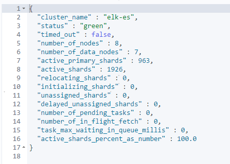
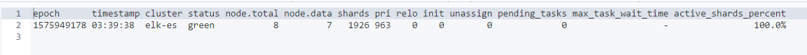

## Elasticsearch7.2.1环境搭建

### 1 环境

OS：CentOS release 6.9

ES：elasticsearch-7.2.1-linux-x86_64.tar.gz

Nodes：192.168.1.31, 192.168.1.32, 192.168.1.33


### 2 OS配置

```shell
ulimit -n
vi /etc/security/limits.conf
```

```
-----------添加如下内容---------------
*	soft    nproc   65535
*	hard    nproc   65535
*	soft    nofile  65535
*	hard    nofile  65535
```


```shell
vi /etc/sysctl.conf
```

```
-----------添加如下内容---------------
vm.max_map_count=262144
```

```shell
sysctl -p
```


### 3 elasticsearch.yml配置文件

```shell
vi /app/elasticsearch/config/elasticsearch.yml
```

1】节点192.168.1.31

```yml
cluster.name: elk-es
node.name: node-01
network.host: 192.168.1.31
discovery.seed_hosts: ["192.168.1.31", "192.168.1.32", "192.168.1.33"]
cluster.initial_master_nodes: ["node-01","node-02","node-03"]
bootstrap.system_call_filter: false
```

2】节点192.168.1.32

```yml
cluster.name: elk-es
node.name: node-02
network.host: 192.168.1.32
discovery.seed_hosts: ["192.168.1.31", "192.168.1.32", "192.168.1.33"]
cluster.initial_master_nodes: ["node-01","node-02","node-03"]
bootstrap.system_call_filter: false
```

3】节点192.168.1.33

```yml
cluster.name: elk-es
node.name: node-03
network.host: 192.168.1.33
discovery.seed_hosts: ["192.168.1.31", "192.168.1.32", "192.168.1.33"]
cluster.initial_master_nodes: ["node-01","node-02","node-03"]
bootstrap.system_call_filter: false
```


### 4 jvm.options配置文件

```shell
vi /app/elasticsearch/config/jvm.options
```

```
--------调整JVM---------------
-Xms30g 
-Xmx30g
```


### 5 JDK环境

```shell
vi vi /app/elasticsearch/bin/elasticsearch
```

```
-------------添加内容-----------
export JAVA_HOME=/app/elasticsearch/jdk
export PATH=$JAVA_HOME/bin:$PATH
```


### 6 启动关闭

```shell
cd /app/elasticsearch/bin
 
# 启动
./elasticsearch -d
 
# 关闭
ps -ef|grep elasticsearch|awk '{print $2}'|xargs kill -9
```


### 7 集群状态

```shell
curl -XGET "http://10.110.39.241:9200/_cluster/health"
```




```shell
curl -XGET "http://10.110.39.241:9200/_cat/health?v"
```




### 8 删除索引

```shell
vi delete_es_index.sh
```

```shell
#/bin/bash
# es-index-clear
LAST_DATA=`date -d "-8 days" "+%Y.%m.%d"`
curl -XDELETE 'http://192.168.1.31:9200/*-'${LAST_DATA}'*'
```


