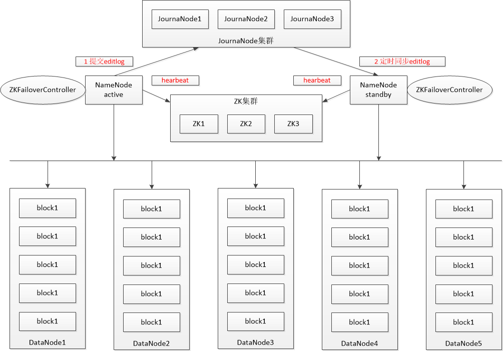

## HDFS

#### 1 基础概念

**Block**： 在HDFS中，每个文件都是采用的分块的方式存储，每个block放在不同的datanode上，每个block的标识是一个三元组（block id， numBytes，generationStamp），其中block id是具有唯一性，具体分配是由namenode节点设置，然后再由datanode上建立block文件，同时建立对应block meta文件。
**Packet**：在DFSclient与DataNode之间通信的过程中，发送和接受数据过程都是以一个packet为基础的方式进行。
**Chunk**：中文名字也可以称为块，但是为了与block区分，还是称之为chunk。在DFSClient与DataNode之间通信的过程中，由于文件采用的是基于块的方式来进行的，但是在发送数据的过程中是以packet的方式来进行的，每个packet包含了多个chunk，同时对于每个chunk进行checksum计算，生成checksum bytes。


```
1 一个文件被拆成多个block持续化存储（block size由配置文件参数决定）
2 数据通讯过程中一个block被拆成多个packet。
3 一个packet包含多个chunk。
4 一个Packet数据包由Header和Data两部分组成。
```


**NameNode**：Master节点（也称元数据节点），是系统唯一的管理者。负责元数据的管理(名称空间和数据块映射信息);配置副本策略；处理客户端请求。
**DataNode**：数据存储节点(也称Slave节点)，存储实际的数据；执行数据块的读写；汇报存储信息给NameNode。
**Sencondary NameNode**：分担namenode的工作量；是NameNode的冷备份；合并fsimage和fsedits然后再发给namenode。注意：在hadoop 2.x 版本，当启用 hdfs ha 时，将没有这一角色。
**client**：系统使用者，调用HDFS API操作文件;与NameNode交互获取文件元数据;与DataNode交互进行数据读写。注意：写数据时文件切分由Client完成 。
**热备份**：b是a的热备份，如果a坏掉。那么b立即运行代替a的工作。
**冷备份**：b是a的冷备份，如果a坏掉。那么b不能立即代替a工作。但是b上存储a的一些信息，减少a坏掉之后的损失。


#### 2 HDFS架构

```
1 元数据与数据分离：文件本身的属性（即元数据）与文件所持有的数据分离。
2 主/从架构：一个HDFS集群是由一个NameNode和一定数目的DataNode组成。
3 一次写入多次读取：HDFS中的文件在任何时间只能有一个Writer。当文件被创建，接着写入数据，最后，一旦文件被关闭，就不能再修改。
4 移动计算比移动数据更划算：数据运算，越靠近数据，执行运算的性能就越好，由于hdfs数据分布在不同机器上，要让网络的消耗最低，并提高系统的吞吐量，最佳方式是将运算的执行移到离它要处理的数据更近的地方，而不是移动数据。
```


**1】HDFS架构**




```
Secondary NameNode定期合并fsimage和edits日志，过程如下：
1 namenode响应 econdary namenode请求，将edit log推送给Secondary namenode，开始重新写一个新的edit log
2 Secondary namenode收到来自namenode 的 fsimage 文件和 edit log
3 Secondary namenode将fsimage加载到内存，应用edit log，并生成一 个新的fsimage文件
4 Secondary namenode将新的fsimage推送给Namenode
5 Namenode 用新的fsimage取代旧的fsimage，在fstime文件中记下检查点发生的时间
在Hadoop2.X中，这个动作是由Standby NameNode来完成
```


#### 3 HDFS读操作

```
F1: Client调用FileSyste对象（DistributedFileSystem的一个实例）的open()方法；
F2: DistributedFileSystem通过RPC调用namenode，以确定文件起始块位置；
F3: namenode返回块对应的datanode地址（包含块副本的datanode地址），datanode地址排列优先顺序,封装成DFSInputStream对象；
F4: Client调用DFSInputStream的read()方法；
F5: DFSInputStream连接第1个块对应最优的datanode；
F6: 反复调用read()方法，将数据返回给Client；
F7: 到达块的末端时，DFSInputStream关闭与该datanode连接；
F8: DFSInputStream连接第2个块的最优的datanode（后续操作类似）；
F9: 直到所有块数据返回给Client， Client调用DFSInputStream的close()方法；
```


#### 4 HDFS写操作

```
F1: Client通过对DistributedFileSystem对象调用create()创建文件,初始化DataStreamer；
F2: DistributedFileSystem对namenode创建RPC调用，在文件系统新建一个文件，该文件暂无数据块；
F3: DistributedFileSystem返回FSDataOutputStream对象，Client开始写入数据；
F4: FSDataOutputStream对象封装一个DFSOutputStream对象，负责datanode和namenode通信；
F5: DFSOutputStream将Client写入数据分割成数据包(packet)，写入数据队列（data queue）；
F6: DataStreamer选择合适的一组datanode，请求namenode分配新的数据块；
F7: DataStreamer将数据队列的packet流式发送到第1个datanode；
F8: 第1个datanode存储该packet，并发送给第2个datanode；
F9: 第2个datanode存储该packet，并发送给第3个datanode；
F10: DFSOutputStream收到管道中所有datanode确认信息(ack queue)，数据队列删除该packet；
F11: Client写入完数据，调用FSDataOutputStream的close()方法；
```


#### 5 HDFS配置文件参数

```
fs.defaultFS		--设置Hadoop默认文件系统
dfs.replication		--文件副本数，默认为3
```


#### 6 HDFS中常用到的命令

```shell
hadoop fs
hadoop fs -ls /
hadoop fs -lsr
hadoop fs -mkdir /user/hadoop
hadoop fs -put a.txt /user/hadoop/
hadoop fs -get /user/hadoop/a.txt /
hadoop fs -cp src dst
hadoop fs -mv src dst
hadoop fs -cat /user/hadoop/a.txt
hadoop fs -rm /user/hadoop/a.txt
hadoop fs -rmr /user/hadoop/a.txt
hadoop fs -text /user/hadoop/a.txt

# 上传文件到HDFS（绝对路径）
hadoop fs -copyFromLocal /app/input/01.txt hdfs://localhost/user/lin/01.txt
# 上传文件到HDFS（相对路径）
hadoop fs -copyFromLocal /app/input/01.txt /user/lin/01.txt
# 下载HDFS文件到本地
hadoop fs -copyToLocal /user/lin/01.txt /tmp/01.txt

hadoop distcp file1 file2		#复制文件
hadoop distcp dir1 fir2			#复制目录

# 复制namenode1集群的foo到namenode2集群，2集群版本兼容
hadoop distcp -update -delete -p hdfs://namenode1/foo hdfs://namenode2/foo
# 复制namenode1集群的foo到namenode2集群，2集群版本不兼容
hadoop distcp webhdfs://namenode1:50070/foo webhdfs://namenode2:50070/foo
```


#### 7 日常维护问题

```
1 Zookeeper过于敏感：Hadoop的配置项中Zookeeper的sessiontimeout的配置参数ha.zookeeper.session-timeout.ms的默认值为5000，也就是5s，这个值比较小，会导致Zookeeper比较敏感，可以把这个值尽量设置得大一些，避免因为网络抖动等原因引起NameNode进行无谓的主备切换。

2 单台JouranlNode故障时会导致主备无法切换：在理论上，如果有3台或者更多的JournalNode，那么挂掉一台JouranlNode应该仍然可以进行正常的主备切换。但是笔者在某次NameNode重启的时候，正好赶上一台JournalNode挂掉宕机了，这个时候虽然某一台NameNode通过Zookeeper选主成功，但是这台被选为主的NameNode无法成功地从Standby状态切换为Active状态。事后追查原因发现，被选为主的NameNode卡在退出Standby状态的最后一步，这个时候它需要等待到JournalNode的请求全部完成之后才能退出。但是由于有一台JouranlNode宕机，到这台JournalNode的请求都积压在一起并且在不断地进行重试，同时在Hadoop的配置项中重试次数的默认值非常大，所以就会导致被选为主的NameNode无法及时退出Standby状态。这个问题主要是Hadoop内部的RPC通信框架的设计缺陷引起的，HadoopHA的源代码IPCLoggerChannel类中有关于这个问题的TODO，但是截止到社区发布的2.7.1版本这个问题仍然存在。
```


