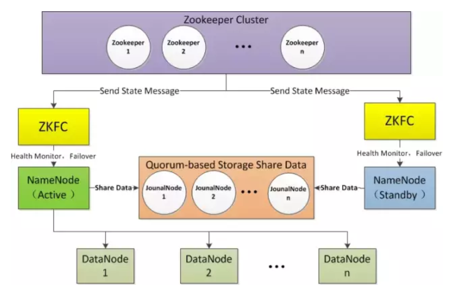
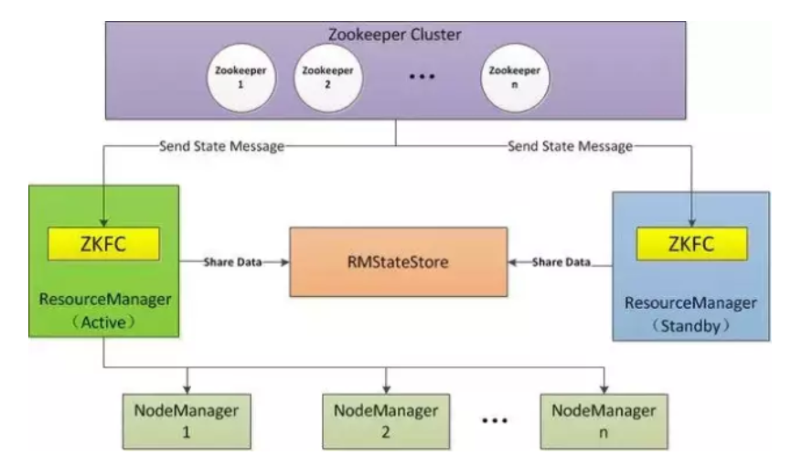
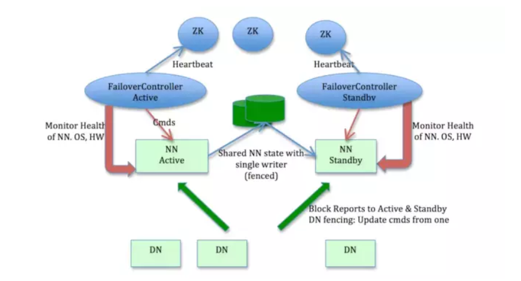

## Hadoop HA

### 1.Hadoop HA简介及工作原理

Hadoop NameNode官方开始支持HA集群默认是从2.0开始，之前的版本均是不支持NameNode HA的高可用的。

#### 1.1 Hadoop HA简介

##### Hadoop-HA集群运作机制介绍

- HA即高可用（7*24小时不中断服务）
- 实现高可用最关键的是消除单点故障
- 分成各个组件的HA机制——HDFS的HA、YARN的HA

##### HDFS的HA机制详解

通过双namenode消除单点故障，以下为双namenode协调工作的特点：

A、元数据管理方式需要改变：

- 内存中各自保存一份元数据
- Edits日志只能有一份，只有Active状态的namenode节点可以做写操作
- 两个namenode都可以读取edits
- 共享的edits放在一个共享存储中管理（qjournal和NFS两个主流实现）

B、需要一个状态管理功能模块

- 实现了一个zkfailover，常驻在每一个namenode所在的节点
- 每一个zkfailover负责监控自己所在namenode节点，利用zk进行状态标识
- 当需要进行状态切换时，由zkfailover来负责切换
- 切换时需要防止brain split现象的发生

#### 1.2 Hadoop HA工作原理图例

##### HDFS的HA架构




###### 使用 Active NameNode，Standby NameNode 两个结点解决单点问题，两个结点通过JounalNode 共享状态，采用ZKFC选举Active实时监控集群状态，自动进行故障备援。

- Active NameNode：接受 client 的 RPC 请求并处理，同时写自己的 Editlog 和共享存储上的 Editlog，接收 DataNode 的 Block report, block location updates 和 heartbeat；
- Standby NameNode：同样会接到来自 DataNode 的 Block report, block location updates 和heartbeat，同时会从共享存储的 Editlog 上读取并执行这些 log 操作，使得自己的 NameNode 中的元数据（Namespcae information + Block locations map）都是和 Active NameNode 中的元数据是同步的。所以说 Standby 模式的 NameNode 是一个热备（Hot Standby NameNode），一旦切换成 Active 模式，马上就可以提供 NameNode 服务
- JounalNode：用于Active NameNode ， Standby NameNode 同步数据，本身由一组 JounnalNode 结点组成，该组结点基数个，支持 Paxos 协议，保证高可用，是 CDH5 唯一支持的共享方式（相对于 CDH4 促在NFS共享方式）
- ZKFC：监控NameNode进程，自动备援。


##### YARN的HA架构



###### ResourceManager HA由一对Active，Standby结点构成，通过RMStateStore 存储内部数据和主要应用的数据及标记。

支持可替代的RMStateStore实现方式如下：

- 基于内存的MemoryRMStateStore
- 基于文件系统的FileSystemRMStateStore
- 基于 zookeeper的ZKRMStateStore
  ResourceManager HA 的架构模式同NameNode HA的架构模式基本一致，数据共享由 RMStateStore，而ZKFC成为ResourceManager进程的一个服务，非独立存在。


#### 1.3Hadoop HA解决方案架构

Hadoop中的HDFS、MapReduce和YARN的单点故障解决方案架构是完全一致的。

- 手动模式：指由管理员通过命令进行主备切换，这通常在服务升级时有用。
- 自动模式：自动模式可降低运维成本并自动切换，但存在潜在危险，如脑裂。




自动模式切换的部署方式：

> 什么是脑裂：脑裂是Hadoop2.X版本后出现的全新问题，从字面意思我们可以理解为“大脑分裂”；我们想一下，当一个正常人，突然出现有了两个大脑，而且这两个大脑都有自己的意识，对于这个人来说肯定是灾难性问题。同理，在Hadoop中，为了防止单点失效问题而出现了两个namenode（HA机制），这两个namenode正常情况下是起到一个失效，另一个代替的作用，但在实际运行过程中很有可能出现两个namenode同时服务于整个集群的情况，这种情况称之为脑裂。

> 为什么会出现脑裂：脑裂通常发生在主从namenode切换时，由于ActiveNameNode的网络延迟、设备故障等问题，另一个NameNode会认为活跃的NameNode成为失效状态，此时StandbyNameNode会转换成活跃状态，此时集群中将会出现两个活跃的namenode。因此，可能出现的因素有网络延迟、心跳故障、设备故障等。

> 怎么解决脑裂问题：1.新增一条心跳线，防止namennode状态无法正常传达。2.使用隔离机制，通过调用活跃节点中的隔离方法，让其主动转换为standby状态，如果该方法失效则使用远程调用执行kill -9命令杀死相应进程，如果该方法仍然无法成功隔离，管理人员可以事先在每台namenode节点中编写一个shell脚本，当出现脑裂问题时，执行该脚本来切断电源，已达到隔离目的。


### 2.HA环境准备

#### 2.1各主机IP规划

| 主机名 | IP地址    | 操作系统  |        安装软件        | 运行进程                                                 |
| :----: | --------- | --------- | :--------------------: | -------------------------------------------------------- |
| sre01  | 10.1.8.11 | centos7.6 | jdk、hadoop、zookeeper | NameNode、DFSZKFailoverController(zkfc)、ResourceManager |
| sre02  | 10.1.8.12 | centos7.6 | jdk、hadoop、zookeeper | NameNode、DFSZKFailoverController(zkfc)、ResourceManager |
| sre03  | 10.1.8.13 | centos7.6 | jdk、hadoop、zookeeper | DataNode、NodeManager、JournalNode、QuorumPeerMain       |
| sre04  | 10.1.8.14 | centos7.6 | jdk、hadoop、zookeeper | DataNode、NodeManager、JournalNode、QuorumPeerMain       |
| sre05  | 10.1.8.15 | centos7.6 | jdk、hadoop、zookeeper | DataNode、NodeManager、JournalNode、QuorumPeerMain       |

> 注意：针对HA模式，就不需要SecondaryNameNode了，因为STANDBY状态的namenode会负责做checkpoint。


#### 2.2添加hosts信息,每台机器均需执行

```shell
vi /etc/hosts
```

```
# 添加host内容
10.1.8.11 sre01
10.1.8.12 sre02
10.1.8.13 sre03
10.1.8.14 sre04
10.1.8.15 sre05
```


#### 2.3实现root用户的免密钥登录（正式环境建议新建用户）。

- 基本要求如下：

```
sre01到sre01、sre02、sre03、sre04、sre05免秘钥登录。
sre02到sre01、sre02、sre03、sre04、sre05免秘钥登录。
Ip地址和主机名均可，本文默认使用hostname的方式实现。
```

- sre01生成密钥并分发密钥至其它机器：

```shell
ssh-keygen -t rsa  # 一路回车
ssh-copy-id -i ~/.ssh/id_rsa.pub sre01
ssh-copy-id -i ~/.ssh/id_rsa.pub sre02
ssh-copy-id -i ~/.ssh/id_rsa.pub sre03
ssh-copy-id -i ~/.ssh/id_rsa.pub sre04
ssh-copy-id -i ~/.ssh/id_rsa.pub sre05
```

- sre02生成密钥并分发密钥至其它机器：

```shell
ssh-keygen -t rsa  # 一路回车
ssh-copy-id -i ~/.ssh/id_rsa.pub sre01
ssh-copy-id -i ~/.ssh/id_rsa.pub sre02
ssh-copy-id -i ~/.ssh/id_rsa.pub sre03
ssh-copy-id -i ~/.ssh/id_rsa.pub sre04
ssh-copy-id -i ~/.ssh/id_rsa.pub sre05
```


#### 2.4安装JDK并配置环境变量

```shell
cd /opt
tar -zxvf jdk-8u211-linux-x64.tar.gz
ln -s jdk-8u211-linux-x64 jdk
vi /etc/profile
```

```
# 添加jdk环境变量
export JAVA_HOME=/opt/jdk
export JRE_HOME=${JAVA_HOME}/jre
export CLASSPATH=.:$JAVA_HOME/lib/dt.jar:$JAVA_HOME/lib/tools.jar:$JRE_HOME/lib:$CLASSPATH
export PATH=$JAVA_HOME/bin:$PATH
```

执行命令：source /etc/profile刷新环境变量


### 3.zookeeper集群部署

根据规划在sre01-05上面分布部署zookeeper节点。

#### 3.1安装zookeeper并修改配置文件

```shell
cd /opt
tar -zxvf zookeeper-3.4.6.tar.gz
ln -s zookeeper-3.4.6 zookeeper
mkdir -p /data/zookeeper/data
mkdir -p /logs/zookeeper
vi /opt/zookeeper/conf/zoo.cfg
```

```
# 添加如下内容
tickTime=2000
initLimit=10
syncLimit=5
dataDir=/data/zookeeper/data
dataLogDir=/logs/zookeeper
clientPort=2181
autopurge.snapRetainCount=500
autopurge.purgeInterval=24
server.1=sre01:2888:3888
server.2=sre02:2888:3888
server.3=sre03:2888:3888
server.4=sre04:2888:3888
server.5=sre05:2888:3888
```


```shell
vi  /opt/zookeeper/data/myid
# 创建文件myid并填写内容为1，把hadoop2、hadoop3、hadoop4、hadoop5中的myid文件里的值修改为2,3,4,5
```


##### 启动或关闭zookeeper集群

```shell
/opt/zookeeper/bin/zkServer.sh start
/opt/zookeeper/bin/zkServer.sh stop
/opt/zookeeper/bin/zkServer.sh status
```


### 4.Hadoop HA集群部署

#### 4.1下载软件并修改环境变量

```shell
cd /opt
tar -zxvf hadoop-2.7.7.tar.gz
ln -s hadoop-2.7.7 hadoop
vi /etc/profile
```

```
# 配置hadoop环境变量
export HADOOP_HOME=/opt/hadoop
export PATH=$PATH:$HADOOP_HOME/bin:$HADOOP_HOME/sbin
```

执行命令：source /etc/profile刷新环境变量


#### 4.2修改core-site.xml配置文件

```shell
vi /opt/hadoop/etc/hadoop/core-site.xml
mkdir -p /data/hadoop/tmp
```

```xml
<?xml version="1.0" encoding="UTF-8"?>
<?xml-stylesheet type="text/xsl" href="configuration.xsl"?>
<configuration>
 <property>
     <name>fs.defaultFS</name>
     <value>hdfs://hadoopha</value>
 </property>
 <property>
     <name>hadoop.tmp.dir</name>
     <value>file:/data/hadoop/tmp</value>
 </property>
 <property>
    <name>ha.zookeeper.quorum</name>
    <value>sre01:2181,sre02:2181,sre03:2181,sre04:2181,sre05:2181</value>
 </property>
 <property>
    <name>ha.zookeeper.session-timeout.ms</name>
    <value>15000</value>
 </property>
</configuration>
```


#### 4.3修改hdfs-site.xml配置文件

```shell
vi /opt/hadoop/etc/hadoop/hdfs-site.xml
mkdir -p /data/hadoop/name
mkdir -p /data/hadoop/data
mkdir -p /data/hadoop/journal
```

```xml
<?xml version="1.0" encoding="UTF-8"?>
<?xml-stylesheet type="text/xsl" href="configuration.xsl"?>
<configuration>
 <property>
     <name>dfs.namenode.name.dir</name>
     <value>file:/data/hadoop/name</value>
 </property>
 <property>
     <name>dfs.datanode.data.dir</name>
     <value>file:/data/hadoop/data</value>
 </property>
 <property>
     <name>dfs.replication</name>
     <value>3</value>
 </property>
    
 <!--HA配置 -->
 <property>
     <name>dfs.nameservices</name>
     <value>hadoopha</value>
 </property>
 <property>
     <name>dfs.ha.namenodes.hadoopha</name>
     <value>nn1,nn2</value>
 </property>
 <!--namenode1 RPC端口 -->
 <property>
     <name>dfs.namenode.rpc-address.hadoopha.nn1</name>
     <value>sre01:9000</value>
 </property>
 <!--namenode1 HTTP端口 -->
 <property>
     <name>dfs.namenode.http-address.hadoopha.nn1</name>
     <value>sre01:50070</value>
 </property>
 <!--namenode2 RPC端口 -->
 <property>
     <name>dfs.namenode.rpc-address.hadoopha.nn2</name>
     <value>sre02:9000</value>
 </property>
 <!--namenode2 HTTP端口 -->
 <property>
     <name>dfs.namenode.http-address.hadoopha.nn2</name>
     <value>sre02:50070</value>
 </property>
    
 <!--HA故障切换 -->
 <property>
     <name>dfs.ha.automatic-failover.enabled</name>
     <value>true</value>
 </property>
    
 <!-- journalnode 配置 -->
 <property>
     <name>dfs.namenode.shared.edits.dir</name>
     <value>qjournal://sre03:8485;sre04:8485;sre05:8485/hadoopha</value>
 </property>
 <!--Journal Node文件存储地址 -->
 <property>
      <name>dfs.journalnode.edits.dir</name>
      <value>/data/hadoop/journal</value>
 </property>
</configuration>

 <!-- failover 配置 -->    
 <property>
     <name>dfs.client.failover.proxy.provider.hadoopha</name>     	<value>org.apache.hadoop.hdfs.server.namenode.ha.ConfiguredFailoverProxyProvider</value>
 </property>
 <property>
     <name>dfs.ha.fencing.methods</name>
     <value>shell(/bin/true)</value>
 </property>
 <!--SSH私钥 -->
 <property>
      <name>dfs.ha.fencing.ssh.private-key-files</name>
      <value>/root/.ssh/id_rsa</value>
 </property>
 <!--SSH超时时间 -->
 <property>
      <name>dfs.ha.fencing.ssh.connect-timeout</name>
      <value>30000</value>
 </property>
```


#### 4.4修改yarn-site.xml配置文件

```shell
vi /opt/hadoop/etc/hadoop/yarn-site.xml
```

```xml
<?xml version="1.0"?>
<configuration>
    <!-- 开启RM高可用 -->
    <property>
         <name>yarn.resourcemanager.ha.enabled</name>
         <value>true</value>
    </property>
    <!-- 指定RM的cluster id -->
    <property>
         <name>yarn.resourcemanager.cluster-id</name>
         <value>yrc</value>
    </property>
    <!-- 指定RM的名字 -->
    <property>
         <name>yarn.resourcemanager.ha.rm-ids</name>
         <value>rm1,rm2</value>
    </property>
    <!-- 分别指定RM的地址 -->
    <property>
         <name>yarn.resourcemanager.hostname.rm1</name>
         <value>sre01</value>
    </property>
    <property>
         <name>yarn.resourcemanager.hostname.rm2</name>
         <value>sre02</value>
    </property>
    <!-- 指定zk集群地址 -->
    <property>
         <name>yarn.resourcemanager.zk-address</name>
         <value>sre01:2181,sre02:2181,sre03:2181,sre04:2181,sre05:2181</value>
    </property>
    <property>
         <name>yarn.nodemanager.aux-services</name>
         <value>mapreduce_shuffle</value>
    </property>
</configuration>
```


#### 4.5修改mapred-site.xml配置文件

```shell
vi /opt/hadoop/etc/hadoop/mapred-site.xml
```

```xml
<?xml version="1.0"?>
<?xml-stylesheet type="text/xsl" href="configuration.xsl"?>
<configuration>
   <property>
          <name>mapreduce.framework.name</name>
          <value>yarn</value>
   </property>
   <property>
         <name>mapreduce.map.memory.mb</name>
         <value>2048</value>
   </property>
   <property>
          <name>mapreduce.reduce.memory.mb</name>
          <value>2048</value>
   </property>
</configuration>
```


#### 4.6修改slaves文件加入节点信息

```shell
vi /opt/hadoop/etc/hadoop/slaves
```

```
sre03
sre04
sre05
```


#### 4.7分发hadoop文件至其他集群节点

```
scp -r /opt/hadoop sre02:/opt/hadoop
scp -r /opt/hadoop sre03:/opt/hadoop
scp -r /opt/hadoop sre04:/opt/hadoop
scp -r /opt/hadoop sre05:/opt/hadoop
```


### 5.Hadoop HA集群启动及维护，需按照顺序执行。

#### 5.1初始化zookeeper并启动集群

```shell
zkServer.sh start		#启动zookeeper节点：sre01、sre02、sre03、sre04、sre05分别执行
hdfs zkfc -formatZK		#格式化zookeeper节点，sre01执行
```


#### 5.2初始化hadoop并启动集群

```shell
hadoop-daemon.sh  start journalnode		#启动journalnode，在sre03、sre04、sre05分别执行
jps		#查看进程，在sre01执行
hdfs namenode -format				#格式化namenode，在sre01执行
hadoop-daemon.sh start namenode		#启动主namenode，在sre01执行
jps		#查看进程，在sre01执行
hdfs namenode -bootstrapStandby		#同步备namenode，在sre02执行
hadoop-daemon.sh start namenode		#启动备namenode，在sre02执行
jps		#查看进程，在sre01执行
hadoop-daemon.sh start datanode		#启动datanode，在sre03、sre04、sre05分别执行
jps		#查看进程，在sre01执行
hadoop-daemon.sh start zkfc			#启动ZKFC，在sre01、sre02执行
jps		#查看进程，在sre01执行

hdfs haadmin -getServiceState nn1	#查看HDFS HA状态，在sre01执行
hdfs haadmin -getServiceState nn2	#查看HDFS HA状态，在sre01执行

start-yarn.sh		#启动yarn，在sre01执行
yarn-daemon.sh start resourcemanager	##启动yarn，在sre02执行
jps		#查看进程，在sre01执行

yarn rmadmin -getServiceState rm1	#查看yarn HA状态，在sre01执行
yarn rmadmin -getServiceState rm2	#查看yarn HA状态，在sre01执行

mr-jobhistory-daemon.sh start historyserver		#启动job历史服务,在sre01执行
```


```
HDFS管理界面：http://10.1.8.11:50070/
YARN管理界面：http://10.1.8.11:8088/
JobHistory管理界面：http://10.1.8.11:19888/
```


- 健康状态检查：运行状态说明。

- - 启动zkfc服务后，sre01和sre02会自动选举出active节点。
  - 此时一个节点为active状态，另一个处于standby状态。


```shell
#测试运行MapReduce Job
# 1.创建输入HDFS目录
hdfs dfs -mkdir -p /wordcountdemo/input

# 2.创建原始文件
vi /app/wc.input
--------------添加如下内容--------------------------
hadoop mapreduce hive
hbase spark storm
sqoop hadoop hive
spark hadoop

# 3.将wc.input文件上传到HDFS的/wordcountdemo/input目录中
hdfs dfs -put /app/wc.input /wordcountdemo/input

# 4.运行WordCount MapReduce Job
bin/yarn jar /app/hadoop-2.7.5/share/hadoop/mapreduce/hadoop-mapreduce-examples-2.7.5.jar wordcount /wordcountdemo/input /wordcountdemo/output
#输出目录不能创建，yarn会自动创建

# 5.查看输出结果目录
hdfs dfs -ls /wordcountdemo/output

# 6.查看输出文件内容
hdfs dfs -cat /wordcountdemo/output/part-r-00000
```


#### 5.3 HA故障自动切换测试

**集群健康状态下，默认sre01为active状态，sre02为standby状态。现在模拟sre01节点故障，将sre01服务终止测试sre02是否自动切换为active状态。**

- sre01节点执行：

```
jps
16415 DFSZKFailoverController
14213 Jps
15626 NameNode
kill -9 15626
```

- sre02状态查看：

此时sre02由standby状态自动切换到active状态，HA故障自动切换测试成功。

> 注意：生成环境中由于ResourceManager消耗资源过多，建议是单独部署于独立节点运行。


