## Java内存泄漏分析

#### 1 打印堆的使用情况

```shell
jmap -heap <pid>
```


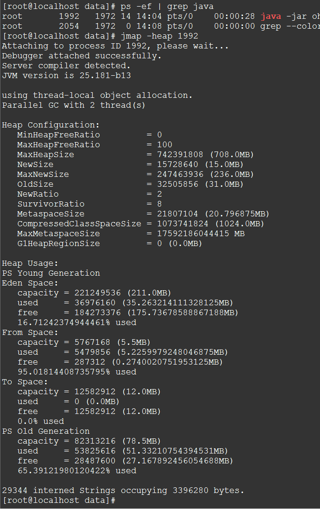

那么，从这个输出中我们也可以大致看出堆的结构，分为Young Generation （年轻代） 和 Old Generation （老年代）

Young Generation又被划分为：Eden Space ， From Space 和 To Space

可以看到这里To区是干净的，还未被使用，From区已经使用了95%了。


#### 2 打印进程TOP类

打印类的实例数量、占用的内存、类的名称

```shell
jmap -histo[:live] <pid>
```

通常我们并不需要看所有的，只需要看前几条即可

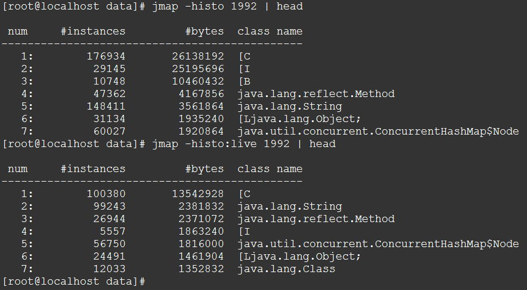


#### 3 生成堆内存dump

以hprof二进制格式dump堆的使用情况

```shell
jmap -dump:live,format=b,file=heap.bin <pid>　
```

（PS：相当于生成一个快照，后续我们可以对这个快照文件进行分析）

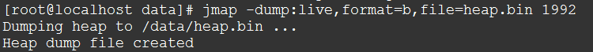


#### 4 分析堆内存dump

Memory Analyzer (MAT)

https://www.eclipse.org/mat/

https://www.eclipse.org/mat/downloads.php

解压之后双击MemoryAnalyzer.exe即可运行

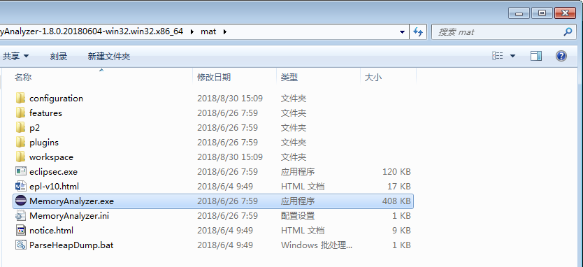

打开刚才的heap.bin文件

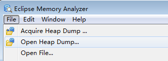

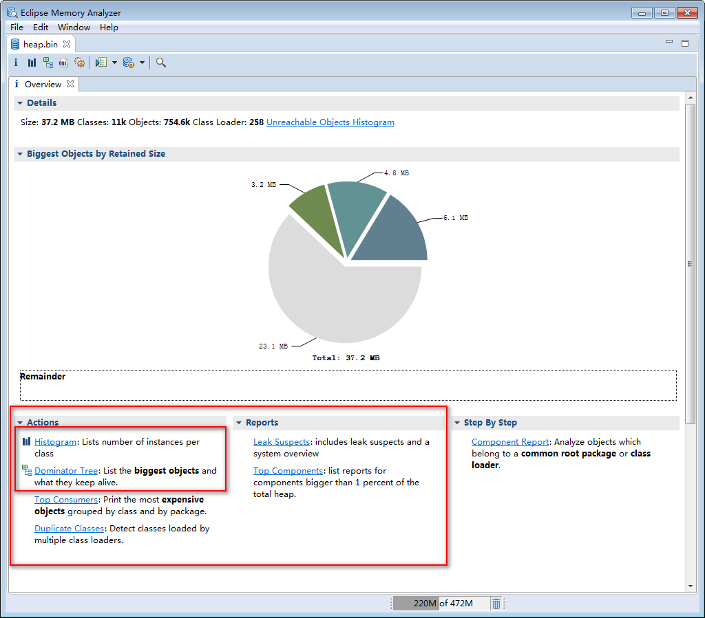

可以看到下面有三个选项卡，包括可以执行的操作和报表

先看第一个**Histogram**

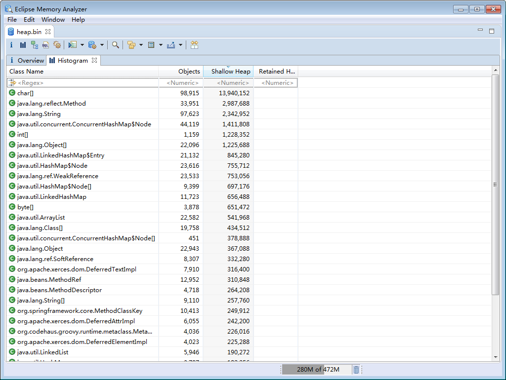

由于这里是随便运行的一个工程，并没有出现内存泄漏之类的问题，所以这里看到的都是一些基础的java类

**查看引用**

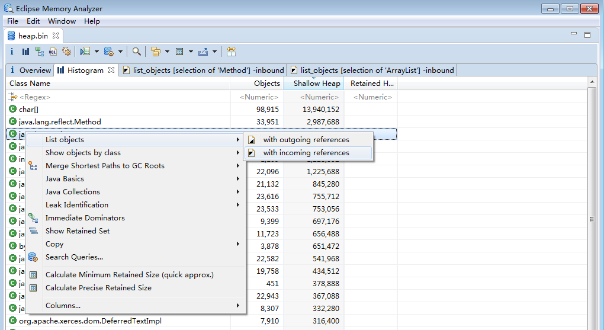

**Dominator Tree** 可以看到biggest object以及它们所占内存的比例

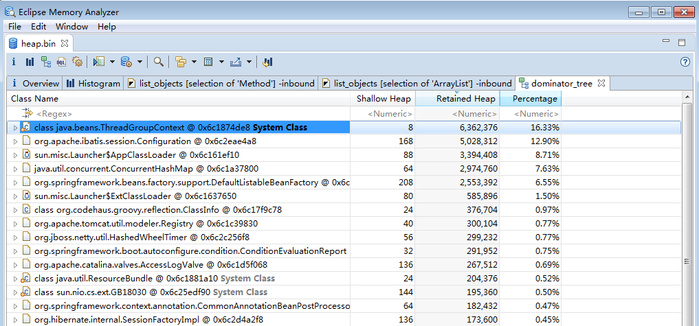

我们一级一级的找，可以找到源文件，然后分析代码，最终定位到问题之根源

jconsole

可以查看本地的进程，也可以查看远程主机上的进程

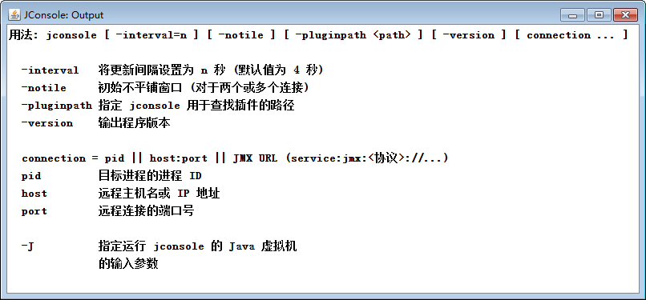

例如：jconsole 192.168.102.16:9105

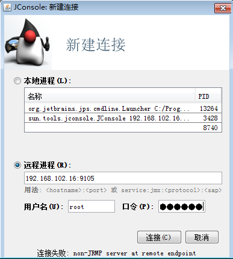

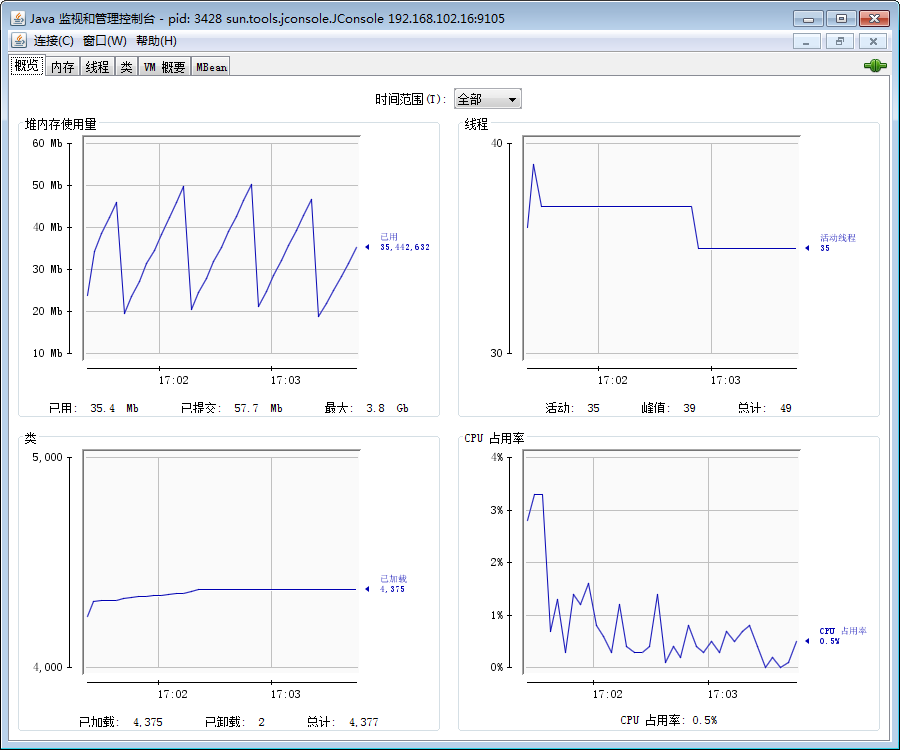

或者本地

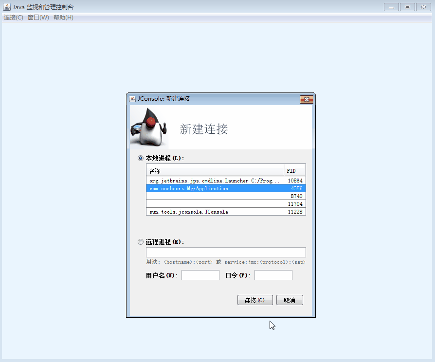


#### 5 线程栈输出

```shell
jstack 40757  > jstack_1106-kms.txt
```


#### 6 查看线程数

```shell
grep 'java.lang.Thread.State' jstack_0408.log |wc -l
```


#### 7 线程状态

```shell
grep -A 1 'java.lang.Thread.State' jstack_0408.log  | grep -v 'java.lang.Thread.State' | sort | uniq -c |sort -n
```


