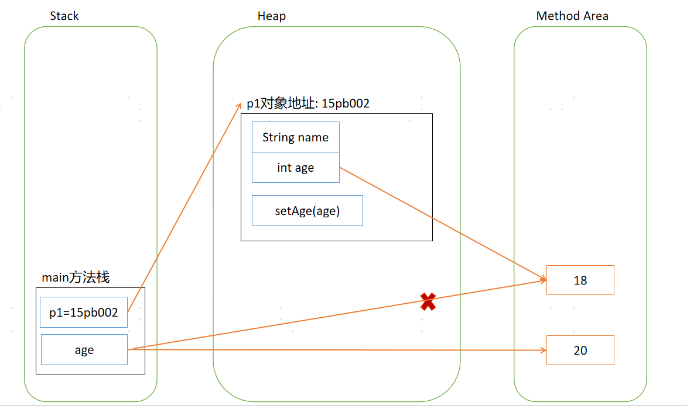
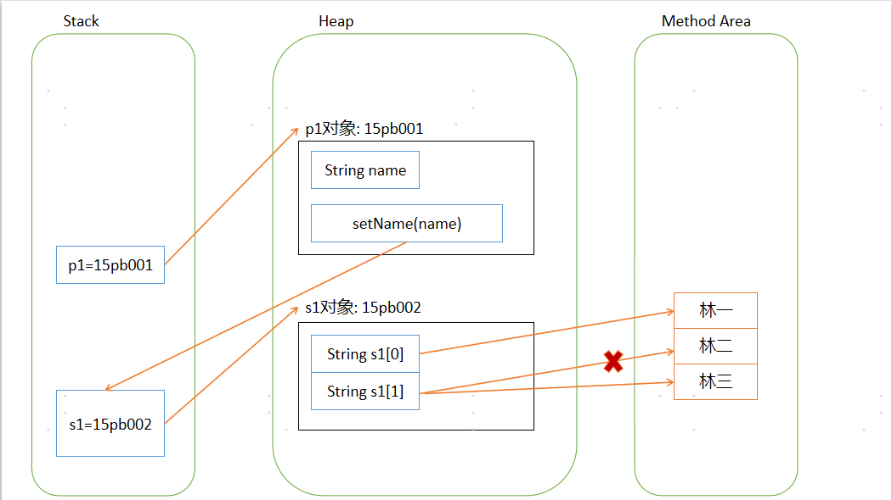

## 面向对象基础

### 一、概念

类(class)：可以看做是一个模版或者图纸。

对象(object/instance)：可以看成该类的一个具体实例。

如：饼干膜具是类，饼干是对象。


### 二、定义类

类由属性(field)、方法(method)、构造器(constructor)组成。

```java
class Students {
    int id;		//属性、成员变量
    String name;
    Students(){}	//构造方法
    void study(){	//普通方法
        System.out.println("正在学习。")
    }
}
```


#### 2.1 属性(field)

属性（也称成员变量）语法：

```java
[修饰符] 属性类型 属性名 = [默认值] ;
```

属性用于定义该类或该类对象包含的数据或者说静态特征。

属性作用范围是整个类体。

| **属性数据类型** | **默认值** |
| ---------------- | ---------- |
| 整型             | 0          |
| 浮点型           | 0.0        |
| 字符型           | '\u0000'   |
| 布尔型           | false      |
| 所有引用类型     | null       |


#### 2.2 方法(method)

方法语法：

```java
[修饰符] 方法返回值类型 方法名(形参列表) {
    // n条语句
}
```

方法用于定义该类或该类实例的行为特征和功能实现。

方法是类和对象行为特征的抽象。


#### 2.3 类例子

```java
class Computer {
    String brand;  //品牌
}
public class Students {
    int id;
    String sname;
    int age;
    Computer comp;
    void study() {
        System.out.println("我正在学习！使用我们的电脑，"+comp.brand);
    }
    Students() {}	//构造方法
    public static void main(String[] args) {
        Students s1 = new Students();
        s1.sname = "林一";
        Computer c1 = new Computer();
         c1.brand = "华为";
        s1.comp = comp1;
        sts1u1.study();
    }
}
```


#### 2.4 内存分析

栈（Stack）：用于存放局部变量。

堆（Heap）：用于存放对象实例。

方法区（Method Area）：用于存放类信息、 常量、 静态变量、 即时编译器编译后的代码等数据。


### 三、构造方法

构造方法(constructor)，用于对象的初始化。

构造方法语法：

```java
[修饰符] 类名(形参列表){
    //n条语句
}
```

构造方法要点：

1. 通过new关键字调用。
2. 构造方法虽然有返回值，但是不能定义返回值类型，不能在构造方法里使用return返回某个值。
3. 如没有定义构造方法，则编译器会自动定义一个无参的构造方法。如已定义则编译器不会自动添加。
4. 构造方法名必须和类名一致。


#### 3.1 自定义构造方法

this关键字区分属性与形参

```java
class User{
    int id;
    String name;
    public User(int id,String name){	//构造方法
        this.id=id;
        this.name=name;
    }
}
```


#### 3.2 构造方法重载

方法的重载(overload)是指一个类中可以定义多个方法名相同，但参数不同的方法。

```java
class User{
    int id;
    String name;
    public User(){}
    public User(int id,String name){
        this.id=id;
        this.name=name;
    }
}
```


### 四、this关键字

this的本质就是“创建好的对象的地址”。

【this关键字作用】：

1. 在构造方法中区分局部变量和成员变量。
2. 在构造方法中调用有参或无参构造方法，并且必须位于第一行。

```java
public class TestThis{
    private int a;	//成员变量
    private int b;
    private int c;
    TestThis(int a,int b){
        this.a=a;	//区分局部变量和成员变量
        this.b=b;
    }
    TestThis(int a,int b,int c){
        this(a,b);	//调用构造方法
        this.c=c;
    }
    ...
}
```


### 五、static关键字

#### 5.1 静态成员变量和方法

1. static修饰的成员变量和方法从属于类，在类被载入时被显式初始化，被该类的所有实例共享。
2. 一般用“类名.类属性/方法”来调用。
3. 在static方法中不能访问非static的成员变量和方法。

```java
package com.test.java;

public class TestJava {
	public static void main(String[] args) {
		TestStatic t1=new TestStatic(1001,"林一");
		t1.printCompany();		//调用static方法
	}
}

class TestStatic{
	private int id;
	private String name;
	static String company="深蓝";		//静态成员变量
	public TestStatic(int id,String name) {
		this.id=id;
		this.name=name;
	}
	public void login() {
		System.out.println("登录：" + name);
	}
	public static void printCompany() {
		//System.out.println(id);
		//login();		//抛错，在static方法中不可直接访问非static的成员变量和方法
		System.out.println(company);	//调用静态成员变量
	}
}
```


#### 5.2 静态初始化块

```java

public class Test {
    int id;
    String name;
    String pwd;
    static String company;
    static {	//static初始化块
        company = "深蓝";
    }  
    ...
}
```


### 六、参数传值机制

Java中，方法中所有参数都是“值传递”。

#### 6.1 基本数据类型

基本数据类型参数传值，传递的是值。

```java
package com.test.java;
/**
 * 测试基本数据类型参数传值
 * @author 835084
 *
 */
public class TestJava {
	public static void main(String[] args) {
		Person p1=new Person();
		int age=18;
		p1.setAge(age);		//值传递，p1对象成员变量age=18
		System.out.println(p1.getAge());	//打印18
		age=20;				//TestJava类成员变量age=20，p1对象成员变量age不变
		System.out.println(p1.getAge());	//打印18
	}
}

class Person{
	private String name;
	private int age;
	public int getAge() {
		return age;
	}
	public void setAge(int age) {
		this.age = age;
	}
}
```




#### 6.2 引用类型

引用类型参数的传值，传递的是对象的地址。

```java
package com.test.java;
/**
 * 测试引用类型参数传值
 * @author 835084
 *
 */
public class TestJava {
	public static void main(String[] args) {
		Person p1=new Person();
		String[] s1=new String[2];
		s1[0]="林一";
		s1[1]="林二";
		p1.setName(s1);		//参数传递是对象的地址
		System.out.println(p1.getName());
		s1[1]="林三";
		System.out.println(p1.getName());
	}
}

class Person{
	private String[] name;
	public String getName() {
		return name[0]+","+name[1];
	}
	public void setName(String[] name) {
		this.name = name;
	}	
}
```




### 七、Package包

#### 7.1 JDK核心包

| 常用包    | **说明**                                                     |
| --------- | ------------------------------------------------------------ |
| java.lang | 包含一些Java语言的核心类，如String、Math、Integer、System和Thread，提供常用功能。 |
| java.awt  | 包含了构成抽象窗口工具集（abstract window toolkits）的多个类，这些类被用来构建和管理应用程序的图形用户界面(GUI)。 |
| java.net  | 包含执行与网络相关的操作的类。                               |
| java.io   | 包含能提供多种输入/输出功能的类。                            |
| java.util | 包含一些实用工具类，如定义系统特性、使用与日期日历相关的函数。 |


#### 7.2 导入类

使用import导入类。

```java
import java.sql.Date;
import java.util.*;		//导入该包下所有的类。会降低编译速度，但不会降低运行速度。
```


#### 7.3 静态导入

静态导入(static import)：用于导入指定类的静态属性。

导入后可以直接使用静态属性。

```java
package com.test.javacore;

import static java.lang.Math.*;		//导入Math类的所有静态属性
 
public class Test{
    public static void main(String [] args){
        System.out.println(PI);
    }
}
```

