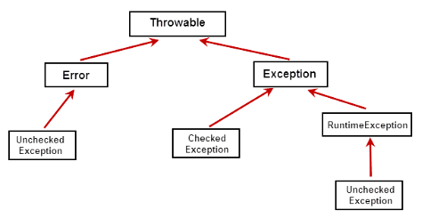

## 异常机制

Java是采用面向对象的方式来处理异常的。


### 一、层次结构图

所有异常的根类为java.lang.Throwable。

Throwable下面又派生了两个子类：Error和Exception。




### 二、Error类

Error是程序无法处理的错误，表示代码运行时 JVM(Java 虚拟机)出现的问题。

如当 JVM 所需的内存资源不足时，将出现 OutOfMemoryError。


### 三、Exception类

Exception是程序本身能够处理的异常

**Exception类**分为：RuntimeException 运行时异常 与 CheckedException 已检查异常。


#### 3.1 RuntimeException子类

RuntimeException异常，一般由编程错误导致的，经常需要通过增加“逻辑处理来避免这些异常”。

##### 3.1.1 算术异常

算术异常(ArithmeticException)

```java
//ArithmeticException异常逻辑处理
public class Test {
    public static void main(String[] args) {
        int b=0;
        if(b!=0){
            System.out.println(1/b);
        }
    }
}
```


##### 3.1.2 空指针异常

当程序访问一个空对象的成员变量或方法，或者访问一个空数组的成员时会发生空指针异常(NullPointerException)。

```java
//NullPointerException异常逻辑处理
public class Test {
    public static void main(String[] args) {
        String str=null;
        if(str!=null){
            System.out.println(str.charAt(0));
        }
    }
}
```


##### 3.1.3 类型转换异常

在引用数据类型转换时，有可能发生类型转换异常(ClassCastException)。

```java
//ClassCastException异常逻辑处理
public class Test {
    public static void main(String[] args) {
        Animal a = new Dog();
        if (a instanceof Cat) {
            Cat c = (Cat) a;
        }
    }
}
```


##### 3.1.4 数组下标越界异常

当程序访问一个数组的某个元素时，如果这个元素的索引超出了0~数组长度-1这个范围，则会出现数组下标越界异常(ArrayIndexOutOfBoundsException)。

```java
//ArrayIndexOutOfBoundsException异常逻辑处理
public class Test {
    public static void main(String[] args) {
        int[] arr = new int[5];
        int a = 5;
        if (a < arr.length) {
            System.out.println(arr[a]);
        }
    }
}
```


##### 3.1.5 数字格式异常

 在使用包装类将字符串转换成基本数据类型时，如果字符串的格式不正确，则会出现数字格式异常(NumberFormatException)。

数字格式化异常的解决，可以引入正则表达式判断是否为数字。

```java
//NumberFormatException异常逻辑处理
import java.util.regex.Matcher;
import java.util.regex.Pattern;
 
public class Test {
    public static void main(String[] args) {
        String str = "1234abcf";
        Pattern p = Pattern.compile("^\\d+$");
        Matcher m = p.matcher(str);
        if (m.matches()) {
            System.out.println(Integer.parseInt(str));
        }
    }
}
```


#### 3.2 CheckedException子类

所有不是RuntimeException的异常，统称为CheckedException，又被称为“已检查异常”，如IOException、SQLException等以及用户自定义的Exception异常。 


### 四、异常处理方式

#### 4.1 try-catch-finally


1. try语句：用于异常捕获并处理的范围。
2. catch语句：用于处理可能产生的不同类型的异常对象。
3. finally语句：用于关闭程序块已打开的资源。


#### 4.2 声明异常

当CheckedException产生时，不一定立刻处理它，可以再把异常throws出去。


### 五、自定义异常类

自定义异常类只需从Exception类或者它的子类派生一个子类即可。

自定义异常类应该包含2个构造器：一个是默认的构造器，另一个是带有详细信息的构造器。

```java
package com.test.java;
/**
 * 测试自定义异常
 * @author 林
 *
 */
public class TestJava {
	public static void main(String[] args) {
		Person p=new Person();
		try {
			p.setName("林一");
			p.setAge(-18);
		}catch(IllegalAge e) {
			e.printStackTrace();
		}
		System.out.println(p);
	}
}

class IllegalAge extends Exception{
	public IllegalAge() {}
	public IllegalAge(String message) {
		super(message);
	}
}

class Person{
	private String name;
    private int age;
	public void setName(String name) {
		this.name = name;
	}
	public void setAge(int age) throws IllegalAge {
		if(age<0) {
			throw new IllegalAge("年龄不能为负数");
		}
		this.age = age;
	}
	public String toString() {
        return "name is " + name + " and age is " + age;
    }
}

```


