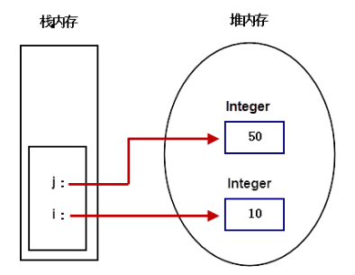
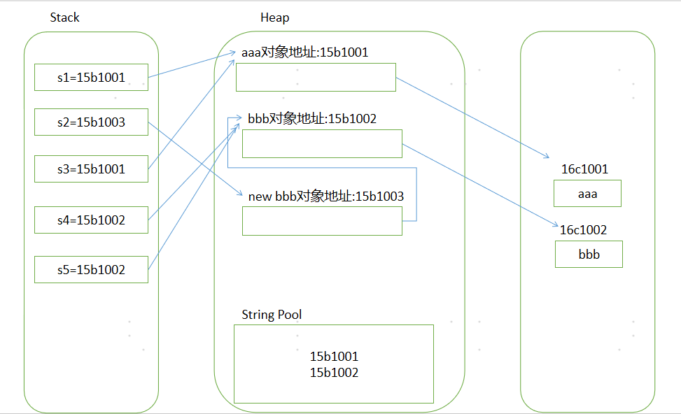

## 常用类

### 一、Object类

Object类是所有Java类的根基类。

#### 1.1 toString方法

Object类中toString方法的源码：

```java
public String toString() {
    return getClass().getName() + "@" + Integer.toHexString(hashCode());
}
```

在打印输出或者用字符串连接对象时，会自动调用该对象的toString()方法。

```java
public class TestJava {
	public static void main(String[] args) {
		Person p1=new Person();
		p1.name="林一";
		System.out.println(p1);		//执行打印，自动调用覆写的toString()
	}
}

class Person{
	String name;
	@Override
	public String toString() {	//覆写toString()方法
		return name+"非常聪明";
	}
}
```


#### 1.2 equals方法

equals 方法：比较两个对象的hashcode，是同一个对象的引用时返回 true，否则返回 false。

“==”：是基本类型则表示值相等，如是引用类型则表示地址相等即是同一个对象。

字符串比对是否相同使用equals 方法。

```java
public class TestJava {
	public static void main(String[] args) {
		String s1 = new String("林一");
        String s2 = new String("林一");
        System.out.println(s1==s2);         //false, s1和s2对象地址不相等
        System.out.println(s1.equals(s2));  //true,  s1和s2对象值相同
	}
}
```


### 二、包装类

包装类(Wrapper Class)：将基本数据类型转化成对象。

| 基本数据类型 | 包装类    |
| ------------ | --------- |
| byte         | Byte      |
| boolean      | Boolean   |
| short        | Short     |
| char         | Character |
| int          | Integer   |
| long         | Long      |
| float        | Float     |
| double       | Double    |


【包装类用途】：

1. 作为和基本数据类型对应的类型存在，方便涉及到对象的操作，如Object[]、集合等的操作。
2. 包含每种基本数据类型的相关属性如最大值、最小值等，以及相关的操作方法。


#### 2.1 Integer

```java
public class WrapperClassTest {
    public static void main(String[] args) {
        Integer i = Integer.valueOf(10);
        Integer j = Integer.valueOf(50);
    }
}
```




#### 2.2 自动拆装箱

 整型、char类型所对应的包装类，在自动装箱时，对于-128~127之间的值会进行缓存处理，其目的是提高效率。

```java
public class TestAutoBox {
	public static void main(String[] args) {
		Integer a=123;	//自动装箱，编译器执行Integer  a = Integer.valueOf(234);
		int b=a;		//自动拆箱，编译器执行int  b = a.intValue();
		
		Integer i1=Integer.valueOf(123);
		Integer i2=Integer.valueOf(123);
		System.out.println(i1==i2);		//true,因为123在缓存[-128,127]范围内
		System.out.println(i1.equals(i2));
		
		Integer i3=Integer.valueOf(1234);
		Integer i4=Integer.valueOf(1234);
		System.out.println(i3==i4);		//false,因为1234不在缓存[-128,127]范围内
		System.out.println(i3.equals(i4));
	}
}
```


### 三、字符串类

#### 3.1 String

String类又称作不可变字符序列。

Java没有内置的字符串类型，而是在标准Java类库中提供了一个预定义的类String，每个用双引号括起来的字符串都是String类的一个实例。

```java
String s1="";	//空字符串
String s2="Hello ";
String s3="Java";
String s4=s2+s3;	//字符串连接
```

```java
//String常用方法1
String s1 = "core Java";
String s2 = "Core Java";
        
System.out.println(s1.charAt(3));	//提取索引为3的字符(索引由0开始)
System.out.println(s2.length());	//字符串的长度
System.out.println(s1.equals(s2));	//比较两个字符串是否相等
System.out.println(s1.equalsIgnoreCase(s2));	//比较两个字符串（忽略大小写）
System.out.println(s1.indexOf("Java"));		//字符串s1中是否包含Java

String s = s1.replace(' ', '&');	//将s1中的空格替换成&
```

```java
////String常用方法2
String s = "";
String s1 = "How are you?";
System.out.println(s1.startsWith("How"));	//是否以How开头
System.out.println(s1.endsWith("you"));		//是否以you结尾

s = s1.substring(4);	//提取子字符串：从下标为4的开始到字符串结尾为止
System.out.println(s);
s = s1.substring(4, 7);	//提取子字符串：下标[4, 7) 不包括7
System.out.println(s);

s = s1.toLowerCase();	//转小写
System.out.println(s);
s = s1.toUpperCase();	//转大写
System.out.println(s);

String s2 = "  How old are you!! ";
s = s2.trim();	//去除字符串首尾的空格
System.out.println(s);
System.out.println(s2);	//因为String是不可变字符串，所以s2不变
```


#### 3.2 StringBuilder

StringBuffer、StringBuilder均代表可变的字符序列。

StringBuilder线程不安全，效率高（一般使用它）；StringBuffer线程安全，效率低。

```java
StringBuilder s1=new StringBuilder("ABCDE");
s1.setCharAt(2, 'Y');	//字符串索引为2的元素替换为Y
```

> 输出结果：
> ABYDE


【String与StringBuilder拼接字符串效率对比】

StringBuilder类是对原字符串本身操作的，可以对字符串进行修改而不产生副本拷贝或者产生少量的副本。

```java
public class TestJava {
	public static void main(String[] args) {
		//String拼接字符串
		String s1="";
		long mem1 = Runtime.getRuntime().freeMemory();
        long time1 = System.currentTimeMillis();
        for(int i=0;i<10000;i++) {
        	s1=s1+i;
        }
        long mem2 = Runtime.getRuntime().freeMemory();
        long time2 = System.currentTimeMillis();
        System.out.println("String占用内存 : " + (mem1 - mem2));
        System.out.println("String占用时间 : " + (time2 - time1));
        
        //StringBuilder拼接字符串
        StringBuilder s2=new StringBuilder();
        long mem3 = Runtime.getRuntime().freeMemory();
        long time3 = System.currentTimeMillis();
        for(int i=0;i<10000;i++) {
        	s2.append(i);
        }
        long mem4 = Runtime.getRuntime().freeMemory();
        long time4 = System.currentTimeMillis();
        System.out.println("StringBuilder占用内存 : " + (mem3 - mem4));
        System.out.println("StringBuilder占用时间 : " + (time4 - time3));        
	}
}
```

>输出结果：
>
>String占用内存 : 35094688
>String占用时间 : 169
>StringBuilder占用内存 : 0
>StringBuilder占用时间 : 0


#### 3.3 常量池

**全局字符串常量池(String Pool)**：存放的是字符串常量的引用值。

class文件常量池(Class Constant Pool)：在编译阶段，存放的是常量(文本字符串、final常量等)和符号引用。

运行时常量池(Runtime Constant Pool)：在类加载完成之后，将每个class常量池中的符号引用值转存到运行时常量池中。

```java
public class TestJava {
	public static void main(String[] args) {
		String s1="aaa";
		String s2= new String("bbb");
		String s3="aaa";
		String s4=s2.intern();
		String s5="bbb";
		System.out.println(s1==s3);	//true
		System.out.println(s2==s4); //false,intern()函数，返回String Pool中“bbb”的引用值
		System.out.println(s4==s5);	//true
	}
}
```




### 四、时间日期类

1970 年 1 月 1 日 00:00:00定为基准时间。

```java
long now=System.currentTimeMillis();	//获取当前时刻值
```


#### 4 .1 Date

Date类：时间类

```java
Date d1=new Date();		//无参，获取当前时间
Date d2=new Date(2020);	//时间由1970开始，单位毫秒
```


#### 4.2 DateFormat

DateFormat类：把时间对象转化成指定格式的字符串。

DateFormat是一个抽象类，一般使用它的的子类SimpleDateFormat类来实现。

```java
SimpleDateFormat s1=new SimpleDateFormat("yyyy-MM-dd hh:mm:ss");
String str1=s1.format(new Date());	//时间对象转字符串
System.out.println(str1);
		
SimpleDateFormat s2 = new SimpleDateFormat("yyyy-MM-dd");
String str2="2020-2-24";
Date d1=s2.parse(str2);		//字符串转时间对象
```

>输出结果：
>
>2021-02-24 03:39:56
>Mon Feb 24 00:00:00 CST 2020


#### 4.3 Calendar

Calendar 类是一个抽象类，为我们提供了关于日期计算的相关功能，比如：年、月、日、时、分、秒的展示和计算。

GregorianCalendar 是 Calendar 的一个具体子类，提供了世界上大多数国家/地区使用的标准日历系统。

 注意：

- 月份的表示，一月是0，二月是1，12月是11。
- 周日是1，周一是2，周六是7

```java
//获取日期
GregorianCalendar g1=new GregorianCalendar(2021,2,14,0,0,0);
int year=g1.get(Calendar.YEAR);			//获取年
int month=g1.get(Calendar.MONTH);		//获取月
int day=g1.get(Calendar.DAY_OF_MONTH);	//获取日
int week=g1.get(Calendar.DAY_OF_WEEK);	//获取星期

//设置日期
GregorianCalendar g2=new GregorianCalendar();
g2.set(Calendar.YEAR, 2020);
g2.set(Calendar.MONTH, 9);
g2.set(Calendar.DATE, 10);
g2.set(Calendar.HOUR_OF_DAY, 0);
g2.set(Calendar.MINUTE, 0);
g2.set(Calendar.SECOND, 0);

//计算日期
GregorianCalendar g3=new GregorianCalendar(2020,10,10,0,0,0);
g3.add(Calendar.MONTH, -2);		//月份减2
g3.add(Calendar.DATE, 7);		//增加7天

//日历对象和时间对象转化
Date d1=g3.getTime();		//日历对象转时间对象
GregorianCalendar g4=new GregorianCalendar();
g4.setTime(new Date());	   //时间对象转日历对象
```


#### 5.4 LocalDate

LocalDate类：日历类

```java
LocalDate date=LocalDate.now();            //构造表示当前日期的对象
LocalDate date=LocalDate.of(2020,9,10);    //构造表示固定日期的对象
```

```java
int year=date.getYear();            //2020，获取年
int month=date.getMonthValue();     //9，获取月
int day=date.getDayOfMonth();       //10，获取日
```

```java
DayOfWeek weekday=date.getDayOfWeek();    //获取星期，星期一为1，星期日为7
```

```java
LocalDate minusDays(int n)    //返回指定日期之前n天日期
LocalDate plusDays(int n)    //返回指定日期之后n天日期
```


【打印日历示例】

```java
public class TestLocalDate {
	public static void main(String[] args) {
		/*LocalDate类不能使用构造器创建对象*/
		//LocalDate d1=LocalDate.now();	//创建日历对象，指定当前日期
		LocalDate d1=LocalDate.of(2020, 9, 10);		//创建日历对象,指定日期2020-9-10
		int year=d1.getYear();			//获取年份
		int month=d1.getMonthValue();	//获取月份
		int day=d1.getDayOfMonth();		//获取天数
		
		d1=d1.minusDays(day-1);		//设置为当月的第一天
		DayOfWeek week=d1.getDayOfWeek();	//创建星期对象
		int value=week.getValue();	//获取星期,1=星期一，7=星期日
		
		System.out.println(year+"年"+month+"月");
		System.out.println("一\t二\t三\t四\t五\t六\t日");
		
		for(int i=1;i<value;i++) {
			System.out.print("\t");
		}
		while(d1.getMonthValue()==month) {
			System.out.print(d1.getDayOfMonth());
			if(d1.getDayOfMonth()==day) {
				System.out.print("*");
			}
			if(d1.getDayOfWeek().getValue()!=7) {
				System.out.print("\t");
			}
			d1=d1.plusDays(1);
			if(d1.getDayOfWeek().getValue()==1) {
				System.out.println();
			}
		}		
	}
}
```


### 五、Math类

| **Math类常用方法**         | **描述**                              |
| -------------------------- | ------------------------------------- |
| abs                        | 绝对值                                |
| acos,asin,atan,cos,sin,tan | 三角函数                              |
| sqrt                       | 平方根                                |
| pow(double a, double b)    | a的b次幂                              |
| max(double a, double b)    | 取大值                                |
| min(double a, double b)    | 取小值                                |
| ceil(double a)             | 大于a的最小整数                       |
| floor(double a)            | 小于a的最大整数                       |
| random()                   | 返回 0.0 到 1.0 的随机数              |
| long round(double a)       | double型的数据a转换为long型(四舍五入) |
| toDegrees(double angrad)   | 弧度->角度                            |
| toRadians(double angdeg)   | 角度->弧度                            |


### 六、File类

#### 6.1 File类方法

```java
File f=new File("a.txt");
System.out.println("File是否存在："+f.exists());
System.out.println("File是否是目录："+f.isDirectory());
System.out.println("File是否是文件："+f.isFile());
System.out.println("File最后修改时间："+new Date(f.lastModified()));
System.out.println("File的大小："+f.length());
System.out.println("File的文件名："+f.getName());
System.out.println("File的目录路径："+f.getAbsolutePath());
```


#### 6.2 创建文件

```java
File f=new File("a.txt");
f.createNewFile();			//创建文件	
```


#### 6.3 创建目录

```java
File f=new File("d:/Java/Test");
boolean flag=f.mkdirs();	//创建目录
```


【打印目录树示例】

```java
package com.test.java;
import java.io.File;
/**
 * 测试递归打印目录树
 * @author 835084
 *
 */
public class TestFile {
	public static void main(String[] args) {
		File f=new File("D:\\Test");
		printFile(f,0);
	}
	
	static void printFile(File file,int level) {
		for(int i=0;i<level;i++) {	//输出层次数
			System.out.print("-");
		}
		
		System.out.println(file.getName());
		
		if(file.isDirectory()) {	//获取子文件列表
			File[] files=file.listFiles();
			for(File temp:files) {
				printFile(temp,level+1);	//递归调用该方法
			}
		}		
	}
}
```

> Test
> -01
> --a.txt
> --b.txt
> -1.txt
> -2.txt


### 七、枚举类型

枚举体就是放置一些常量。

```java
package test;
/**
 * 测试枚举类
 * @author 林
 *
 */
public class TestEnum {
	public static void main(String[] args) {
		Season s=Season.AUTUMN;
		switch(s) {
		case SPRING:
			System.out.println("春天来了");
			break;
		case SUMMER:
			System.out.println("夏天来了");
			break;
		case AUTUMN:
			System.out.println("秋天来了");
			break;
		case WINTER:
			System.out.println("冬天来了");
			break;
		}
	}
}

enum Season{	// 枚举类型
	SPRING, SUMMER,AUTUMN,WINTER		//枚举体
}
```

