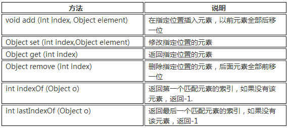
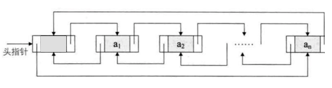
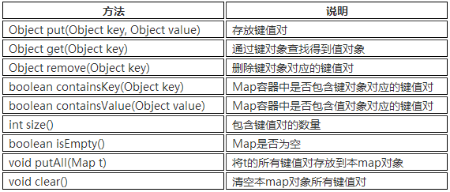
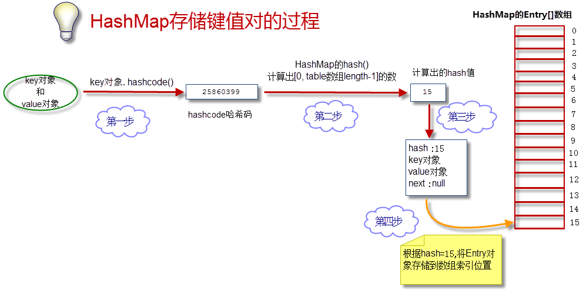
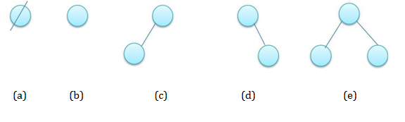
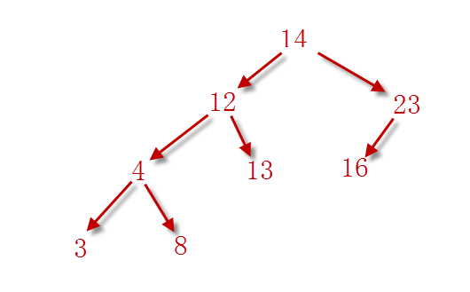
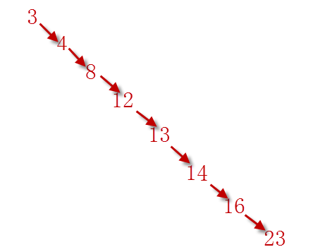
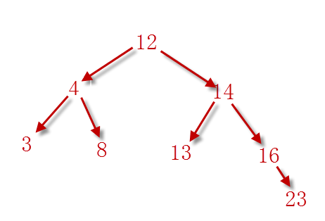
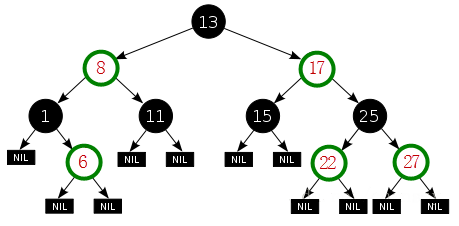

## 容器

容器（也称集合Collection)：用来容纳和管理数据。

数组就是一种容器。

**容器的接口层次结构图：**


### 一、泛型

泛型的本质就是“数据类型的参数化”，可以把“泛型”理解为数据类型的一个占位符。

泛型常用标识符：<T,E,V>

```java
public class TestGenerics {
	public static void main(String[] args) {
		MyCollection<String> m1=new MyCollection<String>();		//传递String类型
		m1.set("AA", 0);
		m1.set("BB", 1);
		String s1=m1.get(1);	//加了泛型，直接返回String类型，不用强制转换
		System.out.println(s1);		
	}
}

//泛型声明
class MyCollection<E>{		//E表示泛型
	Object[] objs=new Object[5];
	public E get(int index) {	//E表示泛型
		return(E) objs[index];
	}	
	public void set(E e,int index) {	//E表示泛型
		objs[index]=e;
	}	
}
```


**泛型类的在容器中的使用：**

```java
/*Collection、List、Set、Map、Iterator接口都定义了泛型*/
List<String> list = new ArrayList<String>();
Set<Man> mans = new HashSet<Man>();
Map<Integer, Man> maps = new HashMap<Integer, Man>();
Iterator<Man> iterator = mans.iterator();
```


### 二、Collection接口

Collection 表示一组对象，它是集中、收集的意思。

Collection接口的两个子接口是List、Set接口。

**Collection接口方法：**


### 三、List子接口

List接口常用的实现类有3个：ArrayList、LinkedList和Vector。

如何选用ArrayList、LinkedList、Vector

- 需要线程安全时，用Vector。
- 不存在线程安全问题时，并且查找较多用ArrayList(一般使用它)。
- 不存在线程安全问题时，增加或删除元素较多用LinkedList。


**List接口方法：**




#### 3.1  ArrayList类

ArrayList底层使用Object数组来存储元素数据。

特点：查询效率高，增删效率低，线程不安全。开发一般使用它。

 ArrayList的Object数组初始化长度为10。

```java
List<String> list=new ArrayList<String>();
```

```java
//List接口常用方法

System.out.println(list.isEmpty());		//true,判断集合是否有元素
list.add("AAA");	// 集合添加元素
list.add("BBB");

System.out.println(list);					//打印集合
System.out.println(list.size());			//集合元素数量
System.out.println(list.contains("CCC"));	//集合是否包含指定元素
list.remove(1);			//移除元素，指定索引
//list.remove("BBB");	//移除元素，指定元素值
//list.clear();  		//清空集合元素
		
Object[] objs=list.toArray();	//集合转换成Object数组
```


#### 3.2 LinkedList类

LinkedList底层用双向链表实现的存储。

特点：查询效率低，增删效率高，线程不安全。

双向链表也叫双链表，是链表的一种，它的每个数据节点中都有两个指针，分别指向前一个节点和后一个节点。 

**LinkedList的存储结构图：**



```java
//每个节点都应该有3部分内容
class  Node {
	Node  previous;     //前一个节点
	Object  element;    //本节点保存的数据
	Node  next;         //后一个节点
}
```


### 四、Set子接口

Set容器特点：无序、不可重复。

- 无序指Set中的元素没有索引，我们只能遍历查找。
- 不可重复指不允许加入重复的元素。
- Set只能放入一个null元素。

Set常用的实现类有：HashSet、TreeSet等。


#### 4.1 HashSet类

HashSet是采用哈希算法实现，底层实际是用HashMap实现的。

HashSet本质就是一个简化版的HashMap，通过key来存储Set的元素。

```java
package com.test.java;

import java.util.HashSet;
import java.util.Set;

/**
 * 测试HashSet的使用
 * @author 林
 *
 */
public class TestHashSet {
	public static void main(String[] args) {
		Set<String> s=new HashSet<String>();
		s.add("AA");	//增加元素
		s.add("BB");
		System.out.println(s);
		
		s.add("AA");	//相同的元素不会被加入，容器元素数量不变
		
		s.add(null);
		System.out.println(s);		
	}
}
```

> [AA, BB]
> [AA, BB, null]


#### 2.6 TreeSet类

TreeSet底层实际是用TreeMap实现的。

TreeSet是一个简化版的TreeMap，通过key来存储Set的元素。

**TreeSet使用要点：**

- TreeSet需要对元素做内部排序。
- TreeSet中不能放入null元素。

```java
package com.test.java;

import java.util.Set;
import java.util.TreeSet;

/**
 * 测试TreeSet和Comparable接口的使用
 * @author 林
 *
 */
public class TestTreeSet {
	public static void main(String[] args) {
		User u1=new User(1001,"林一",18);
		User u2=new User(1002,"林二",16);
		Set<User> s1=new TreeSet<User>();
		s1.add(u1);
		s1.add(u2);
	}
}

class User implements Comparable<User>{
	int id;
	String uname;
	int age;
	
	public User(int id,String uname,int age) {
		this.id=id;
		this.uname=uname;
		this.age=age;
	}
	
	@Override
	public int compareTo(User o) {
		if(this.id>o.id) {
			return 1;
		}else if(this.id<o.id) {
			return -1;
		}else {
			return 0;
		}
	}
}
```


### 五、Map接口

 Map就是用来存储“键(key)-值(value) 对”的。

 Map 接口的实现类有HashMap、TreeMap、HashTable、Properties等。

**Map接口中常用的方法：**




#### 5.1 HashMap类

HashMap采用哈希算法实现，是Map接口最常用的实现类，在查找、删除、修改方面都有非常高的效率。

 HashTable类和HashMap类似，区别是HashTable的方法添加了synchronized关键字确保线程同步检查，效率较低。

1. HashMap: 线程不安全，效率高。允许key或value为null。
2. HashTable: 线程安全，效率低。不允许key或value为null。

```java
Map<Integer,String> m=new HashMap<Integer,String>();
```

```java
Map<Integer,String> m1=new HashMap<Integer,String>();
Map<Integer,String> m2=new HashMap<Integer,String>();

m1.put(1, "A");		//存放键值对
m1.put(2, "B");
m1.put(3, "C");
m1.put(3, "D");		//键重复，则会替换旧的键值对
m2.put(1, "a");
m2.put(2, "b");

System.out.println(m1.size());				//获取键值对数量
System.out.println(m1.containsKey(1));		//ture,是否包含key=1的键值对
System.out.println(m1.containsValue("A"));	//ture,是否包含value=“A”的键值对	

Map<Integer,String> m3=new HashMap<Integer,String>();
m3.putAll(m1);		//将m1的键值对存放到m3容器中
```


#### 5.2 HashMap原理

HashMap底层实现采用了哈希表。

- 数组：占用空间连续。 寻址容易，查询速度快。但是，增加和删除效率非常低。
- 链表：占用空间不连续。 寻址困难，查询速度慢。但是，增加和删除效率非常高。
- 哈希表的本质就是“数组+链表”。




#### 5.3 二叉树

二叉树(BinaryTree)由一个节点及两棵互不相交的、分别称作这个根的左子树和右子树的二叉树组成。

二叉树五种基本形态示意图：



(a) 为空树。
(b) 为仅有一个结点的二叉树。
(c) 是仅有左子树而右子树为空的二叉树。
(d) 是仅有右子树而左子树为空的二叉树。
(e) 是左、右子树均非空的二叉树。

注意：二叉树的左子树和右子树是严格区分并且不能随意颠倒的，(c) 与(d) 就是两棵不同的二叉树。


**【排序二叉树】**

特点：

1. 左子树上所有节点的值均小于它的根节点的值。
2. 右子树上所有节点的值均大于它的根节点的值。


【14,12,23,4,16,13, 8, 3】存储到排序二叉树中：



【3,4,8,12,13,14,16,23】存储到排序二叉树中：




**【平衡二叉树】**

特点：左右子树的高度相差不超过 1。

【3,4,8,12,13,14,16,23】存储到平衡二叉树中：



**【红黑二叉树】**

特点：

1. 每个节点要么是红色，要么是黑色。
2. 根节点永远是黑色的。
3. 所有的叶节点都是空节点(即 null)，并且是黑色的。
4. 每个红色节点的两个子节点都是黑色。
5. 从任一节点到其子树中每个叶子节点的路径都包含相同数量的黑色节点。




#### 5.4 TreeMap类

TreeMap是红黑二叉树的典型实现。

【TreeMap和HashMap区别】：

- HashMap效率高于TreeMap
- 需要排序的Map时才选用TreeMap


### 四、迭代器

如果遇到遍历容器时，判断删除元素的情况，使用迭代器遍历。

#### 4.1 迭代器遍历List

```java
package com.test.java;

import java.util.ArrayList;
import java.util.Iterator;
import java.util.List;

/**
 * 迭代器遍历List
 * @author 林
 *
 */
public class TestIteratorList {
	public static void main(String[] args) {
		List<String> alist=new ArrayList<String>();
		
		for(int i=0;i<5;i++) {
			alist.add("a"+i);
		}
		System.out.println(alist);
		
		for(Iterator<String> iter=alist.iterator();iter.hasNext();) {
			String temp=iter.next();
			System.out.print(temp+"\t");
			if(temp.endsWith("3")) {	//删除3结尾的字符串
				iter.remove();
			}
		}
		System.out.println();
		System.out.println(alist);
	}
}
```


#### 4.2 迭代器遍历Set

```java
package com.test.java;

import java.util.HashSet;
import java.util.Iterator;
import java.util.Set;

/**
 * 测试迭代器遍历Set
 * @author 林
 *
 */
public class TestIteratorSet {
	public static void main(String[] args) {
		Set<String> s1=new HashSet<String>();
		
		for(int i=0;i<5;i++) {
			s1.add("a"+i);
		}
		System.out.println(s1);
		
		for(Iterator<String> iter=s1.iterator();iter.hasNext();) {
			String temp=iter.next();
			System.out.print(temp+"\t");
		}
	}
}
```


#### 4.3 迭代器遍历Map

```java
package com.test.java;

import java.util.HashMap;
import java.util.Iterator;
import java.util.Map;
import java.util.Set;
/**
 * 迭代器遍历Map
 * @author 林
 *
 */
public class TestIteratorMap {
	public static void main(String[] args) {
		Map<String,String> m1=new HashMap<String,String>();
		m1.put("1001", "AA");
		m1.put("1002", "BB");
		Set<String> s1=m1.keySet();
		for(Iterator<String> iter=s1.iterator();iter.hasNext();) {
			String key=iter.next();
			System.out.println(key+"--"+m1.get(key));
		}
	}
}
```


### 五、遍历容器方法

#### 5.1 遍历List方法一

**普通for循环**

```java
for(int i=0;i<list.size();i++){
    String temp = (String)list.get(i);
    System.out.println(temp);
}
```


#### 5.2 遍历List方法二

**增强for循环**

```java
for (String temp : list) {
System.out.println(temp);
}
```


#### 5.3 遍历List方法三

**使用Iterator迭代器**

```java
for(Iterator iter= list.iterator();iter.hasNext();){
    String temp = (String)iter.next();
    System.out.println(temp);
}
```


```java
Iterator  iter =list.iterator();
while(iter.hasNext()){
    Object  obj =  iter.next();
    iter.remove();
    System.out.println(obj);
}
```


#### 5.4 遍历Set方法一

**增强for循环**

```java
for(String temp:set){
    System.out.println(temp);
}
```


#### 5.5 遍历Set方法二

**使用Iterator迭代器**

```java
for(Iterator iter = set.iterator();iter.hasNext();){
    String temp = (String)iter.next();
    System.out.println(temp);
}
```


#### 5.6 遍历Map方法一

**根据key获取value**

```java
Map<Integer, Man> maps = new HashMap<Integer, Man>();
Set<Integer>  keySet =  maps.keySet();
for(Integer id : keySet){
    System.out.println(maps.get(id).name);
}
```


#### 5.7 遍历Map方法二

**使用entrySet**

```java
Set<Entry<Integer, Man>>  ss = maps.entrySet();
for (Iterator iterator = ss.iterator(); iterator.hasNext();) {
    Entry e = (Entry) iterator.next(); 
    System.out.println(e.getKey()+"--"+e.getValue());
```


### 六、容器工具类

类 java.util.Collections ：

-  void sort(List) ：对List容器内的元素排序，排序的规则是按照升序进行排序。
- void shuffle(List) ：对List容器内的元素进行随机排列。
- void reverse(List) ：对List容器内的元素进行逆续排列 。
- void fill(List, Object) ：用一个特定的对象重写整个List容器。
- int binarySearch(List, Object) ：对于顺序的List容器，采用折半查找的方法查找特定对象。

```java
package com.test.java;

import java.util.ArrayList;
import java.util.Collections;
import java.util.List;

public class TestCollections {
	public static void main(String[] args) {
		List<String> alist=new ArrayList<String>();
		for(int i=0;i<5;i++) {
			alist.add("a"+i);
		}
		System.out.println(alist);
		
		Collections.shuffle(alist);	//随机排列
		System.out.println(alist);
		
		Collections.reverse(alist); //反转元素
		System.out.println(alist);
		
		Collections.sort(alist);	//升序排列
		System.out.println(alist);
		
		System.out.println(Collections.binarySearch(alist, "a3"));
		
		Collections.fill(alist, "Java");
		System.out.println(alist);
	}
}
```

> [a0, a1, a2, a3, a4]
> [a2, a1, a3, a4, a0]
> [a0, a4, a3, a1, a2]
> [a0, a1, a2, a3, a4]
> 3
> [Java, Java, Java, Java, Java]