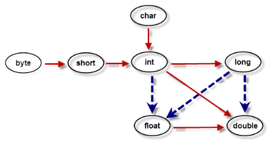

## 数据类型

 

#### 一、整型

Java整型默认类型是int。

| **类型** | **占用存储空间** | **表数范围**                                 |
| -------- | ---------------- | -------------------------------------------- |
| byte     | 1字节            | -27 ~  27-1（-128~127）                      |
| short    | 2字节            | -215 ~  215-1（-32768~32767）                |
| int      | 4字节            | -231 ~  231-1 (-2147483648~2147483647)约21亿 |
| long     | 8字节            | -263 ~  263-1                                |

**整型常量的表示形式：**

- 十进制整数，如：99, -500, 0
- 八进制整数，要求以 0 开头，如：015
- 十六进制数，要求 0x 或 0X 开头，如：0x15
- 二进制数，要求0b或0B开头，如：0b01110011


#### 二、浮点型

Java浮点型默认类型是double。

| **类型** | **占用存储空间** | **表数范围**         |
| -------- | ---------------- | -------------------- |
| float    | 4字节            | -3.403E38~3.403E38   |
| double   | 8字节            | -1.798E308~1.798E308 |

float类型被称作单精度类型，double类型被称作双精度类型。

**浮点类型的表示形式**：

- 十进制数形式，例如:3.14，314.0，0.314
- 科学记数法形式，如314e2，314E2，314E-2 


#### 三、字符型

字符型在内存中占2个字节，在Java中使用单引号来表示字符常量。

 char 类型用来表示在Unicode编码表中的字符。

| 转义符 | 含义              | Unicode值 |
| ------ | ----------------- | --------- |
| \b     | 退格（backspace） | \u0008    |
| \n     | 换行              | \u000a    |
| \r     | 回车              | \u000d    |
| \t     | 制表符（tab）     | \u0009    |
| \“     | 双引号            | \u0022    |
| \‘     | 单引号            | \u0027    |
| \\     | 反斜杠            | \u005c    |


#### 四、布尔型

boolean类型有两个常量值，true和false，在内存中占一位（不是一个字节）。


#### 五、类型转换

自动类型转换：指的是容量小的数据类型可以自动转换为容量大的数据类型。



- 实线表示无数据丢失的自动类型转换。
- 虚线表示在转换时可能会有精度的损失。


强制类型转换：又被称为造型，用于显式的转换一个数值的类型。

```java
double a=3.14;
int b=(int)a;	//b=3
```

