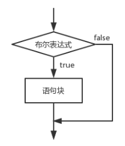
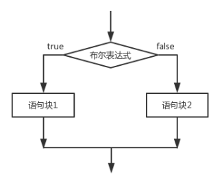
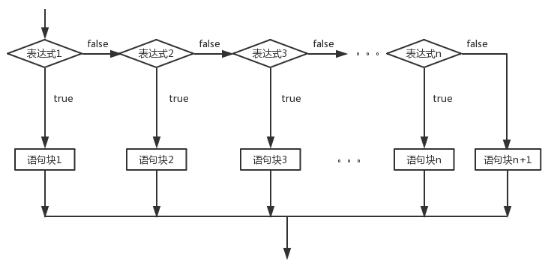
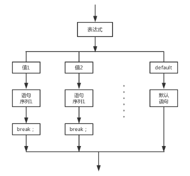
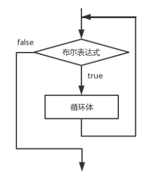
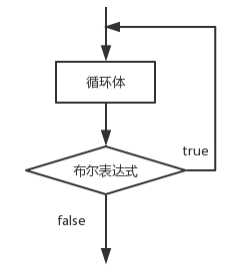
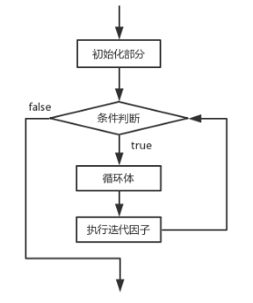

## 控制流程


#### 一、if语句

【1】if结构

语法：

```java
if(布尔表达式){
    语句块
}
```



【2】if-else结构

语法：

```java
if(布尔表达式){
	语句块1
}else{
	语句块2
}
```




【3】if-else-if-else结构

语法：

```java
if(布尔表达式1) {
	语句块1;
} else if(布尔表达式2) {
	语句块2;
}……
else if(布尔表达式n){
    语句块n;
} else {
    语句块n+1;
}
```




#### 二、switch语句

语法：

```java
switch (表达式) {
case 值1: 
	语句序列1;
	[break];
case 值2:
    语句序列2;
	[break];
     … … …      … …
[default:
 	默认语句;]
}
```




#### 三、while循环

while语法：

```java
while (布尔表达式) {
    循环体;
}
```




do-while语法：

```java
do {
	循环体;
} while(布尔表达式) ;
```




#### 四、for循环

for循环是while循环简化版。

for语法：

```java
for (初始表达式; 布尔表达式; 迭代因子) {
      循环体;
}
```




#### 五、中断语句

break语句：于强行退出循环，不执行循环中剩余的语句。

```java
public class Test{
    public static void main(String[] args){
        int sum=0;
        while(true) {
        	sum++;
        	int i=(int)Math.round(100*Math.random());
        	if(i==88) {
        		break;
        	}
        }
        System.out.println(sum);	//输出循环的次数
	}
}
```


continue语句：跳过循环体中尚未执行的语句，返回到是否执行循环的判定。

```java
public class Test{
    public static void main(String[] args){
        int sum=0;
        for(int i=1;i<100;i++) {
        	if(i%3!=0) {
        		continue;
        	}      	
        	sum++;
        }
        System.out.println(sum);	//统计被3整除数量
	}
}
```


#### 六、语句块

语句块：是用花括号扩起的任意数量的简单Java语句。

```java
public class Test {
    public static void main(String[] args) {
        int n;
        int a;
        {	//语句块
            int k;
            int n; //编译错误：不能重复定义变量n
        } //变量k的作用域到此为止
    }
}
```


#### 七、递归结构

递归的基本思想就是“自己调用自己”。

递归结构包括两个部分：定义递归头与递归体。

```java
package com.test.java;

public class Test {

	public static void main(String[] args) {
		System.out.println(factorial(5));
	}
	
	static long factorial(int n) {
		if(n==1) {	//递归头
			return 1;
		}else {		//递归体
			return n*factorial(n-1);
		}
	}
}
```

运行效果图：


