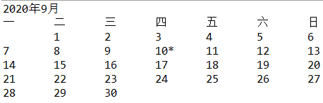

## 内部类


#### 一、Date类

1970 年 1 月 1 日 00:00:00定为基准时间。

```java
//创建对象
new Date()
```

```java
//将对象传递给方法
System.out.println(new Date());
```

```java
//对象调用方法，结果存放变量
String s = new Date().toString();
```

```java
//对象存放变量
//一个对象变量并没有实际包含一个对象，而仅仅引用一个对象
Date d = new Date();
```

```java
//对象变量设置为null,表明这个对象变量目前没有引用任何对象
d=null;
```


```java
public class TestDate {
	public static void main(String[] args) {
		Date d1=new Date();		//无参，获取当前时间
		System.out.println(d1);
		
		Date d2=new Date(2020);	//时间由1970开始，单位毫秒
		System.out.println(d2);
	}
}
```

>输出结果：
>
>Wed Jan 20 22:40:40 CST 2021
>Thu Jan 01 08:00:02 CST 1970


#### 二、LocalDate类

```java
LocalDate calender=LocalDate.now()				//构造一个表示当前日期的对象
LocalDate calender=LocalDate.of(1999, 12, 31)	//构造一个表示给定日期的对象
```

```java
calender.getYear()			//获取年，1999
calender.getMonthValue()	//获取月，12
calender.getDayOfMonth()	//获取日，31
```

```java
DayOfWeek week=calender.getDayOfWeek();		//创建星期对象
week.getValue()		//获取星期，1 表示星期一，7 表示星期日
```


```java
public class TestLocalDate {
	public static void main(String[] args) {
		/*LocalDate类不能使用构造器创建对象*/
		//LocalDate d1=LocalDate.now();	//创建日历对象，指定当前日期
		LocalDate d1=LocalDate.of(2020, 9, 10);		//创建日历对象,指定日期2020-9-10
		int year=d1.getYear();			//获取年份
		int month=d1.getMonthValue();	//获取月份
		int day=d1.getDayOfMonth();		//获取天数
		
		d1=d1.minusDays(day-1);		//设置为当月的第一天
		DayOfWeek week=d1.getDayOfWeek();	//创建星期对象
		int value=week.getValue();	//获取星期,1=星期一，7=星期日
		
		System.out.println(year+"年"+month+"月");
		System.out.println("一\t二\t三\t四\t五\t六\t日");
		
		for(int i=1;i<value;i++) {
			System.out.print("\t");
		}
		while(d1.getMonthValue()==month) {
			System.out.print(d1.getDayOfMonth());
			if(d1.getDayOfMonth()==day) {
				System.out.print("*");
			}
			if(d1.getDayOfWeek().getValue()!=7) {
				System.out.print("\t");
			}
			d1=d1.plusDays(1);
			if(d1.getDayOfWeek().getValue()==1) {
				System.out.println();
			}
		}		
	}
}
```

