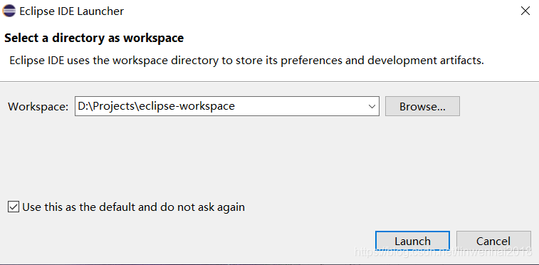

## Eclipse安装

版本：jdk-8u131-windows-x64.exe

OS：win10

JDK：1.8.0_131

#### 一、JDK环境变量

Eclipse IDE JDK版本要求：

URL：http://wiki.eclipse.org/Eclipse/Installation

Eclipse 4.16 (2020-06) was released on June 17, 2020.

Consider using the Installer. Please see 5 Steps to Install Eclipse.

A Java 8 or newer JRE/JDK is required, LTS release are preferred to run all Eclipse 2020-06 packages based on Eclipse 4.16, as well as the Installer.

【设置JDK环境变量】

1. 具体操作是：打开开始菜单，找到“此电脑”，然后右键“更多”→“属性”
2. 在弹出的页面，选择“高级系统设置”
3. 在弹出的页面，选择“环境变量（N）…”
4. 在系统变量区域，选择“新建”，输入变量名：JAVA_HOME，输入变量值：C:\Program Files\Java\jdk1.8.0_131，然后点击“确定”
5. 在系统变量区域，选择“新建”，输入变量名：CLASSPATH；输入变量值：.;%JAVA_HOME%\lib\dt.jar;%JAVA_HOME%\lib\tools.jar;
6. 在系统变量区域找到“Path”变量，并双击打开，点击新建，输入值：%JAVA_HOME%\bin
7. 在系统变量区域找到“Path”变量，并双击打开，点击新建，输入值：%JAVA_HOME%\jre\bin
8. 使用Windows图标+R，快速打开“运行”操作界面，并输入cmd，回车确认。

#### 二、下载eclipse

下载URL：https://www.eclipse.org/downloads/packages/release/2020-06/r

eclipse-java-2020-06-R-win32-x86_64.zip

历史版本：

#### 三、Eclipse IDE 安装

直接解压就可用。

1】设置项目路径：

2】创建新项目

#### 四、Eclipse使用技巧

- 把光标放类名，按Ctrl键+点击鼠标左键看类源码。
- 按Ctrl键+ /键：批量注释代码。