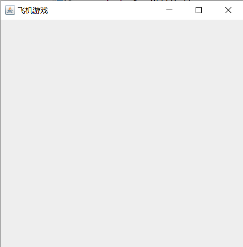
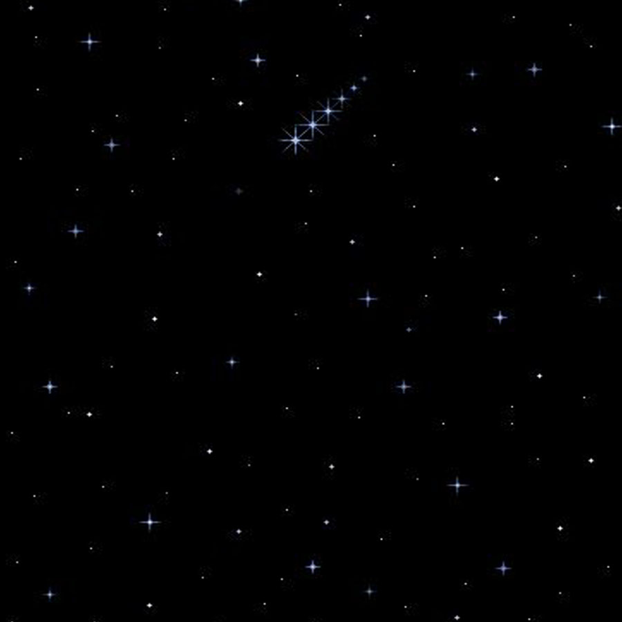
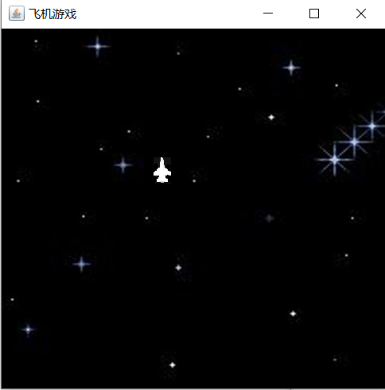
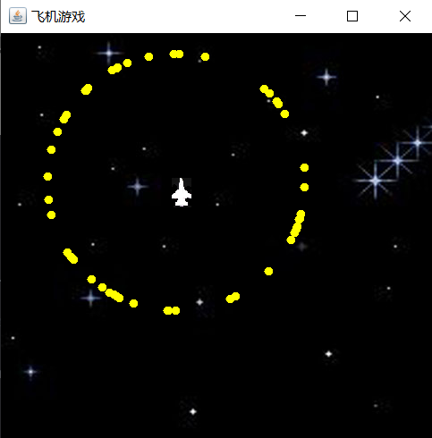

## Java飞机小项目

### 一、创建游戏主窗口

新建MyGameFrame.java

```java
package com.test.game;

import java.awt.event.WindowAdapter;
import java.awt.event.WindowEvent;
import javax.swing.JFrame;

public class MyGameFrame extends JFrame {    
    /*初始化窗口类*/
	public void launchFrame() {
		setTitle("飞机游戏");	//标题
		setVisible(true);		//窗口默认不可见，设为可见
		setSize(500,500);		//窗口大小，宽500，高500
		setLocation(300,300);	//窗口左上角顶点的坐标位置
		
		/*增加关闭窗口监听，用户可点击右上角关闭图标*/
		addWindowListener(new WindowAdapter() {
			@Override
			public void windowClosing(WindowEvent e) {
				System.exit(0);
			}	
		});
	}

    public static void main(String[] args) {
		MyGameFrame f=new MyGameFrame();
		f.launchFrame();
	}
}
```


### 二、加载背景和飞机图片

创建GameUtil.java

```java
package com.test.game;

import java.awt.Image;
import java.awt.image.BufferedImage;
import java.io.IOException;
import java.net.URL;
import javax.imageio.ImageIO;

public class GameUtil {		//加载图片工具类
	private GameUtil() {}
	
	public static Image getImage(String path) {
		BufferedImage bi =null;
		try {
			URL u=GameUtil.class.getClassLoader().getResource(path);
			bi=ImageIO.read(u);
		} catch(IOException e) {
			e.printStackTrace();
		}
		return bi;
	}
}
```




创建images目录，拷贝背景图片bg.jpg和飞机图片plane.png进来。 




修改MyGameFrame.java

```java
package com.test.game;

import java.awt.Graphics;
import java.awt.Image;
import java.awt.event.WindowAdapter;
import java.awt.event.WindowEvent;
import javax.swing.JFrame;

public class MyGameFrame extends JFrame {
	/*定义加载图片变量*/
	Image planeImg=GameUtil.getImage("images/plane.png");
	Image bgImg=GameUtil.getImage("images/bg.jpg");
	
	/*加载图片,被系统自动调用*/
	@Override
	public void paint(Graphics g) {
		g.drawImage(bgImg,0,0,null);
		g.drawImage(planeImg,300,300,null);	
	}
	--snip--
```




### 三、实现飞机移动功能

修改MyGameFrame.java

```java
package com.test.game;

import java.awt.Graphics;
import java.awt.Image;
import java.awt.event.WindowAdapter;
import java.awt.event.WindowEvent;
import javax.swing.JFrame;

public class MyGameFrame extends JFrame {
	int x=300,y=300;
	--snip--
	/*加载图片,被系统自动调用*/
	@Override
	public void paint(Graphics g) {
		g.drawImage(bgImg,0,0,null);
		g.drawImage(planeImg,x,y,null);	
		x++;	//飞机向右移动
	}

    /*增加PaintThread内部类*/
	class PaintThread extends Thread{
		@Override
		public void run() {
			while(true) {
				repaint();
				try {
					Thread.sleep(40);  //画图频率，毫秒
				}catch(InterruptedException e) {
					e.printStackTrace();
				}
			}
		}
	}
    
    /*初始化窗口*/
	public void launchFrame() {
		--snip--		
		new PaintThread().start();  //启动重画线程
	}
--snip--
```


### 四、创建游戏物体父类

创建GameObject.java

```java
package com.test.game;

import java.awt.Graphics;
import java.awt.Image;
import java.awt.Rectangle;

public class GameObject {
	Image img;
	double x,y;
	int speed;
	int width,height;
	
	public void drawSelf(Graphics g) {
		g.drawImage(img, (int)x, (int)y, null);
	}
	
	public GameObject(Image img, double x, double y, int speed, int width, int height) {
		super();
		this.img = img;
		this.x = x;
		this.y = y;
		this.speed = speed;
		this.width = width;
		this.height = height;
	}

	public GameObject(Image img, double x, double y) {
		super();
		this.img = img;
		this.x = x;
		this.y = y;
	}
	
	public GameObject() {}
	
    /*返回物体对应矩形区域，用于碰撞检测中使用*/
	public Rectangle getRect() {
		return new Rectangle((int)x,(int)y,width,height);
	}
}
```


创建Plane.java

```java
package com.test.game;

import java.awt.Graphics;
import java.awt.Image;

public class Plane extends GameObject {
	public void drawSelf(Graphics g) {
		g.drawImage(img, (int)x, (int)y, null);
		x++;
	}
	
	public Plane(Image img,double x,double y) {
		this.img=img;
		this.x=x;
		this.y=y;
	}
}
```


修改MyGameFrame.java

```java
package com.test.game;

import java.awt.Graphics;
import java.awt.Image;
import java.awt.event.WindowAdapter;
import java.awt.event.WindowEvent;
import javax.swing.JFrame;

public class MyGameFrame extends JFrame {
	/*定义加载图片变量*/
	Image planeImg=GameUtil.getImage("images/plane.png");
	Image bgImg=GameUtil.getImage("images/bg.jpg");
	
	Plane p=new Plane(planeImg,300,300);	//创建飞机对象
	
	/*加载图片,被系统自动调用*/
	@Override
	public void paint(Graphics g) {
		g.drawImage(bgImg,0,0,null);	//画背景
		p.drawSelf(g);  				//画飞机
	}
--snip--
```


### 五、添加键盘控制功能

按下键盘方向键，移动飞机。

【1】修改Plane.java

```java
package com.test.game;

import java.awt.Graphics;
import java.awt.Image;
import java.awt.event.KeyEvent;

public class Plane extends GameObject {
	boolean left,up,right,down;
	int speed=3;
	
	public void drawSelf(Graphics g) {
		g.drawImage(img, (int)x, (int)y, null);		
		if(left) {x-=speed;}
		if(right) {x+=speed;}
		if(up) {y-=speed;}
		if(down) {y+=speed;}
	}
	
	/*按下上下左右键，则改变方向值*/
	public void addDirection(KeyEvent e) {
		//System.out.println("-----"+e.getKeyCode());	//调试代码
		switch(e.getKeyCode()) {
		case KeyEvent.VK_LEFT:
			left=true;
			break;
		case KeyEvent.VK_UP:
			up=true;
			break;
		case KeyEvent.VK_RIGHT:
			right=true;
			break;
		case KeyEvent.VK_DOWN:
			down=true;
			break;
		}
	}
	
	/*松开上下左右键，则改变方向值*/
	public void minuDirection(KeyEvent e) {
		switch(e.getKeyCode()) {
		case KeyEvent.VK_LEFT:
			left=false;
			break;
		case KeyEvent.VK_UP:
			up=false;
			break;
		case KeyEvent.VK_RIGHT:
			right=false;
			break;
		case KeyEvent.VK_DOWN:
			down=false;
			break;
		}
	}
	--snip--
}
```

【2】修改MyGameFrame.java

```java
package com.test.game;

import java.awt.Graphics;
import java.awt.Image;
import java.awt.event.KeyAdapter;
import java.awt.event.KeyEvent;
import java.awt.event.WindowAdapter;
import java.awt.event.WindowEvent;
import javax.swing.JFrame;

public class MyGameFrame extends JFrame {
    --snip--
    /*定义键盘监听的内部类*/
	class KeyMonitor extends KeyAdapter{
		@Override
		public void keyPressed(KeyEvent e) {
			p.addDirection(e);
		}
		
		@Override
		public void keyReleased(KeyEvent e) {
			p.minuDirection(e);
		}
	}
    --snip--
    /*初始化窗口*/
	public void launchFrame() {
        --snip--
        addKeyListener(new KeyMonitor());	//给窗口增加键盘的监听
    }
--snip--
```


### 六、加载炮弹

【1】创建Constant.java

```java
package cn.sxt.game;

public class Constant {
	public static final int GAME_WIDTH = 500;
	public static final  int  GAME_HEIGHT = 500;
}
```

【2】创建Shell.java

```java
package com.test.game;

import java.awt.Color;
import java.awt.Graphics;

public class Shell extends GameObject {
	double degree;
	
	public Shell() {
		degree=Math.random()*Math.PI*2;
		x=200;
		y=200;
		width=10;
		height=10;
		speed=3;
	}
	
	public void draw(Graphics g) {
		//将外部传入对象g的状态保存好
		Color c=g.getColor();
		g.setColor(Color.yellow);
		g.fillOval((int)x, (int)y, width, height);
		
		//炮弹沿着任意角度飞行
		x+=speed*Math.cos(degree);
		y+=speed*Math.sin(degree);
		
		//实现碰到边界，炮弹反弹回来
		if(x<0||x>Constant.GAME_WIDTH-width) {
			degree=Math.PI-degree;
		}
		if(y>Constant.GAME_HEIGHT-height||y<30) {
			degree=-degree;
		}
		
		//返回给外部，变回以前的颜色
		g.setColor(c);
	}
}
```

【3】修改MyGameFrame.java

```java
package com.test.game;

import java.awt.Graphics;
import java.awt.Image;
import java.awt.event.KeyAdapter;
import java.awt.event.KeyEvent;
import java.awt.event.WindowAdapter;
import java.awt.event.WindowEvent;
import javax.swing.JFrame;

public class MyGameFrame extends JFrame {
	--snip--
	Shell s=new Shell();	//创建炮弹对象

    /*加载图片,被系统自动调用*/
	@Override
	public void paint(Graphics g) {	
		g.drawImage(bgImg, 0, 0, null);		//画背景
		p.drawSelf(g);  //画飞机
		s.draw(g);    //画炮弹
	}
--snip--
}
```


【4】修改MyGameFrame.java

创建容器存储多发炮弹

```java
--snip--
public class MyGameFrame extends Frame {
	--snip--
	
	//容器对象存储多发炮弹
	ArrayList<Shell> shellList=new ArrayList<Shell>();

	/*加载图片,被系统自动调用*/
	@Override
	public void paint(Graphics g) {	
		--snip--
		
		//画出容器中所有的子弹
		for(int i=0;i<shellList.size();i++) {
			Shell b=shellList.get(i);
			b.draw(g);
		}
	}

    --snip--

	/*初始化窗口*/
	public void launchFrame() {
		--snip--
		
		//初始化30个炮弹
		for(int i=0;i<50;i++) {
			Shell b=new Shell();
			shellList.add(b);
		}
--snip--
```




【5】解决闪烁问题

修改MyGameFrame.java

```java
--snip--
public class MyGameFrame extends Frame {
    --snip--

	private Image offScreenImage = null;
	 
	public void update(Graphics g) {
	    if(offScreenImage == null)
	        offScreenImage = this.createImage(500,500);//这是游戏窗口的宽度和高度
	     
	    Graphics gOff = offScreenImage.getGraphics();
	    paint(gOff);
	    g.drawImage(offScreenImage, 0, 0, null);
	}
}
```


### 七、添加炮弹与飞机碰撞效果

【1】修改Plane

```java
--snip--
public class Plane extends GameObject {
	boolean left,up,right,down;
	boolean  live = true; 
	
	public void drawSelf(Graphics g) {
		if(live) {
			g.drawImage(img, (int)x,(int) y, null);	
			if(left) {x-=speed;}
			if(right) {x+=speed;}
			if(up) {y-=speed;}
			if(down) {y+=speed;}
		}else {
			
		}
	}
	
--snip--
	
	public Plane(Image img,double x,double y) {
		this.img=img;
		this.x=x;
		this.y=y;
		this.speed=3;
		this.width=img.getWidth(null);
		this.height=img.getHeight(null);
	}
}
```


【2】修改MyGameFrame.java

```java
--snip--
		//画出容器中所有的炮弹
		for(int i=0;i<shellList.size();i++) {
			Shell b=shellList.get(i);
			b.draw(g);
			
			//飞机和所有炮弹对象进行矩形检测
			boolean peng=b.getRect().intersects(p.getRect());
			if(peng) {
				p.live=false;	//飞机死掉,画面不显示
			}
		}
--snip--	
```


【3】创建Explode.java

```java
package com.test.game;

import java.awt.Graphics;
import java.awt.Image;

public class Explode {
	double x,y;
	static Image[] imgs=new Image[16];
	static {
		for(int i=0;i<16;i++) {
			imgs[i]=GameUtil.getImage("images/explode/e"+(i+1)+".gif");
			imgs[i].getWidth(null);
		}
	}
	
	int count;
	
	public void draw(Graphics g) {
		if(count<=15) {
			g.drawImage(imgs[count],(int)x,(int)y,null);
            count++;
		}
	}
	
	public Explode(double x,double y) {
		this.x=x;
		this.y=y;
	}
}
```


【4】修改MyGameFrame.java

```java
--snip--
			//飞机和所有炮弹对象进行矩形检测
			boolean peng=b.getRect().intersects(p.getRect());
			if(peng) {
				p.live=false;	//飞机死掉,画面不显示
				if(bao==null) {
					bao=new Explode(p.x,p.y);
				}
				bao.draw(g);
			}
--snip--
```


### 八、添加游戏计时功能

【1】修改MyGameFrame.java

```java
--snip--
	/*加载图片,被系统自动调用*/
	@Override
	public void paint(Graphics g) {
		g.drawImage(bgImg,0,0,null);	//画背景
		p.drawSelf(g);  //画飞机
		
		//画出容器中所有的炮弹
		for(int i=0;i<shellList.size();i++) {
			Shell b=shellList.get(i);
			b.draw(g);
			
			//飞机和所有炮弹对象进行矩形检测
			boolean peng=b.getRect().intersects(p.getRect());
			if(peng) {
				p.live=false;	//飞机死掉,画面不显示
				if(bao==null) {
					bao=new Explode(p.x,p.y);
					endTime=new Date();
					period = (int)((endTime.getTime()-startTime.getTime())/1000);
				}
				bao.draw(g);
			}
		
			//计时功能，给出提示
			if(!p.live) {
				Color   c =  g.getColor();
				g.setColor(Color.red);
				Font f=new Font("宋体",Font.BOLD,30);
				g.setFont(f);
				g.drawString("时间："+period+"秒", (int)p.x, (int)p.y);
				g.setColor(c);
			}
		}
	}
```

