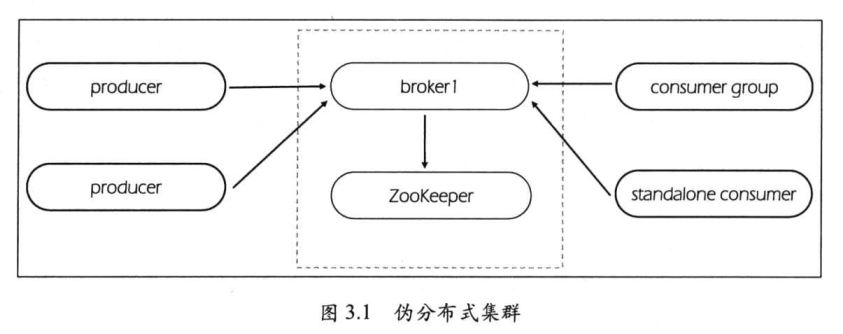

## Kafka伪分布环境




### 1 JDK安装

```shell
java -version
```


### 2 Zookeeper安装

```shell
tar -zxvf apache-zookeeper-3.5.8-bin.tar.gz
ln -s apache-zookeeper-3.5.8-bin zookeeper
cd /opt/zookeeper/conf
cp zoo_sample.cfg zoo.cfg
```


```shell
cat zoo.cfg
```

```
tickTime=2000
initLimit=10
syncLimit=5
dataDir=/opt/zookeeper/data
clientPort=2181
```


```shell
#启动zookeeper
bin/zkServer.sh start
bin/zkServer.sh status
```


### 3 Kafka安装

```shell
tar -zxvf kafka_2.11-1.1.1.tgz
ln -s kafka_2.11-1.1.1 kafka
```


```shell
vi bin/server.properties
```

```
broker.id=0
num.network.threads=3
num.io.threads=8
socket.send.buffer.bytes=102400
socket.receive.buffer.bytes=102400
socket.request.max.bytes=104857600
log.dirs=/opt/kafka/data-logs
num.partitions=1
num.recovery.threads.per.data.dir=1
offsets.topic.replication.factor=1
transaction.state.log.replication.factor=1
transaction.state.log.min.isr=1
log.retention.hours=168
log.segment.bytes=1073741824
log.retention.check.interval.ms=300000
zookeeper.connect=localhost:2181
zookeeper.connection.timeout.ms=6000
group.initial.rebalance.delay.ms=0
```


```shell
#启动kafka
bin/kafka-server-start.sh -daemon config/server.properties
```


```shell
tail -n 10 bin/logs/server.log
```

```
[2020-06-06 23:33:03,809] INFO [KafkaServer id=0] started (kafka.server.KafkaServer)
```


### 4 测试

```shell
#创建主题test
bin/kafka-topics.sh --create --zookeeper localhost:2181 --replication-factor 1 --partitions 1 --topic test
```


```shell
#查看所有主题
bin/kafka-topics.sh --list --zookeeper localhost:2181
#查看主题test状态
bin/kafka-topics.sh --describe --zookeeper localhost:2181 --topic test
```


```shell
#向主题test发送消息
bin/kafka-console-producer.sh --broker-list localhost:9092 --topic test
```

```shell
#消费主题test消息
bin/kafka-console-consumer.sh --bootstrap-server localhost:9092 --topic test --from-beginning
```


```shell
#生产者吞吐量测试
bin/kafka-producer-perf-test.sh --producer-props bootstrap.servers=localhost:9092 --topic test --num-records 50000 --record-size 10 --throughput 400
```

```
50000 records sent, 399.939209 records/sec (3.00 MB/sec), 1.19 ms avg latency, 260.00 ms max latency, 1 ms 50th, 2 ms 95th, 9 ms 99th, 56 ms 99.9th.
```

平均每秒吞吐量：3.00 MB/sec（24Mb/s）
平均每秒发送消息：399.939209 records/sec
平均延时：1.19 ms avg latency
最大延时：260.00 ms max latency
平均50%消息发送耗时：1 ms 50th
平均95%消息发送耗时：2 ms 95th
平均99%消息发送耗时：9 ms 99th
平均99.9%消息发送耗时：56 ms 99.9th


```shell
#消费组测试吞吐量
bin/kafka-consumer-perf-test.sh --broker-list localhost:9092 --topic test --fetch-size 200 --messages 50000 --threads 1
```


