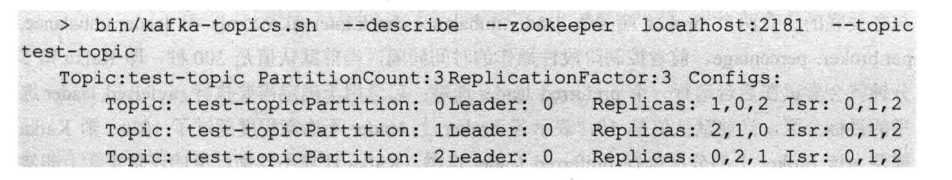
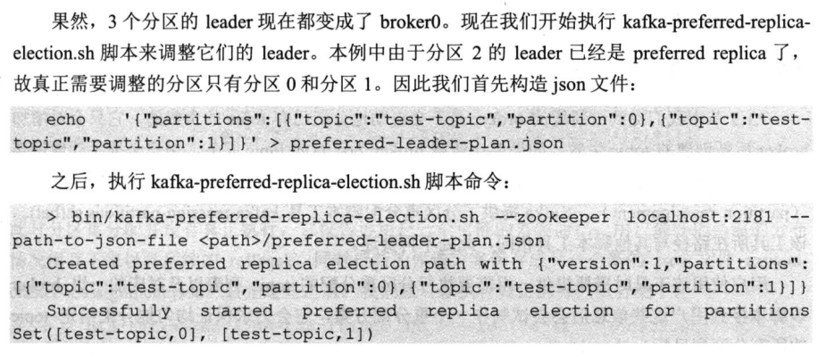
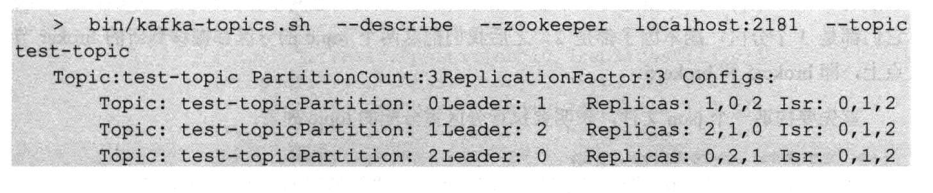
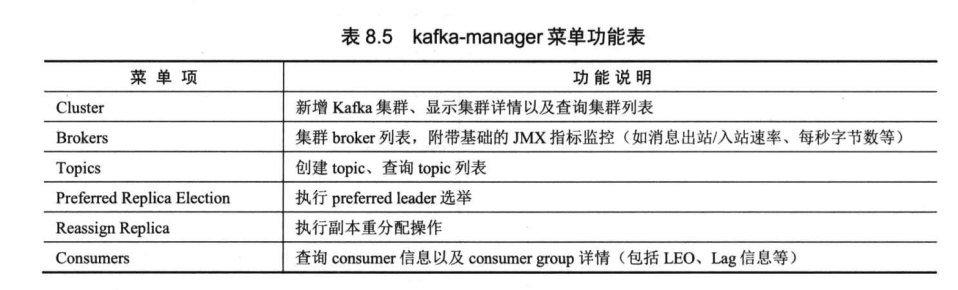
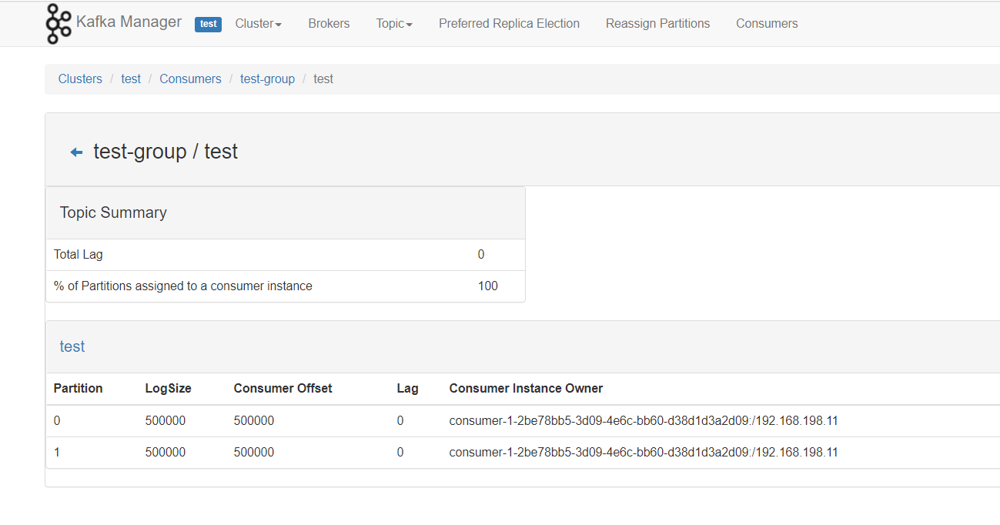

### 1 启停broker

```shell
#启动kafka,-daemon后台启动
bin/kafka-server-start.sh -daemon config/server.properties
```

```shell
#停止kafka
bin/kafka-server-stop.sh
```


### 2 主题topic

```shell
#创建topic，指定分区和副本
bin/kafka-topics.sh --create --zookeeper localhost:2181 --replication-factor 1 --partitions 1 --topic test
```


```shell
# 删除topic
bin/kafka-topics.sh --delete --zookeeper localhost:2181 --topic test
```


```shell
#查询topic
bin/kafka-topics.sh --describe --zookeeper localhost:2181 --topic test
```


```shell
#增加主题分区，kafka不支持减少分区
bin/kafka-topics.sh --alter --zookeeper localhost:2181 --partitions 2 --topic test
```


### 3 消费组consumer

```shell
#插入测试数据
bin/kafka-producer-perf-test.sh --producer-props bootstrap.servers=localhost:9092 --topic test --num-records 1000000 --record-size 100 --throughput -1
```


```shell
#重头消费主题test，指定消费组test-group1
bin/kafka-console-consumer.sh --bootstrap-server localhost:9092 --topic test --from-beginning --consumer-property group.id=test-group1
```


```shell
#查看集群消费组列表
bin/kafka-consumer-groups.sh --bootstrap-server localhost:9092 --list
```


```shell
#查看消费组test-group1信息
bin/kafka-consumer-groups.sh --bootstrap-server localhost:9092 --describe --group test-group1
```


```shell
#查看消费组test-group1成员
bin/kafka-consumer-groups.sh --bootstrap-server localhost:9092 --describe --group test-group1 --members
```


```shell
#删除消费组
bin/kafka-consumer-groups.sh -bootstrap-server localhost:9092 --delete --group test-group1
```


### 4 重置offset

```shell
#--to-earliest，重置offset为0位移
bin/kafka-consumer-groups.sh --bootstrap-server localhost:9092 --group test-group1 --reset-offsets --all-topics --to-earliest --execute
```


```shell
#--to-latest，重置offset为最新位移
bin/kafka-consumer-groups.sh --bootstrap-server localhost:9092 --group test-group1 --reset-offsets --all-topics --to-latest --execute
```


```shell
# --to-offset，重置offset到位移(固定位移100000)
bin/kafka-consumer-groups.sh --bootstrap-server localhost:9092 --group test-group1 --reset-offsets --all-topics --to-offset 100000 --execute
```


```shell
#--shift-by，重置offset到位移（最新位移-100000）
bin/kafka-consumer-groups.sh --bootstrap-server localhost:9092 --group test-group1 --reset-offsets --all-topics --shift-by -100000 --execute
```


```shell
#--to-datetime，重置offset到位移（固定时间）
bin/kafka-consumer-groups.sh --bootstrap-server localhost:9092 --group test-group1 --reset-offsets --all-topics --to-datetime 2020-06-07T10:00:00.000 --execute
```


```shell
#--by-duration，重置offset到位移(1小时前)
bin/kafka-consumer-groups.sh --bootstrap-server localhost:9092 --group test-group --reset-offsets --all-topics --by-duration PT1H0M0S --execute
```


### 5 preferred replica

3节点模拟故障








### 6 kafka-manager

Apache Kafka集群管理工具CMAK(Cluster Manager for Apache Kafka)

下载：

https://github.com/yahoo/CMAK

cmak-3.0.0.4.zip


kafka-manager-1.3.3.13.zip（已构建好zip）

```
#修改内容
kafka-manager.zkhosts="localhost:2181"
```

```shell
bin/kafka-manager
```

```
[info] p.c.s.NettyServer - Listening for HTTP on /0:0:0:0:0:0:0:0:9000
```







