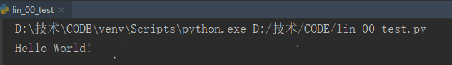
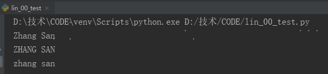
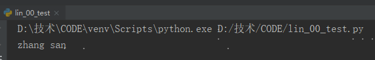
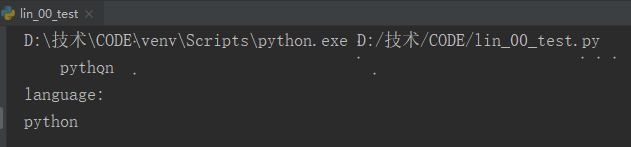
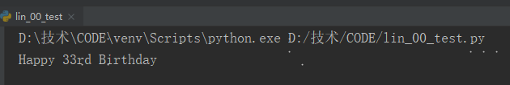

### 1 变量

- 变量名只能包含字母、数字和下划线。
- 变量名不能包含空格，但可使用下划线来分隔其中的单词。
- 不要将Python关键字和函数名用作变量名。
- 变量名应既简短又具有描述性。
- 慎用小写字母l和大写字母O。

```python
message = 'Hello World!'
print(message)
```




### 2 字符串

字符串就是一系列字符。在Python中，用引号括起的都是字符串，其中的引号可以是单引号，也可以是双引号。

1】字母转换

```
方法title()：以首字母大写的方式显示每个单词，即将每个单词的首字母都改为大写。
方法upper()：字符串全部转换大写字母。
方法lower()：字符串全部转换小写字母。
```

```shell
name = "zhang san"
print(name.title())
print(name.upper())
print(name.lower())
```




2】Python使用加号（+）来合并字符串

```python
first_name = 'zhang'
last_name = 'san'
full_name = first_name + " " + last_name
print(full_name)
```




3】Python使用制表符 \t 或换行符 \n 来添加空白

```python
print("\tpython")
print("language:\npython")
```




4】删除空白

```
方法lstrip() ：删除字符首空格
方法rstrip() ：删除字符末尾空格
方法strip()  ：删除字符首尾空格
```

```python
language_1 = ' python'
language_2 = 'python '
language_3 = ' python '
print(language_1.lstrip())
print(language_2.rstrip())
print(language_3.strip())
```


5】使用函数str()避免类型错误

```
函数str()：将非字符串值转换为字符串
```

```python
age = 33
message = "Happy " + str(age) + "rd Birthday"
print(message)
```



