## 列表

列表由一系列按特定顺序排列的元素组成，用方括号[]表示列表，用逗号分隔元素。

### 1 访问列表元素

指定索引，访问列表元素 。
第一个列表元素的索引为0，而不是1，最后一个元素索引为-1，倒数第二个元素索引为-2。

```python
language = ['c','java','php','python']
print(language[0])
print(language[1])
print(language[-1])
```

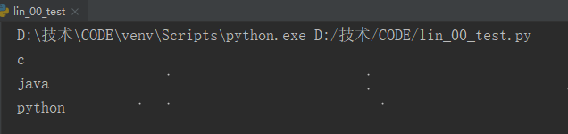


### 2 修改列表元素

指定列表名和元素索引，修改元素值。

```python
language = ['c','java','php','python']
language[1]='go'
print(language)
```

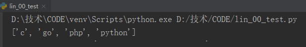


### 3 在列表中添加元素

方法append()：将元素添加到了列表末尾。

```python
language = []
language.append('c')
language.append('java')
language.append('python')
print(language)
```

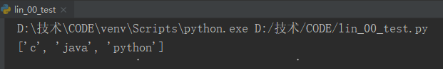


### 4 在列表中插入元素

方法insert()：指定索引位置和新元素，添加到列表。

```python
language = ['c','java','python']
language.insert(1,'php')
print(language)
```

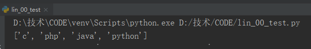


### 5 从列表中删除元素

1】方法del：指定索引删除元素

```python
language = ['c', 'php', 'java', 'python']
del language[0]
print(language)
```

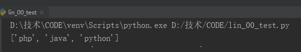


2】方法pop()：删除列表末尾的元素，并能够接着使用

```python
language = ['c', 'php', 'java', 'python']
language_2 = language.pop()
print(language_2)
print(language)
```

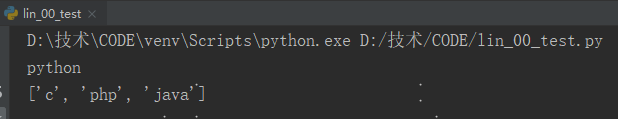


3】方法remove()：根据元素值删除元素（如列表有多个值，需使用for循环删除）

```python
language = ['c', 'php', 'java', 'python']
language.remove('php')
print(language)
```

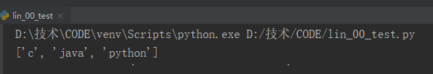


### 6 列表排序

1】方法sort()：对列表进行永久性排序，默认升序，反序使用参数reverse=True

```python
language = ['c', 'php', 'java', 'python']
language.sort()
print(language)
```

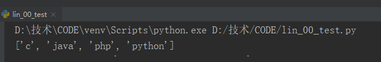


```python
language = ['c', 'php', 'java', 'python']
language.sort(reverse=True)
print(language)
```

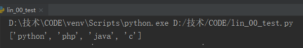


2】函数sorted()：对列表进行临时排序，默认升序，反序使用参数reverse=True

```python
language = ['c', 'php', 'java', 'python']
print(sorted(language))
print(language)
```

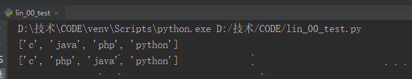


```python
language = ['c', 'php', 'java', 'python']
print(sorted(language,reverse=True))
print(language)
```

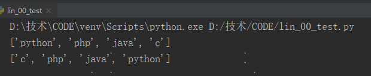


3】方法reverse()：永久性反转列表元素的排列顺序（非首字母排列）

```python
language = ['c', 'php', 'java', 'python']
language.reverse()
print(language)
```


### 7 遍历整个列表

```python
languages = ['c', 'php', 'java', 'python']
for language in languages:
    print(language)
```

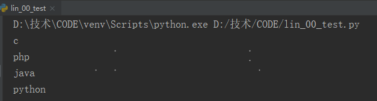


### 8 创建数字列表

1】函数range()：生成一系列的数字

```python
for value in range(1,5):
    print(value)
```

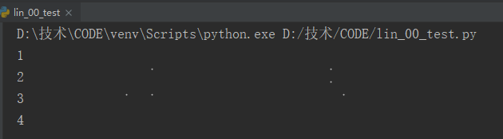


2】函数list()：将range()的结果直接转换为列表

```python
numbers = list(range(1,6))
print(numbers)
```


### 9 列表解析

```python
numbers = []
for number in range(1,11):
    numbers.append(number**2)
print(numbers)
```

```python
numbers = [number**2 for number in range(1,11)]
print(numbers)
```

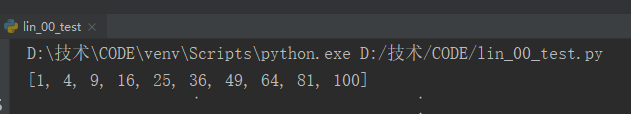


### 10 列表统计计算

```python
numbers = [1,2,3,4,5,6,7,8,9,0]
print(min(numbers))
print(max(numbers))
print(sum(numbers))
print(len(numbers))
```

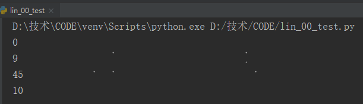


### 11 切片

1】使用切片提取列表元素

如没有指定第一个索引，将自动从列表开头开始。
如没有指定最后索引，将提取到列表末尾的所有元素。

```python
languages = ['c','php','java','python','go']
print(languages[0:3])
print(languages[1:4])
print(languages[:3])
print(languages[2:])
```

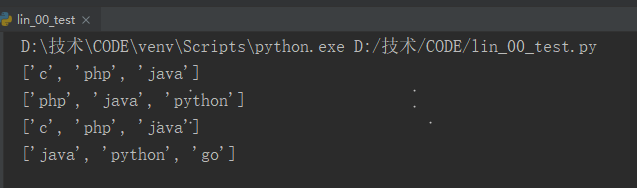


2】使用for循环遍历切片

```python
languages = ['c','php','java','python','go']
for language in languages[:3]:
    print(language)
```

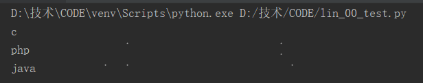


### 12 复制列表

要复制列表，可创建一个包含整个列表的切片，方法是同时省略起始索引和终止索引（[:]）

```python
languages = ['c','php','java','python','go']
my_languages = languages[:]
print(my_languages)
```

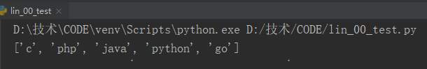


### 13 元组

不可变的列表被称为元组，元组使用圆括号表示，语法和列表类似。

```python
numbers = (100,200,300)
print(numbers[0])
print(numbers[1])
```

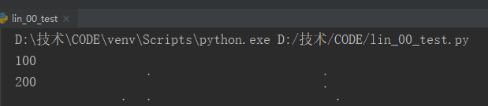


