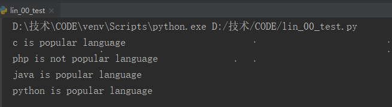

## if语句

#### 1 条件测试

每条if语句的核心都是一个值为True或False的表达式，这种表达式被称为条件测试。

小于、小于等于、大于、大于等于、等于、不等于。

```python
>>> age = 19
>>> age < 21
True
>>> age <= 21
True
>>> age > 21
False
>>> age >= 21
False
>>> age == 19
True
>>> age != 19
False
```


#### 2 检查多个条件

| 检查条件   |                                              |
| ---------- | -------------------------------------------- |
| and        | 两个条件都为True，整个表达式就为True         |
| or         | 只要至少有一个条件为True，整个表达式就为True |
| in         | 判断特定的值是否已包含在列表中               |
| not in     | 检查特定值是否不包含在列表中                 |
| 布尔表达式 | 结果要么为True，要么为为False                |


#### 3 if-else结构

```python
age = 17
if age >= 18:
    print("你是成年人")
else:
    print("你是未成年人")
```


#### 4 if-elif-else结构

```python
age = 5
if age >= 18:
    print("你是成年人")
elif age > 6:
    print("你是少年人")
else:
    print("你是儿童")
```


#### 5 多elif代码块

```python
age = 67
if age < 6:
    print("你是儿童")
elif age < 18:
    print("你是少年人")
elif age < 60:
    print("你是成年人")
else:
    print("你是老年人")
```


#### 5 使用if语句处理列表

```python
languages = ['c','php','java','python']
for language in languages:
    if language == 'php':
        print("php is not good language")
    else:
        print(language + " is good language")
```


#### 7 使用多个列表

```python
a_languages = ['c','php','java','python']
b_languages = ['c','go','java','python']
for language in a_languages:
    if language in b_languages:
        print(language + " is popular language")
    else:
        print(language + " is not popular language")
```




