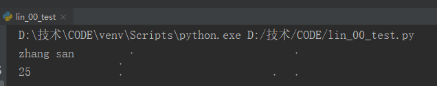
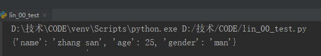
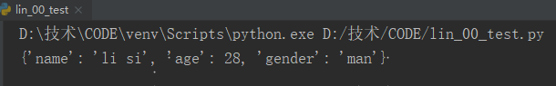
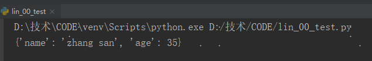
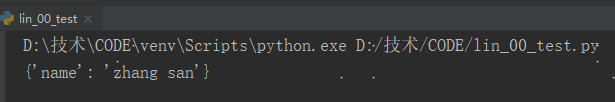
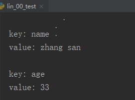
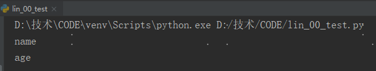
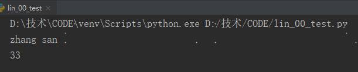
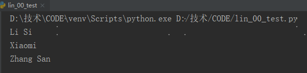

## 字 典

在Python中，字典是一系键-值对。


### 1 访问字典中的值

```python
message = {'name':'zhang san','age':25}
print(message['name'])
print(message['age'])
```




### 2 键添加键-值对

```python
message = {'name':'zhang san','age':25}
message['gender'] = 'man'
print(message)
```




```python
message = {}
message['name'] = 'li si'
message['age'] = 28
message['gender'] = 'man'
print(message)
```





### 3 修改字典中的值

```python
messages = {'name':'zhang san','age':33}
messages['age'] = 35
print(messages)
```




### 4 删除键值对

del语，指定字典名和要删除的键。

```python
messages = {'name':'zhang san','age':33}
del messages['age']
print(messages)
```




### 5 访问字典键值对

方法items()：返回一个键值对列表。

```python
messages = {'name':'zhang san','age':33}
for key,value in messages.items():
    print("\nkey: " + key)
    print("value: " + str(value))
```




方法keys()：只返回字典的键

```python
messages = {'name':'zhang san','age':33}
for key in messages.keys():
    print(key)
```




方法`values()`：返回字典的值

```python
messages = {'name':'zhang san','age':33}
for value in messages.values():
    print(str(value))
```




函数sorted()：按特定顺序排列的键列表的副本。

```python
languages = {'xiaomi':'php','zhang san':'c','li si':'java'}
for name in sorted(languages.keys()):
    print(name.title())
```




### 6 嵌套

将一系列字典存储在列表中，或将列表作为值存储在字典中，这称为嵌套

#### 1】在列表中存储字典

```python
languages = [{'zhang': 'c'}, {'wu': 'php'}, {'lin': 'python'}]
```


#### 2】在字典中存储列表

```python
languages = {'zhang':'c','lin':['python','java']}
```


#### 3】在字典中存储字典

```python
languages = {'language_1':{'zhang':'c'},'language_2':{'wu':'php'}}
```

