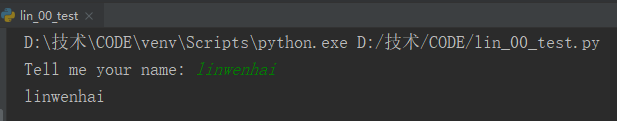
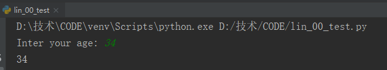
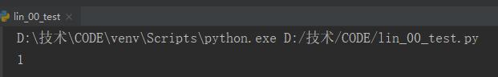
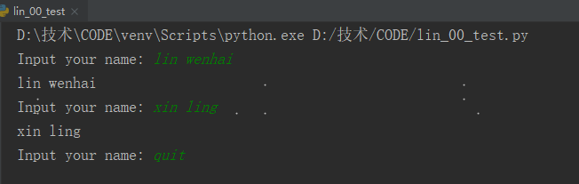
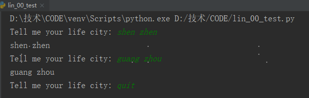
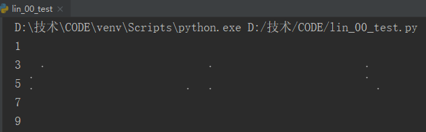
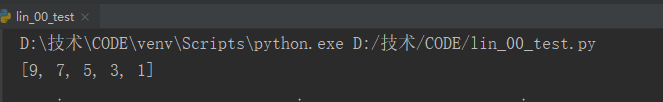
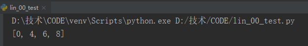
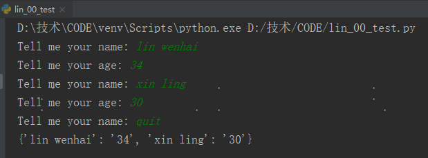

## 用户输入和while循环

### 1 函数input()

函数input()让程序暂停运行，等待用户输入一些文本。

```python
names = input("Tell me your name: ")
print(names)
```




使用int()来获取`数值`输入。

```python
ages = int(input("Inter your age: "))
print(ages)
```




求模运算符%，将两个数相除并返回余数。

```python
number = 4 % 3
print(number)
```




### 2 while循环

for循环用于针对集合中的每个元素都一个代码块；

while循环不断地运行，直到指定的条件不满足为止。


### 3 使用标志退出循环

定义一个变量，用于判断整个程序是否处于活动状态。这个变量被称为标志。

```python
q = True
while q:
    message = input("Input your name: ")
    if message == 'quit':
        q = False
    else:
        print(message)
```




### 4 使break退出循环

```python
while True:
    city = input("Tell me your life city: ")
    if city == 'quit':
        break
    else:
        print(city)
```




### 5 在循环中使continue返回到循环开头

要返回到循环开头，并根据条件测试结果决定是否继续执行循环，可使用continue语句

```python
number = 0
while number < 10:
    number += 1
    if number % 2 == 0:
        continue
    print(number)
```




### 6 使用循环在列表之间移动元素

```python
number_1 = [1,3,5,7,9]
number_2 = []
while number_1:
    number = number_1.pop()
    number_2.append(number)
print(number_2)
```




### 7 使用循环删除列表元素

函数remove()

```python
numbers = [0,2,4,6,8,2]
while 2 in numbers:
    numbers.remove(2)
print(numbers)
```




### 8 使用用户输入来填充字典

```python
messages = {}
active = True
while active:
    name = input("Tell me your name: ")
    if name == 'quit':
        break
    age = input("Tell me your age: ")
    if age == 'quit':
        break
    messages[name] = age
print(messages)
```



