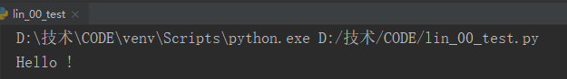
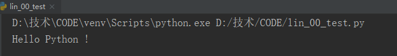
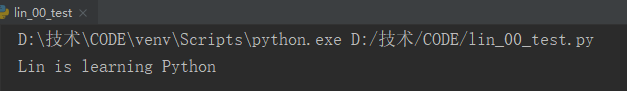
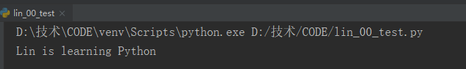
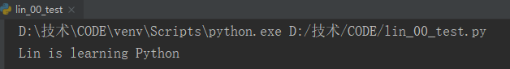
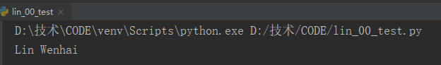
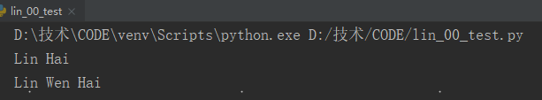
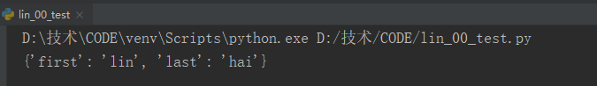
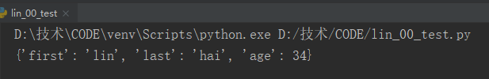

## 函数

### 1 定义函数

使用关键字`def`，以冒号结尾。

```python
def my_function():
    """打印问候语"""
    print("Hello !")
    
my_function()
```




### 2 向函数传递参数

`形参`：username

`实参`：linwenhai

```python
def my_function(language):
    """打印问候语"""
    print("Hello " + language.title() + " !")

my_function("python")
```




### 3 位置参数

位置参数：基于实参的顺序的关联方式称为位置实参。

```python
def my_f(name,language):
    """打印学习语言信息"""
    print(name.title() + " is learning " + language.title())

my_f("lin","python")
```




### 4 关键字实参

关键字实参：是传递给函数的名称-值对

```python
def my_f(name,language):
    """打印学习语言信息"""
    print(name.title() + " is learning " + language.title())

my_f(name="lin",language="python")
```




### 5 参数默认值

函数参数使用默认值，在形参列表中须先列出没有默认值的形参，在列出有默认值的形参。

```python
def my_f(name,language='python'):
    """打印学习语言信息"""
    print(name.title() + " is learning " + language.title())

my_f("lin")
```




### 6 返回值return

```python
def get_name(first_name,last_name):
    """返回全名"""
    full_name = first_name + " " + last_name
    return full_name.title()

print(get_name("lin","wenhai"))
```




### 7 形参可选

middle_name指定一个默认值--空字符串。

```python
def get_full_name(first_name,last_name,middle_name=''):
    """返回全名"""
    if middle_name:
        full_name = first_name + " " + middle_name + " " + last_name
    else:
        full_name = first_name + " " + last_name
    return full_name.title()

print(get_full_name("lin","hai"))
print(get_full_name("lin","hai","wen"))
```




### 8 返回字典

```python
def my_f(first_name,last_name):
    """返回一个字典"""
    message = {'first':first_name,'last':last_name}
    return message

print(my_f("lin","hai"))
```




```python
def my_f(first_name,last_name,age=''):
    """返回一个字典"""
    message = {'first':first_name,'last':last_name}
    if age:
        message['age'] = age
    return message

print(my_f("lin","hai",age=34))
```




### 9 函数和while循环

```python
def get_full_name(first_name,last_name):
    """返回全名"""
    full_name = first_name + " " + last_name
    return full_name.title()

while True:
    f_name = input("Inter your first name: ")
    if f_name == 'q':
        break
    l_name = input("Inter your last name: ")
    if l_name == 'q':
        break
    print(get_full_name(f_name,l_name))
```


