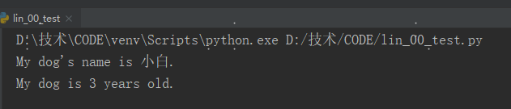
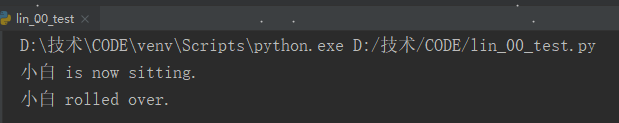
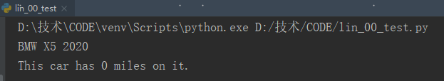
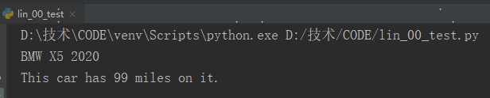
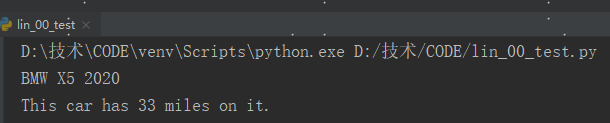

## 类

面向对象编程是最有效的软件编写方法之一，使用面向对象编程可模拟现实情景

使用类来模拟现实世界中情景。

根据类来创建对象被称为实例化。

类中的函数称为方法。

可通过实例访问的变量称为属性。


### 1 定义类

```python
class Dog():
    """模拟小狗"""
    def __init__(self,name,age):
         """初始化属性name和age"""
         self.name = name
         self.age = age
    def sit(self):
        """模拟蹲下"""
        print(self.name + " is now sitting.")
    def roll_over(self):
        """模拟打滚"""
        print(self.name + " rolled over.")
```

方法`__init__`()定义成了包含三个形参：self、name和age，形参self必不可少，须位于其他形参的前面。

Python调用这个`__init__`()方法来创建Dog实例时，将自动传入实参self。每个与类相关联的方法调用都自动传递实参self，它是一个指向实例本身的引用，让实例能够访问类中的属性和方法。


### 2 根据类创建实例

```python
class Dog():
	...

my_dog = Dog("小白",6)
print("My dog's name is " + my_dog.name + ".")
print("My dog is " + str(my_dog.age) + " years old.")
```




#### 1】访问属性

my_dog.name，my_dog.age


#### 2】调用方法

根据Dog类创建实例后，就可以使用句点表示法来调用Dog类中定义的任何方法。

```python
class Dog():
    ...
my_dog = Dog("小白",3)
my_dog.sit()
my_dog.roll_over()
```




### 3 创建多个实例

```python
class Dog():
    ...
my_dog = Dog("小白",3)
your_dog = Dog("小黑",2)
print("My dog's name is " + my_dog.name + ".")
print("Your dog's name is " + your_dog.name + ".")
```


### 4 修改属性的值

#### 1】给属性指定默认值

```python
class Car():
    """定义一个汽车类"""

    def __init__(self,make,model,year):
        self.make = make
        self.model = model
        self.year = year
        """给属性指定默认值"""
        self.mile = 0

    def get_message(self):
        """显示车完整信息"""
        message = self.make + " " + self.model + " " + str(self.year)
        return  message

    def read_mile(self):
        """显示里程数"""
        print("This car has " + str(self.mile) + " miles on it.")

my_car = Car('BMW','X5',2020)
print(my_car.get_message())
my_car.read_mile()
```




#### 2】直接修改属性的值

```python
class Car():
	...
my_car = Car('BMW','X5',2020)
print(my_car.get_message())
my_car.mile = 99
my_car.read_mile()
```




#### 3】通过方法修改属性的值

```python
class Car():
	...
    def update_mile(self,mile):
        self.mile = mile
    ...

my_car = Car('BMW','X5',2020)
print(my_car.get_message())
my_car.update_mile(33)
my_car.read_mile()
```




