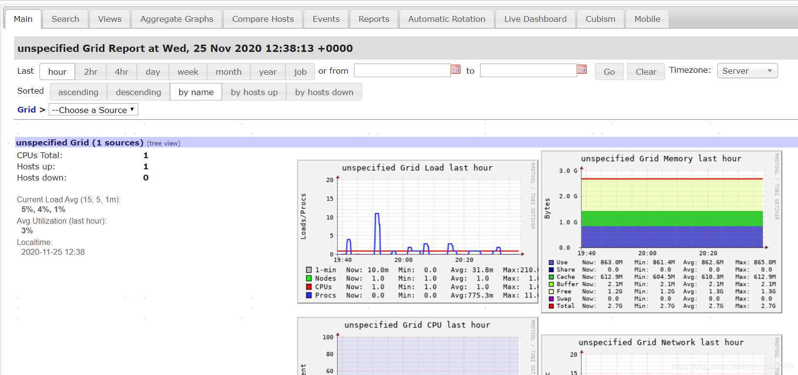

## Ganglia 安装配置

### 一、简介

Ganglia是UC Berkeley发起的一个开源集群监视项目，设计用于测量数以千计的节点。Ganglia的核心包含gmond、gmetad以及web前端。主要是用来监控系统性能，如：cpu 、mem、硬盘利用率， I/O负载、网络流量情况等，通过曲线很容易见到每个节点的工作状态，对合理调整、分配系统资源，提高系统整体性能起到重要作用。

- gmond：客户端，是一个守护进程，运行在每一个需要监测的节点上，用于收集本节点的信息并发送到其他节点，同时也接收其他节点发过了的数据，默认的监听端口为8649。

- gmetad：服务端，是一个守护进程，运行在一个数据汇聚节点上，定期检查每个监测节点的gmond进程并从那里获取数据，然后将数据指标存储在本地RRD存储引擎中。

- web前端：是一个基于web的图形化监控界面，需要和Gmetad安装在同一个节点上，它从gmetad取数据，并且读取RRD数据库，通过rrdtool生成图表。

 

### 二、安装配置

OS版本：Centos 7.8

#### 1 安装Ganglia

```bash
# CentOS系统中默认的yum源并没有包含Ganglia，需安装扩展yum源
wget http://dl.fedoraproject.org/pub/epel/epel-release-latest-7.noarch.rpm
rpm -ivh epel-release-latest-7.noarch.rpm
```

```bash
# 安装gmetad、gmond、web前端
yum -y install ganglia*
```


#### 2 配置Ganglia

##### 2.1 ganglia.conf

（服务端 web）/etc/httpd/conf.d/ganglia.conf

```bash
#
# Ganglia monitoring system php web frontend
#
 
Alias /ganglia /usr/share/ganglia
 
<Location /ganglia>
  # Order deny,allow
  # Allow from all
  # Deny from all
  # Allow from 127.0.0.1
  # Allow from ::1
  # Allow from .example.com
  Require all granted
</Location>
```


##### 2.2 gmetad.conf

（服务端 gmetad）/etc/ganglia/gmetad.conf

```bash
# hbase为自定义集群名，192.168.100.11为节点ip
data_source "hbase" 192.168.100.11
```


##### 2.3 gmond.conf

（客户端 gmond）

/etc/ganglia/gmond.conf

通过将各个gmond节点的数据送到一个gmond节点上，然后gmetad去这个节点上获取所有的数据。

```bash
# 修改name与gmetad定义名字一致
cluster {
  name = "hbase"
  owner = "unspecified"
  latlong = "unspecified"
  url = "unspecified"
}
 
 
 
udp_send_channel {
  #mcast_join = 239.2.11.71    # 此处为多播设置，单播模式要注释
  host = 192.168.100.11 # gmond中心节点，收集所有监控节点的数据
  port = 8649
  ttl = 1
}
 
 
# 接受其他监控节点发送的UDP数据
udp_recv_channel {
  port = 8649
  retry_bind = true
}
```


#### 3 配置hadoop

etc/hadoop/hadoop-metrics2.properties

```bash
namenode.sink.ganglia.servers=yourgangliahost_1:8649,yourgangliahost_2:8649
datanode.sink.ganglia.servers=yourgangliahost_1:8649,yourgangliahost_2:8649
resourcemanager.sink.ganglia.servers=yourgangliahost_1:8649,yourgangliahost_2:8649
nodemanager.sink.ganglia.servers=yourgangliahost_1:8649,yourgangliahost_2:8649
mrappmaster.sink.ganglia.servers=yourgangliahost_1:8649,yourgangliahost_2:8649
jobhistoryserver.sink.ganglia.servers=yourgangliahost_1:8649,yourgangliahost_2:8649
```

需重启hadoop


#### 4 启动Ganglia

```bash
service gmetad start
service gmond start
service httpd start
```


访问：http://192.168.100.11/ganglia/

