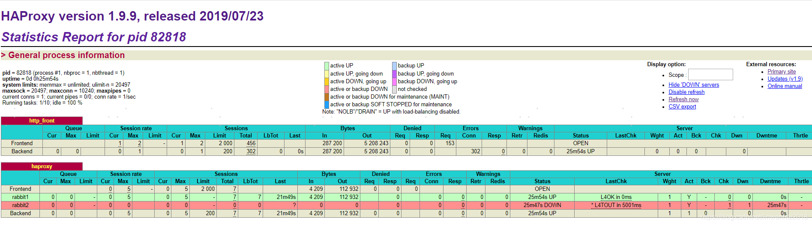

## Haproxy安装配置

OS：centos 7.3

Hproxy：haproxy-1.9.9

Hproxy国内下载：https://mirrors.huaweicloud.com/haproxy/


### 一、安装

```bash
cd /opt
wget https://mirrors.huaweicloud.com/haproxy/1.9/src/haproxy-1.9.9.tar.gz
tar -zxvf haproxy-1.9.9.tar.gz
cd haproxy-1.9.9
make TARGET=generic PREFIX=/opt/haproxy
make install PREFIX=/opt/haproxy
```


### 二、配置

```bash
cd /opt/haproxy
mkdir conf
vi conf/haproxy.cfg
```

```bash
global
  #日志输出配置，所有日志都记录在本机，通过local0输出
  log 127.0.0.1 local0 info
  #最大连接数
  maxconn 10240
  #以守护进程方式运行
  daemon

defaults
  #应用全局的日志配置
  log global
  mode http
  #超时配置
  timeout connect 5000
  timeout client 5000
  timeout server 5000
  timeout check 2000

listen http_front #haproxy的客户页面
  bind 192.168.100.11:8888
  mode http
  option httplog
  stats uri /haproxy
  stats auth admin:123456
  stats refresh 5s
  stats enable

listen haproxy #负载均衡的名字
  bind 0.0.0.0:1080 #对外提供的虚拟的端口
  option tcplog
  mode tcp
  #轮询算法
  balance roundrobin
  server rabbit1 192.168.100.12:8080 check inter 5000 rise 2 fall 2
  server rabbit2 192.168.100.13:8080 check inter 5000 rise 2 fall 2
```


### 三、启动

```bash
/opt/haproxy/sbin/haproxy -f /opt/haproxy/conf/haproxy.cfg
```

验证：

http://192.168.100.11:8888/haproxy/




