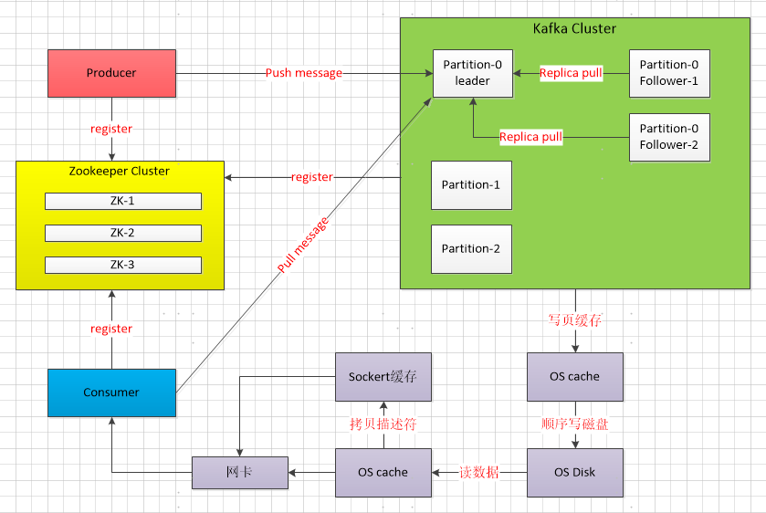
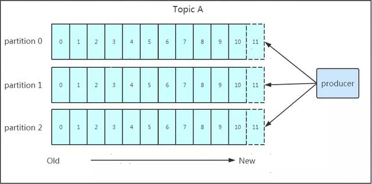
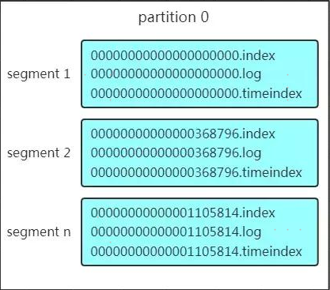
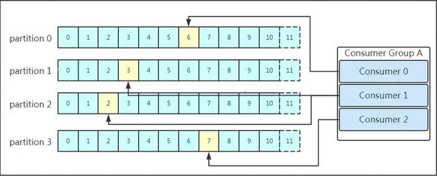
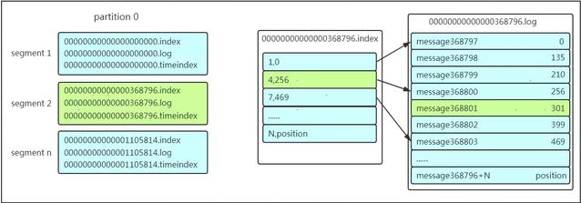

## KAFKA原理

**消息队列分类**：

**点对点消息队列**
消息生产者生产消息发送到queue中，然后消息消费者从queue中取出并且消费消息。这里要注意：

- 消息被消费以后，queue中不再有存储，所以消息消费者不可能消费到已经被消费的消息。
- Queue支持存在多个消费者，但是对一个消息而言，只会有一个消费者可以消费。

**发布/订阅消息队列**
消息生产者（发布）将消息发布到topic中，同时有多个消息消费者（订阅）消费该消息。和点对点方式不同，发布到topic的消息会被所有订阅者消费。

**背景介绍**

kafka是最初由Linkedin公司开发，使用Scala语言编写，Kafka是一个分布式、分区的、多副本的、多订阅者的日志系统(分布式MQ系统)，可以用于web/nginx日志，搜索日志，监控日志，访问日志等等。

### 1 Kafka 中的术语

-  broker：一台kafka服务器就是一个broker。一个集群由多个broker组成。一个broker可以容纳多个topic。
-  topic：可以理解为一个队列。
-  producer：消息生产者，就是向kafka broker发消息的客户端。
-  consumer：消息消费者，向kafka broker取消息的客户端。
- Consumer group：多个消息消费者组成一个消费者组。
- Partition：Topic的分区，每个topic可以有多个分区。
- replica：partition的副本。
- Offset：kafka的存储文件都是按照offset.kafka来命名。

### 2 kafka特性

- 通过O(1)的磁盘数据结构提供消息的持久化。
- 高吞吐量：即使是非常普通的硬件kafka也可以支持每秒数十万的消息。
- 支持同步和异步复制两种HA。
- Consumer客户端pull，随机读，利用sendfile系统调用，zero-copy ,批量拉数据。
- 消费状态保存在客户端。
- 消息存储顺序写。
- 数据迁移、扩容对用户透明。
- 支持Hadoop并行数据加载。
- 支持online和offline的场景。
- 持久化：通过将数据持久化到硬盘以及replication防止数据丢失。
- scale out：无需停机即可扩展机器。
- 定期删除机制，支持设定partitions的segment file保留时间。

### 3 Kafka架构

### 4 KAFKA写数据

Kafka写数据2个特征：**页缓存技术**和**磁盘顺序写**

**1】KAFKA写数据**：

- Producer在写入数据的时候找partition leader。
- partition follower是主动的去partition leader进行同步数据。
- Producer用push模式将数据发布到broker，每条消息追加到分区中，顺序写入磁盘。

**2】Producer写数据负载**：

- partition在写入的时候可以指定需要写入的partition，如有指定，则写入对应的partition。
- 如没有指定partition，但是设置了数据的key，则会根据key的值hash出一个partition。
-  如既没指定partition，又没有设置key，则会轮询选出一个partition。

**3】Producer向队列写入数据的时候设置参数来确定是否确认kafka接收到数据，参数值为0、1、all：**

- 0代表producer往集群发送数据不需要等到集群的返回，不确保消息发送成功。
- 1代表producer往集群发送数据只要leader应答就可以发送下一条，只确保leader发送成功。
- all代表producer往集群发送数据需要所有的follower都完成从leader的同步才会发送下一条，确保leader发送成功和所有的副本都完成备份。

如往不存在的topic写数据，kafka会自动创建topic，分区和副本的数量根据默认配置都是1。

### 5 KAFKA存储数据

**1】Partition 结构** ：

- Partition由多组segment文件组成，每组segment文件包含.index文件、.log文件、.timeindex文件。
- log文件就实际是存储message的地方，而index和timeindex文件为索引文件，用于检索消息。
- 文件的命名是以该segment最小offset来命名的，如000.index存储offset为0~368795的消息。

**2】Message结构**

- offset：offset是一个占8byte的有序id号，它可以唯一确定每条消息在parition内的位置。
- 消息大小：消息大小占用4byte，用于描述消息的大小。
- 消息体：消息体存放的是实际的消息数据（被压缩过）。

**3】存储策略**

- 基于时间，默认配置是168小时（7天）。
- 基于大小，默认配置是1073741824。

kafka读取特定消息的时间复杂度是O(1)，删除过期的文件并不会提高kafka的性能。

### 6 KAFKA读数据

- 多个消费者可以组成一个消费者组（consumer group），每个消费者组都有一个组id。
- 同一个消费组者的消费者可以消费同一topic下不同分区的数据。
- 消费者组内的消费者小于partition数量，某个消费者消费多个partition数据。
- 消费者组的消费者多于partition的数量，某个消费者空闲。

**1】查找message**

segment+有序offset+稀疏索引+二分查找+顺序查找等多种手段来高效的查找数据。

- 先找到offset的368801message所在的segment文件，如图message2。

- message2的.index文件起始偏移量为368796+1，要查找的offset为368801的message在该index内的偏移量为368796+5=368801，相对offset为5。
- 根据找到的相对offset为4的索引确定message存储的物理偏移位置为256，从位置为256的那个地方开始顺序扫描直到找到offset为368801的那条Message。

