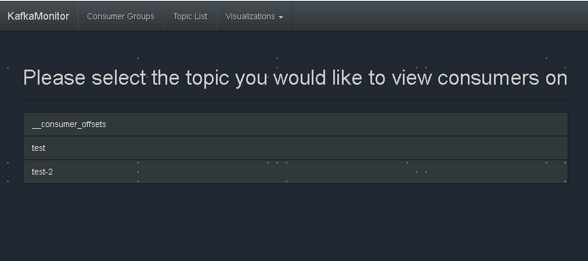

## Kafka监控工具KafkaOffsetMonitor配置及使用


下载地址：https://github.com/quantifind/KafkaOffsetMonitor/releases


```shell
mkdir -p /app/KafkaMonitor
cp KafkaOffsetMonitor-assembly-0.2.0.jar /app/KafkaMonitor
```


```
vi kafka-monitor-start.sh 
```

```
java -cp KafkaOffsetMonitor-assembly-0.2.0.jar com.quantifind.kafka.offsetapp.OffsetGetterWeb --zk 10.0.0.50:2181,10.0.0.60:2181,10.0.0.70:2181 --port 8088  --refresh 5.seconds --retain 1.days
```

- zk ：zookeeper主机地址，如果有多个，用逗号隔开
- port ：应用程序端口
- refresh ：应用程序在数据库中刷新和存储点的频率
- retain ：在db中保留多长时间
- dbName ：保存的数据库文件名，默认为offsetapp


在游览器中输入：http://ip:port即可以查看KafkaOffsetMonitor Web UI,如下图：



