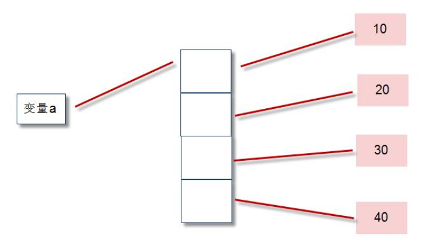

## 序列

序列是一种数据存储方式，用来存储一系列的数据。

在内存中，序列就是一块用来存放多个值的连续的内存空间。

序列a=[10,20,30,40]内存图：

python中常用的序列结构有：字符串、列表、元组、字典、集合。

### 1 列表

列表：用于存储任意数目、任意类型的数据集合。

列表是内置可变序列，是包含多个元素的有序连续的内存空间。

| 列表常用方法         | 描述                                                         |
| -------------------- | ------------------------------------------------------------ |
| list.append(x)       | 将元素 x 增加到列表 list 尾部                                |
| list.extend(aList)   | 将列表 alist 所有元素加到列表 list 尾部                      |
| list.insert(index,x) | 在列表 list 指定位置 index 处插入元素 x                      |
| list.remove(x)       | 在列表 list 中删除首次出现的指定元素 x                       |
| list.pop([index])    | 删除并返回列表 list 指定为止 index 处的元素，默认是最后一个元素 |
| list.clear()         | 删除列表所有元素，并不是删除列表对象                         |
| list.index(x)        | 返回第一个 x 的索引位置，若不存在 x 元素抛出异常             |
| list.count(x)        | 返回指定元素 x 在列表 list 中出现的次数                      |
| len(list)            | 返回列表中包含元素的个数                                     |
| list.reverse()       | 所有元素原地翻转                                             |
| list.sort()          | 所有元素原地排序                                             |
| list.copy()          | 返回列表对象的浅拷贝                                         |