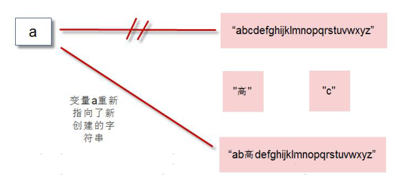

## 字符串

### 1 字符串的编码

Python3 的字符默认就是16 位Unicode 编码。

- ord() 函数：把字符转换成对应的Unicode 码。
- chr() 函数：把十进制数字转换成对应的字符。

```python
print(ord('A'))
print(ord('林'))
print(chr(66))
```

>执行结果：
>
>65
>26519
>B

### 2 创建字符串

可以通过单引号或双引号创建字符串。例如：a=’abc’; b=”sxt”。

### 3 len()函数

Python 允许空字符串的存在，不包含任何字符且长度为0。

len() 函数：用于计算字符串含有多少字符。

### 4 转义字符

| 转义字符 | 描述             |
| -------- | ---------------- |
| \        | 续行符(在行尾时) |
| `\\`     | 反斜杠符号       |
| `\'`     | 单引号           |
| `\"`     | 双引号           |
| \b       | 退格(Backspace)  |
| \n       | 换行             |
| \t       | 横向制表符       |
| \r       | 回车             |

### 5 字符串拼接和复制

可以使用+将多个字符串拼接起来。

- 1] 如+两边都是字符串，则拼接。
- 2] 如+两边都是数字，则加法运算。
- 3] 如+两边类型不同，则抛出异常。

使用*可以实现字符串复制。

### 6 end参数

调用print 时，会自动打印一个换行符。

可以通过参数end = “任意字符串”，实现末尾添加任何内容。

```python
print("lin",end='')
print("yi",end='$$')
```

>执行结果：
>
>linyi$$

### 7 input() 函数

input() 函数：从控制台读取键盘输入的内容。

```python
name=input("请输入你的名字:")
```

### 8 str()函数

str()可以将其他数据类型转换为字符串。

调用print()函数时，解释器自动调用了str()将非字符串的对象转成了字符串。

### 9 字符串提取字符[]

以通过在字符串后面添加[]，在[]里面指定偏移量，可以提取该位置的单个字符。

### 10 replace()函数

replace()实现字符串替换。

```python
a='abcdefghijklmnopqrstuvwxyz'
b=a.replace('c','高')
print(b)
```



### 11 字符串切片[]

切片slice操作可以让我们快速的提取子字符串。标准格式为：[起始偏移量start：终止偏移量end：步长step]

```python
a="abcdefg"[3:5]
print(a)
```

### 12 split()和join()函数

split() 可以基于指定分隔符将字符串分隔成多个子字符串(存储到列表中)，默认使用空白字符(换行符/空格/制表符)。

join() 的作用和split()作用刚好相反，用于将一系列子字符串连接起来。

```python
a="I love duoduo"
print(a.split())    # 存储到列表中
b=['I','love','duoduo']
print(" ".join(b))
```

>执行结果：
>
>['I', 'love', 'duoduo']
>I love duoduo


```python
# 测试+拼接符和 join()，不同的效率
import time
start_time1=time.time()
a=""
for i in range(1000000):
    a+="lin"
end_time1=time.time()
print("+运算时间："+str(end_time1-start_time1))

start_time2=time.time()
li=[]
for i in range(1000000):
    li.append("lin")
b="".join(li)
end_time2=time.time()
print("join运算时间："+str(end_time2-start_time2))
```

>执行结果：
>
>+运算时间：0.6750690937042236
>join运算时间：0.14000678062438965

### 13 strip()函数

函数strip()：去除字符串首尾指定信息，默认去除空格。

```python
a=" python "
print(a.strip())    #去除首部和尾部空格
print(a.lstrip())   #去除首部空格
print(a.rstrip())   #去除尾部空格
```

### 14 大小写转换

```
a="i love duoduo"
```

| 示例           | 结果            | 描述                   |
| -------------- | --------------- | ---------------------- |
| a.capitalize() | "I love duoduo" | 首字母大写             |
| a.title()      | "I Love Duoduo" | 每个单词都首字母大写   |
| a.upper()      | "I LOVE DUODUO" | 所有字符都转换大写字母 |
| a.lower()      | "i love duoduo" | 所有字符都转换小写字母 |

### 15 format()函数

函数format()：通过{索引}/{参数名}，直接映射参数值，实现对字符串的格式化

```python
a="我的名字是:{0}，年龄是:{1}"
print(a.format("林一",18))
```

>执行结果：
>
>我的名字是:林一，年龄是:18

### 16 数字格式化

浮点数通过 f，整数通过 d 进行需要的格式化。

| 格式    | 示例       | 输出      | 描述                     |
| ------- | ---------- | --------- | ------------------------ |
| {:.2f}  | 3.1415926  | 3.14      | 保留小数点后2位          |
| {:.0f}  | 3.1415926  | 3         | 保留整数                 |
| {:0>2d} | 5          | 05        | 位数为2，数字补0，左补充 |
| {:x<4d} | 5          | 5xxx      | 位数为4，数字补x，右补充 |
| {:,}    | 1000000    | 1,000,000 | 以逗号分隔的数字格式     |
| {:.2%}  | 0.25       | 25%       | 百分比格式               |
| {:.2e}  | 1000000000 | 1.00E+0.9 | 指数记法                 |

```python
print("{:.2f}".format(3.1415926))
print("{:.0f}".format(3.1415926))
print("{:0>2d}".format(5))
print("{:x<4d}".format(5))
print("{:,}".format(1000000))
print("{:.2%}".format(0.25))
print("{:.2e}".format(1000000000))
```

>执行结果：
>
>3.14
>3
>05
>5xxx
>1,000,000
>25.00%
>1.00e+09


### 17 编码转换

str->bytes：encode编码

bytes->str：decode解码

```python
a="林一"
b=a.encode()    # str转bytes
print(b)
c=b.decode()    # bytes转str
print(c)
```

