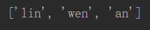
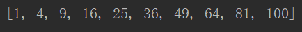
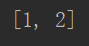
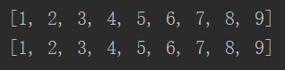

## 列表

列表由一系列按特定顺序排列的元素组成。

方括号`[]`来表示列表，并用逗号来分隔其中的元素。

列表非常适合用于存储在程序运行期间可能变化的数据集。

#### 1 访问列表元素

列表第一个元素的索引为0，第二个为1。倒数第一个为-1，倒数第二个为-2。

```python
name = ['lin','wen','hai']
print(name[0])
print(name[1])
```

```
结果：
lin 
web
```


#### 2 替换元素

```python
#修改列表元素
name = ['lin','wen','hai']
name[2] = 'an'
print(name)
```




#### 3 列表解析

```python
x = [value**2 for value in range(1,11)]
print(x)
```




#### 4 切片

```python
# 切片截取第一个元素，到截至第二个元素，不包含第二个元素
x = [1,2,3,4,5,6,7,8,9]
print(x[0:2])
```



```python
x = [1,2,3,4,5,6,7,8,9]
print(x[:3])	#返回从第1个元素，到截至第3个元素
print(x[3:])	#返回从第3个元素到列表末尾的所有元素
```


#### 5 复制列表

```python
x = [1,2,3,4,5,6,7,8,9]
y = x[:]
print(x)
print(y)
```




