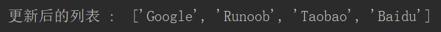
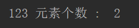
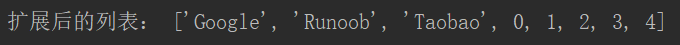
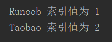
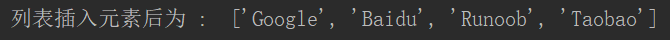
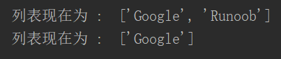
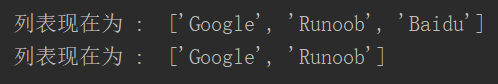
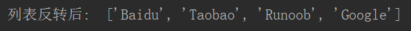
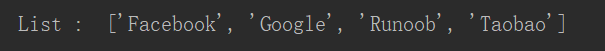
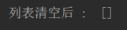

## 方法

#### 1 append()方法

append() 方法用于在列表末尾添加新的对象。

```python
语法：list.append(obj)
例子：
list1 = ['Google', 'Runoob', 'Taobao']
list1.append('Baidu')
print ("更新后的列表 : ", list1)
```




#### 2 count() 方法

count() 方法用于统计某个元素在列表中出现的次数。

```python
语法：list.count(obj)
例子：
aList = [123, 'Google', 'Runoob', 'Taobao', 123]
print ("123 元素个数 : ", aList.count(123))
```




#### 3 extend() 方法

extend() 方法用于在列表末尾一次性追加另一个序列中的多个值（用新列表扩展原来的列表）。

```python
语法：list.extend(seq)
例子：
list1 = ['Google', 'Runoob', 'Taobao']
list2=list(range(5))
list1.extend(list2)
print ("扩展后的列表：", list1)
```




#### 4 index() 方法

index() 方法用于从列表中找出某个值第一个匹配项的索引位置。

```python
语法：list.index(obj)
例子：
list1 = ['Google', 'Runoob', 'Taobao']
print ('Runoob 索引值为', list1.index('Runoob'))
print ('Taobao 索引值为', list1.index('Taobao'))
```




#### 5 insert() 方法

insert() 方法用于将指定对象插入列表的指定位置。

```python
语法：list.insert(index, obj)
例子：
list1 = ['Google', 'Runoob', 'Taobao']
list1.insert(1, 'Baidu')
print ('列表插入元素后为 : ', list1)
```




#### 6 pop() 方法

pop() 方法用于移除列表中的一个元素（默认最后一个元素），并且返回该元素的值。

```python
语法：list.pop([index])
例子：
list1 = ['Google', 'Runoob', 'Taobao']
list1.pop()
print ("列表现在为 : ", list1)
list1.pop(1)
print ("列表现在为 : ", list1)
```




#### 7 remove()方法

remove()方法用于移除列表中某个值的第一个匹配项。

```python
语法：list.remove(obj)
例子：
list1 = ['Google', 'Runoob', 'Taobao', 'Baidu']
list1.remove('Taobao')
print ("列表现在为 : ", list1)
list1.remove('Baidu')
print ("列表现在为 : ", list1)
```




#### 8 reverse()方法

reverse() 方法用于反向列表中元素。

```python
语法：list.reverse()
例子：
list1 = ['Google', 'Runoob', 'Taobao', 'Baidu']
list1.reverse()
print ("列表反转后: ", list1)
```




#### 9 sort() 方法

sort() 方法用于对原列表进行排序，如果指定参数，则使用比较函数指定的比较函数。

参数：
key：主要是用来进行比较的元素，只有一个参数，具体的函数的参数就是取自于可迭代对象中，指定可迭代对象中的一个元素来进行排序。
reverse：排序规则，reverse = True 降序， reverse = False 升序（默认）。

```python
语法：list.sort( key=None, reverse=False)
例子：
aList = ['Google', 'Runoob', 'Taobao', 'Facebook']
aList.sort()
print ( "List : ", aList)
```



```python
vowels = ['e', 'a', 'u', 'o', 'i']
vowels.sort(reverse=True)
print ( '降序输出:', vowels )
```


#### 10 clear()方法

clear()方法用于清空列表，类似于 del a[:]。

```python
语法：list.clear()
例子：
list1 = ['Google', 'Runoob', 'Taobao', 'Baidu']
list1.clear()
print ("列表清空后 : ", list1)
```




#### 11 copy() 方法

copy() 方法用于复制列表，类似于 a[:]。

```python
语法：list.copy()
例子：
list1 = ['Google', 'Runoob', 'Taobao', 'Baidu']
list2 = list1.copy()
print ("list2 列表: ", list2)
```


