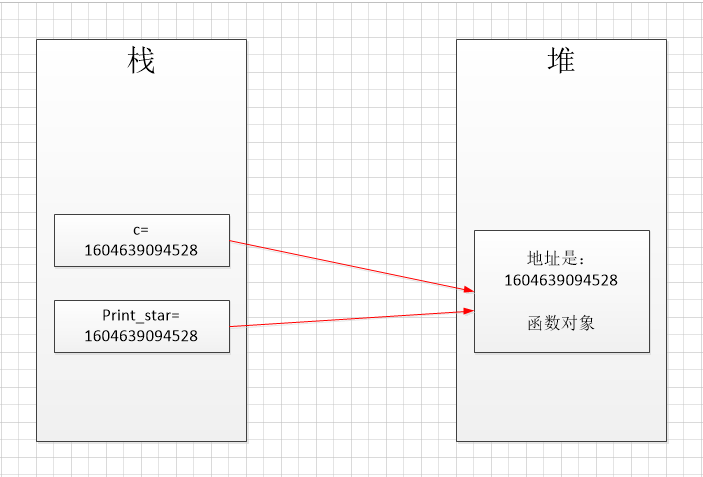

## 函数内存底层


Python 中，“一切都是对象”。  执行 def 定义函数后，系统就创建了相应的函数对象。  

```python
def print_star(n):
    print("*"*n)

print(print_star)
print(id(print_star))

c = print_star

c(5)
```

执行结果：

```
<function print_star at 0x000001759BF17700>
1604639094528
*****
```

Python 中，圆括号意味着调用函数。在没有圆括号的情况下，Python会把函数当做普通对象。  

内存图：

