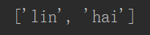

## 方法

#### 1 append()

```python
# 方法append()将元素添加到了列表末尾。
name = ['lin','wen','hai']
name.append('good')
print(name)
```


#### 2 insert()

```python
# 使用insert()在列表中插入元素
name = ['lin','wen','hai','good']
name.insert(3,'is')
print(name)
```


#### 3 pop()

```python
# 使用pop()删除列表末尾的元素
name = ['lin','wen','hai','is','good']
name.pop()
print(name)
```


```python
# 使用pop()删除列表任意位置元素
name = ['lin','wen','hai']
name.pop(1)
print(name)
```



#### 4 remove()

```python
# 使用remove()根据值删除元素
name = ['lin','wen','hai']
name.remove('wen')
print(name)
```


#### 5 sort()

```python
# 使用方法sort()对列表进行永久性排序
cars = ['bmw', 'audi', 'toyota', 'subaru']
cars.sort()		#参数为空，默认是升序排序
print(cars)
```


```python
cars = ['bmw', 'audi', 'toyota', 'subaru']
cars.sort(reverse=True)		#降序排序
print(cars)
```


#### 6 sorted()

```python
# 使用sorted()升序排序，不改变原始排列顺序
cars = ['bmw', 'audi', 'toyota', 'subaru']
print(sorted(cars))
print(cars)
```


#### 7 reverse()

```python
# 方法reverse()反转列表元素的排列顺序
cars = ['bmw', 'audi', 'toyota', 'subaru']
cars.reverse()
print(cars)
```


