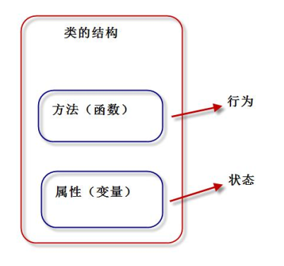
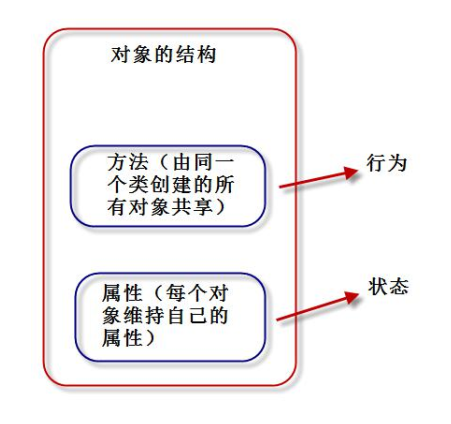
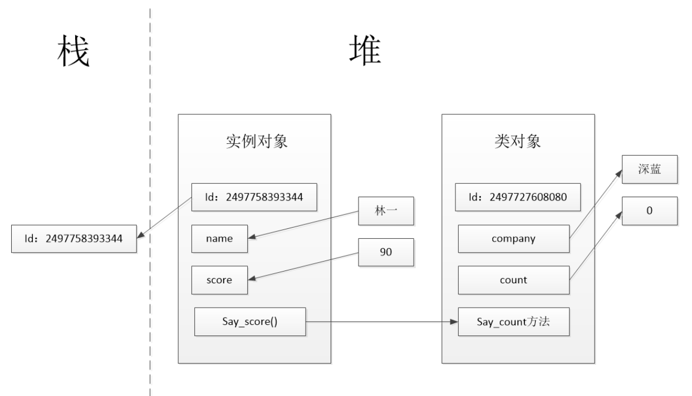
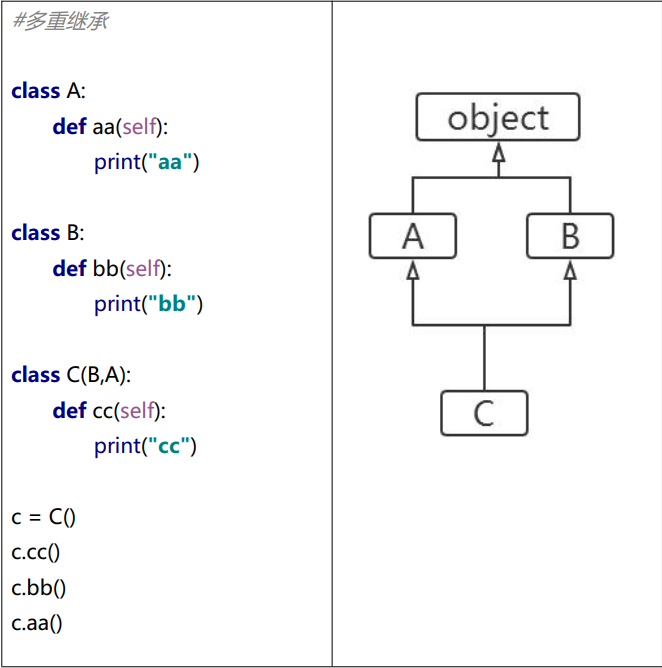
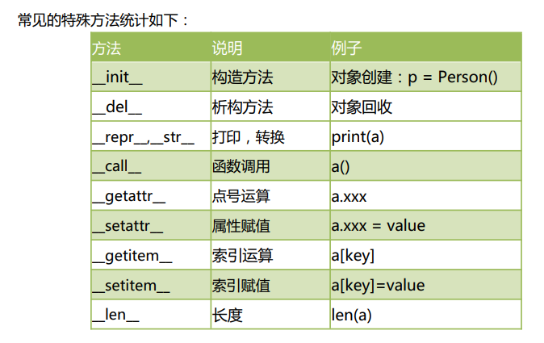
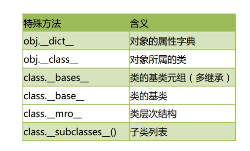

### 1 类的定义

通过类定义数据类型的属性（数据）和方法（行为） ，“类将行为和状态打包在一起”  

对象  ：类的实例





Python 中，“一切皆对象”。类也称为“类对象”，类的实例也称为“实例对象”。  

定义类的语法格式：

```python
class 类名：
	类体
```

类要点如下：

- 类名必须符合“标识符”的规则；一般规定，首字母大写，多个单词使用“驼峰原则”。
- 类体中我们可以定义属性和方法。
- 属性用来描述数据，方法(即函数)用来描述这些数据相关的操作 。 


```python
#一个典型的类的定义
class Student:
    def __init__(self,name,score):
        self.name = name
        self.score = score

    def say_score(self):
        print(self.name,'的分数是:',self.score)

s1 = Student('林一',90)
s1.say_score()
```

执行结果：

```
林一 的分数是: 90
```


类是抽象的，也称之为“对象的模板”。通过类这个模板，创建类的实例对象，然后才能使用类定义的功能。  

Python 对象包含如下部分：

- id（identity 识别码）
- type（对象类型）
- value（对象的值）：属性（attribute）和方法（method）  

  

### 2 `__init__`和`__new__`方法  

`__init__()`方法 ： 构造方法用于执行“实例对象的初始化工作”，即对象创建后，初始化当前对象的相关属性，无返回值。  

`__init__()`的要点如下：

1】名称固定，必须为：`__init__()`
2】第一个参数固定，必须为：self，self 指的就是刚刚创建好的实例对象。
3】构造函数通常用来初始化实例对象的实例属性，如下代码就是初始化实例属性：name和 score。  

```python
def __init__(self,name,score):
	self.name = name 	#实例属性
	self.score = score	#实例属性
```

4】通过“类名(参数列表)”来调用构造函数。调用后，将创建好的对象返回给相应的变量。比如：s1 = Student('张三', 80)  
5】`__init__()`方法：初始化创建好的对象，初始化指的是：“给实例属性赋值”
6】`__new__()`方法: 用于创建对象，但我们一般无需重定义该方法。
7】如不定义`__init__`方法，系统会提供一个默认的`__init__`方法。如果我们定义了带参的`__init__`方法，系统不创建默认的`__init__`方法。  


### 3 实例属性和实例方法  

**实例属性**：是从属于实例对象的属性，也称为“实例变量”。

**实例属性要点**：  

​	1】实例属性一般在`__init__()`方法中通过如下代码定义：self.实例属性名 = 初始值。
​	2】在本类的其他实例方法中，也是通过self进行访问：self.实例属性名。
​	3】创建实例对象后，通过实例对象访问：

```python
类名() 			#创建对象，调用`__init__()`初始化属性
实例属性名=值 	 #可以给已有属性赋值，也可以新加属性
```


**实例方法**：是从属于实例对象的方法。  

实例方法 格式：

```python
def 方法名(self [, 形参列表])：
	函数体
```

方法的调用格式：

```python
对象.方法名([实参列表])
```

**实例方法要点**：
	1】定义实例方法时，第一个参数必须为 self。和前面一样，self 指当前的实例对象。
	2】调用实例方法时，不需要也不能给 self 传参。self 由解释器自动传参。


### 4 类对象、类属性、类方法、静态方法  

当解释器执行 class 语句时，就会创建一个**类对象**。  

```python
#测试类对象的生成
class Student:
    pass
print(type(Student))
print(id(Student))
```

执行结果：

```
<class 'type'>
1713323084048
```


**类属性**是从属于“类对象”的属性，也称为“类变量”。  

```python
class Student:
    company = "AI"	#类属性
    count = 0		#类属性

    def __init__(self,name,score):
        self.name = name	#实例属性
        self.score = score	#实例属性
        Student.count += 1

    def say_score(self):	#实例方法
        print("我的公司是：")
        print(self.name,"的分数是:",self.score)

s1 = Student("林一",97)
s1.say_score()
print("创建{0}个对象".format(Student.count))
```


**类方法**是从属于“类对象”的方法。  

```python
class Student:
    company = "AI"
    @classmethod
    def printCompany(cls):	#类方法
        print(cls.company)

Student.printCompany()
```

类方法要点如下：
	1】@classmethod必须位于方法上面一行；
	2】第一个cls必须有；cls指的就是“类对象”本身；
	3】调用类方法格式：“类名.类方法名(参数列表)”。 参数列表中，不需要也不能给cls传值；
	4】类方法中访问实例属性和实例方法会导致错误；
	5】子类继承父类方法时，传入cls是子类对象，而非父类对象。


Python 中允许定义与“类对象”无关的方法，称为“**静态方法**”。  

```python
class Student:
    company = "AI"
    @staticmethod
    def add(a,b):	#静态方法
        print("{0}+{1}={2}".format(a,b,(a+b)))
        return a+b

Student.add(20,30)
```

执行结果：

```
20+30=50
```


### 5 内存分析实例对象和类对象创建过程  

```python
class Student:
    company = "深蓝"  #类属性
    count = 0
    def __init__(self,name,score):
        self.name = name    #实例属性
        self.score = score
        Student.count += 1
    def say_score(self):    #实例方法
        print("我的公司是：",Student.company)
        print(self.name,"的分数是：",self.score)
print(id(Student))
print(id(Student("林一",90)))
s1 = Student("林一",90)   #s1 是实例对象，自动调用__init__()方法
print(id(s1))
s1.say_score()
print("一共创建{0}个student对象".format(Student.count))
```

执行结果：

```
2497727608080
2497758393344
2497758393344
我的公司是： 深蓝
林一 的分数是： 90
一共创建2个student对象
```




### 6 `__del__`方法和垃圾回收机制  

`__del__`方法称为“析构方法”，用于实现对象被销毁时所需的操作。比如：释放对象
占用的资源，例如：打开的文件资源、网络连接等。  

系统会自动提供`__del__`方法，一般不需要自定义析构方法。  

```python
class Person:
    def __del__(self):
        print("销毁对象:{0}".format(self))
p1 = Person()
p2 = Person()
del p2
print("程序结束")
```

执行结果：

```
销毁对象:<__main__.Person object at 0x000001EDDB0F6070>
程序结束
销毁对象:<__main__.Person object at 0x000001EDDB0E7400>
```


### 7 `__call__`方法和可调用对象  

```python
##可以像调用函数一样调用对象的__call__方法
class SalaryAccount:
    """工资计算类"""
    def __call__(self,salary):
        yearSalary = salary*12
        daySalary = salary//30
        hourSalary = daySalary//8
        return dict(monthSalary=salary,yearSalary=yearSalary,daySalary=daySalary,hourSalary=hourSalary)

s = SalaryAccount()
print(s(20000))
```

执行结果：

```
{'monthSalary': 20000, 'yearSalary': 240000, 'daySalary': 666, 'hourSalary': 83}
```


### 8 方法没有重载和动态性

Python中方法没有重载，不要使用重名的方法。

Python是动态语言，我们可以动态的为类添加新的方法，或者动态的修改类的已有的方法。  

```python
#Person动态的新增了play_game方法，以及用work2替换了work方法
class Person:
    def work(self):
        print("努力工作")

def play_game(self):
    print("{0}玩游戏".format(self))

def work2(s):
    print("好好工作，努力上班")

Person.play = play_game
Person.work = work2
p = Person()
p.play()
p.work()
```

执行结果：

```
<__main__.Person object at 0x0000021051E47400>玩游戏
好好工作，努力上班
```


### 9 私有属性和私有方法  

私有属性和私有方法，有如下要点：
	1】通常我们约定，两个下划线开头的属性是私有的(private)。其他为公共的(public)。
	2】类内部可以访问私有属性(方法)。
	3】类外部不能直接访问私有属性(方法)。
	4】类外部可以通过“_类名__私有属性(方法)名”访问私有属性(方法)。


```python
class Employee:
    __company = "AI"	#私有类属性，通过dir可以查到
    def __init__(self,name,age):
        self.name = name
        self.__age = age	#私有实例属性
    def say_company(self):
        #类内部可以直接访问私有属性
        print("我的公司是：",Employee.__company)
        print(self.name,"的年龄是:",self.__age)
        self.__work()

    def __work(self):	#私有实例方法 通过dir可以查到
        print("好好工作")
p1 = Employee("林一",25)
print(p1.name)
print(dir(p1))
p1.say_company()
##通过这种方式可以直接访问到私有属性
print(p1._Employee__age) 
```

执行结果：

```
林一
['_Employee__age', '_Employee__company', '_Employee__work', '__class__', '__delattr__', '__dict__', '__dir__', '__doc__', '__eq__', '__format__', '__ge__', '__getattribute__', '__gt__', '__hash__', '__init__', '__init_subclass__', '__le__', '__lt__', '__module__', '__ne__', '__new__', '__reduce__', '__reduce_ex__', '__repr__', '__setattr__', '__sizeof__', '__str__', '__subclasshook__', '__weakref__', 'name', 'say_company']
我的公司是： AI
林一 的年龄是: 25
好好工作
25
```


### 10 @property 装饰器  

```python
class Employee:
    @property
    def salary(self):
        return  30000
emp1 = Employee()
print(emp1.salary)
print(type(emp1.salary))
```

执行结果：

```
30000
<class 'int'>
```


### 11 面向对象三大特征

面向对象编程的三大特性：继承、封装（隐藏）、多态。  


### 12 继承 

object 是所有类的父类，里面定义了一些所有类共有的默认实现，比如：__new__()。  

```python
class Person:   #父类
    def __init__(self,name,age):
        self.name = name
        self.__age = age
    def say_age(self):
        print(self.name,"的年龄是",self.__age)
class Student(Person):   #子类
    def __init__(self,name,age,score):
        self.score =score
        #定义子类时，必须在其构造函数中调用父类的构造函数。
        Person.__init__(self,name,age)
s1 = Student("林一",12,99)
s1.say_age()
print(dir(s1))
```

执行结果：

```
林一 的年龄是 12
['_Person__age', '__class__', '__delattr__', '__dict__', '__dir__', '__doc__', '__eq__', '__format__', '__ge__', '__getattribute__', '__gt__', '__hash__', '__init__', '__init_subclass__', '__le__', '__lt__', '__module__', '__ne__', '__new__', '__reduce__', '__reduce_ex__', '__repr__', '__setattr__', '__sizeof__', '__str__', '__subclasshook__', '__weakref__', 'name', 'say_age', 'score']
```


**成员继承**：子类继承了父类除构造方法之外的所有成员。  

**方法重写**：子类可以重新定义父类中的方法，这样就会覆盖父类的方法，也称为“重写 。

```python
class Person:
    def __init__(self,name,age):
        self.name = name
        self.age = age
    def say_age(self):
        print(self.name,"的年龄是",self.age)
    def say_name(self):
        print("我是",self.name)

class Student(Person):
    def __init__(self,name,age,score):
        self.score = score
        Person.__init__(self,name,age)
    def say_score(self):
        print(self.name,"的分数是：",self.score)
    def say_name(self): 	#重写父类的方法
        print("报告老师，我是",self.name)

s1 = Student("林一",15,98)
s1.say_score()
s1.say_name()
s1.say_age()
```

执行结果：

```
林一 的分数是： 98
报告老师，我是 林一
林一 的年龄是 15
```


### 13 object 根类  

函数 dir()，可以看到指定对象所有的属性。  

```python
class Person:
    def __init__(self,name,age):
        self.name =name
        self.age = age
    def say_age(self):
        print(self.name,"的年龄是:",self.age)
obj = object()
print(dir(obj))

s2 = Person("林一",17)
print(dir(s2))
```

执行结果：

```
['__class__', '__delattr__', '__dir__', '__doc__', '__eq__', '__format__', '__ge__', '__getattribute__', '__gt__', '__hash__', '__init__', '__init_subclass__', '__le__', '__lt__', '__ne__', '__new__', '__reduce__', '__reduce_ex__', '__repr__', '__setattr__', '__sizeof__', '__str__', '__subclasshook__']
['__class__', '__delattr__', '__dict__', '__dir__', '__doc__', '__eq__', '__format__', '__ge__', '__getattribute__', '__gt__', '__hash__', '__init__', '__init_subclass__', '__le__', '__lt__', '__module__', '__ne__', '__new__', '__reduce__', '__reduce_ex__', '__repr__', '__setattr__', '__sizeof__', '__str__', '__subclasshook__', '__weakref__', 'age', 'name', 'say_age']
```


重写`__str__()`方法  

```python
class Person:
    def __init__(self,name,age):
        self.name = name
        self.age = age
    def __str__(self):
        """'将对象转化成一个字符串，一般用于str方法"""
        return "名字是:{0},年龄是{1}".format(self.name,self.age)

p = Person("林一",18)
print(p)
```

执行结果：

```
名字是:林一,年龄是18
```


### 14 多重继承  

Python 支持多重继承，一个子类可以有多个“直接父类”。这样，就具备了“多个父类”的特点。  




### 15 MRO()  

打印类的层次结构

```python
class A:
    def aa(self):
        print("aa")
    def say(self):
        print("say AAA!")
class B:
    def bb(self):
        print("bb")
    def say(self):
        print("say BBB!")
class C(B,A):
    def cc(self):
        print("cc")
c = C()
print(C.mro()) #打印类的层次结构
c.say()
```


### 16 super()获得父类定义 

```python
class A:
    def say(self):
        print("A",self)
        print("say AAA")
class B(A):
    def say(self):
        super().say()
        print("say BBB")

b = B()
b.say()
```

执行结果：

```
A <__main__.B object at 0x00000203728F6070>
say AAA
say BBB
```


### 17 多态

多态（polymorphism）是指同一个方法调用由于对象不同可能会产生不同的行为。  

```python
class Animal:
    def shout(self):
        print("动物叫了一声")
class Dog(Animal):
    def shout(self):
        print("小狗，汪汪汪")
class Cat(Animal):
    def shout(self):
        print("小猫，喵喵喵")

def animalShout(a):
    if isinstance(a,Animal):
        a.shout()

animalShout(Dog())
animalShout(Cat())
```

执行结果：

```
小狗，汪汪汪
小猫，喵喵喵
```


### 18 特殊方法




### 19 特殊属性




### 20 对象的浅拷贝和深拷贝 


21 

##### 1 工厂模式

工厂模式实现了创建者和调用者的分离，使用专门的工厂类将选择实现类、创建对象进行统一的管理和控制 。

```python
#工厂模式
class CarFactory:
    def createCar(self,brand):
        if brand == "奔驰":
            return Benz()
        elif brand == "宝马":
            return BMW()
        elif brand == "比亚迪":
            return BYD()
        else:
            return "未知品牌"

class Benz:
    pass

class BMW:
    pass

class BYD:
    pass

factory = CarFactory()
c1 = factory.createCar("奔驰")
c2 = factory.createCar("宝马")
print(c1)
print(c2)
```

输出结果：

```
<__main__.Benz object at 0x000001F33E706070>
<__main__.BMW object at 0x000001F33E706B50>
```

1