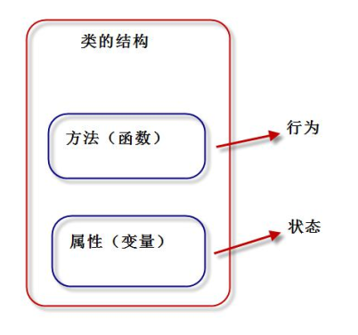
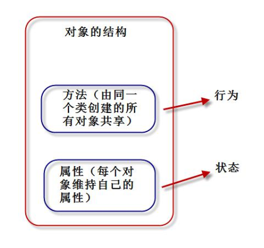

### 1 类的定义

通过类定义数据类型的属性（数据）和方法（行为） ，“类将行为和状态打包在一起”  

对象  ：类的实例





Python 中，“一切皆对象”。类也称为“类对象”，类的实例也称为“实例对象”。  

定义类的语法格式：

```python
class 类名：
	类体
```

类要点如下：

- 类名必须符合“标识符”的规则；一般规定，首字母大写，多个单词使用“驼峰原则”。
- 类体中我们可以定义属性和方法。
- 属性用来描述数据，方法(即函数)用来描述这些数据相关的操作 。 


```python
#一个典型的类的定义
class Student:
    def __init__(self,name,score):
        self.name = name
        self.score = score

    def say_score(self):
        print(self.name,'的分数是:',self.score)

s1 = Student('林一',90)
s1.say_score()
```

执行结果：

```
林一 的分数是: 90
```


类是抽象的，也称之为“对象的模板”。通过类这个模板，创建类的实例对象，然后才能使用类定义的功能。  

Python 对象包含如下部分：

- id（identity 识别码）
- type（对象类型）
- value（对象的值）：属性（attribute）和方法（method）  

  

### 2 `__init__`和`__new__`方法  

`__init__()`方法 ： 构造方法用于执行“实例对象的初始化工作”，即对象创建后，初始化当前对象的相关属性，无返回值。  

`__init__()`的要点如下：

1】名称固定，必须为：`__init__()`
2】第一个参数固定，必须为：self，self 指的就是刚刚创建好的实例对象。
3】构造函数通常用来初始化实例对象的实例属性，如下代码就是初始化实例属性：name和 score。  

```python
def __init__(self,name,score):
	self.name = name 	#实例属性
	self.score = score	#实例属性
```

4】通过“类名(参数列表)”来调用构造函数。调用后，将创建好的对象返回给相应的变量。比如：s1 = Student('张三', 80)  
5】`__init__()`方法：初始化创建好的对象，初始化指的是：“给实例属性赋值”
6】`__new__()`方法: 用于创建对象，但我们一般无需重定义该方法。
7】如不定义`__init__`方法，系统会提供一个默认的`__init__`方法。如果我们定义了带参的`__init__`方法，系统不创建默认的`__init__`方法。  


### 3 实例属性和实例方法  

**实例属性**：是从属于实例对象的属性，也称为“实例变量”。

**实例属性要点**：  

​	1】实例属性一般在`__init__()`方法中通过如下代码定义：self.实例属性名 = 初始值。
​	2】在本类的其他实例方法中，也是通过self进行访问：self.实例属性名。
​	3】创建实例对象后，通过实例对象访问：

```python
类名() 			#创建对象，调用`__init__()`初始化属性
实例属性名=值 	 #可以给已有属性赋值，也可以新加属性
```


**实例方法**：是从属于实例对象的方法。  

实例方法 格式：

```python
def 方法名(self [, 形参列表])：
	函数体
```

方法的调用格式：

```python
对象.方法名([实参列表])
```

**实例方法要点**：
	1】定义实例方法时，第一个参数必须为 self。和前面一样，self 指当前的实例对象。
	2】调用实例方法时，不需要也不能给 self 传参。self 由解释器自动传参。


### 4 类对象、类属性、类方法、静态方法  

当解释器执行 class 语句时，就会创建一个**类对象**。  

```python
#测试类对象的生成
class Student:
    pass
print(type(Student))
print(id(Student))
```

执行结果：

```
<class 'type'>
1713323084048
```


**类属性**是从属于“类对象”的属性，也称为“类变量”。  

```python
class Student:
    company = "AI"	#类属性
    count = 0		#类属性

    def __init__(self,name,score):
        self.name = name	#实例属性
        self.score = score	#实例属性
        Student.count += 1

    def say_score(self):	#实例方法
        print("我的公司是：")
        print(self.name,"的分数是:",self.score)

s1 = Student("林一",97)
s1.say_score()
print("创建{0}个对象".format(Student.count))
```


**类方法**是从属于“类对象”的方法。  

```python
class Student:
    company = "AI"
    @classmethod
    def printCompany(cls):	#类方法
        print(cls.company)

Student.printCompany()
```

类方法要点如下：
	1】@classmethod必须位于方法上面一行；
	2】第一个cls必须有；cls指的就是“类对象”本身；
	3】调用类方法格式：“类名.类方法名(参数列表)”。 参数列表中，不需要也不能给cls传值；
	4】类方法中访问实例属性和实例方法会导致错误；
	5】子类继承父类方法时，传入cls是子类对象，而非父类对象。


Python 中允许定义与“类对象”无关的方法，称为“**静态方法**”。  

```python
class Student:
    company = "AI"
    @staticmethod
    def add(a,b):	#静态方法
        print("{0}+{1}={2}".format(a,b,(a+b)))
        return a+b

Student.add(20,30)
```

执行结果：

```
20+30=50
```


### 5 内存分析实例对象和类对象创建过程  


